# Bazel Architecture for OpenTelemetry Astronomy Shop Demo

## 1) Document scope and intent

This document defines a **target Bazel architecture** for this fork of the OpenTelemetry Astronomy Shop demo.  
It is a planning and design blueprint only: no code changes are implied by this file.

Goals:

- Design a realistic, production-ready Bazel architecture for a polyglot monorepo.
- Keep compatibility with current local runtime (`docker compose`) during migration.
- Model CI/CD evolution (GitHub Actions first, Zuul-compatible later).
- Provide language-specific integration details for services under `src/`.
- Provide detailed diagrams and command catalogs that can be used directly in execution planning.

---

## 2) Current project reality that drives architecture decisions

The repository currently uses:

- Root orchestration: `Makefile`
- Container orchestration: `docker-compose.yml`, `docker-compose-tests.yml`
- Protobuf generation scripts: `docker-gen-proto.sh`, `ide-gen-proto.sh`
- CI: GitHub Actions matrix image builds and trace-based integration tests
- Polyglot services under `src/`:
  - Go, .NET, Java, Kotlin, Node.js/TypeScript, Python, Rust, C++, Ruby, Elixir, PHP

Therefore, Bazel architecture must:

1. Handle true polyglot builds, not just one language lane.
2. Support both source compilation and OCI image assembly.
3. Integrate with existing test posture (trace tests + Cypress + selective unit tests).
4. Introduce hermeticity progressively without breaking developer flow.

---

## 3) Target Bazel architecture at a glance

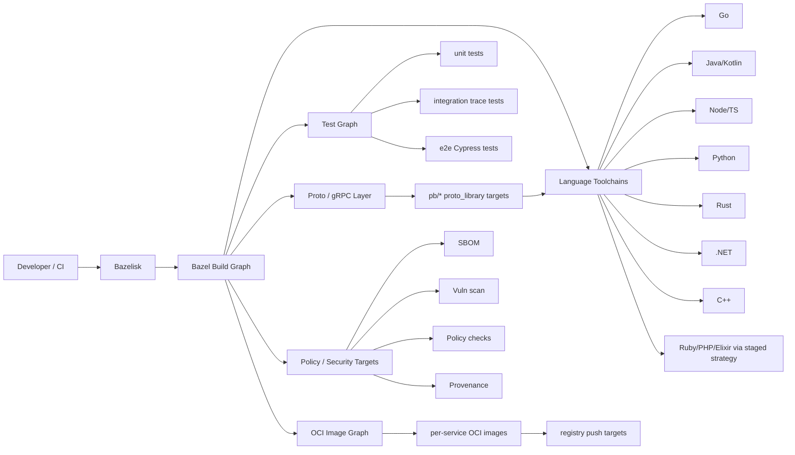

---

## 4) Proposed repository architecture (target)

## 4.1 Root-level structure (planned)

```text
/
├── MODULE.bazel
├── MODULE.bazel.lock
├── .bazelversion
├── .bazelrc
├── .bazelignore
├── BUILD.bazel
├── tools/
│   ├── bazel/
│   │   ├── defs/
│   │   │   ├── service_image.bzl
│   │   │   ├── service_test_tags.bzl
│   │   │   ├── proto_conventions.bzl
│   │   │   └── language_wrappers.bzl
│   │   ├── platforms/
│   │   │   ├── BUILD.bazel
│   │   │   └── constraints.bzl
│   │   ├── ci/
│   │   │   ├── affected_targets.sh
│   │   │   ├── ci_fast.sh
│   │   │   ├── ci_full.sh
│   │   │   └── ci_release.sh
│   │   └── security/
│   │       ├── sbom.sh
│   │       ├── scan.sh
│   │       └── policy_check.sh
│   └── ...
├── pb/
│   ├── BUILD.bazel
│   └── ...
├── src/
│   ├── <service>/BUILD.bazel
│   └── ...
├── test/
│   ├── BUILD.bazel
│   └── tracetesting/BUILD.bazel
└── .github/workflows/
    └── (progressively Bazel-first)
```

## 4.2 Layering model

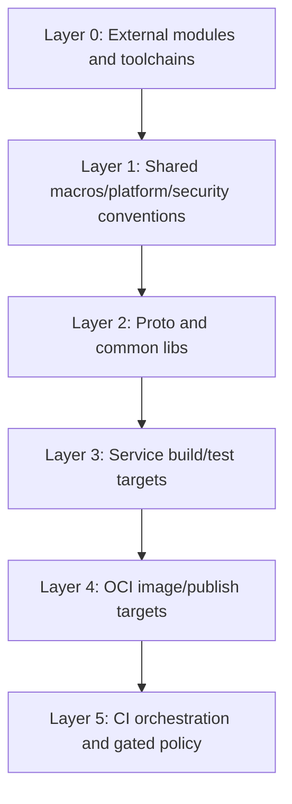

Design rule:

- Lower layers must not depend on higher layers.
- Service-specific implementation details stay in each `src/<service>/BUILD.bazel`.
- Global standards (tags, image naming, security policy wiring) stay in `tools/bazel/defs/`.

---

## 5) Bazel core design decisions

## 5.1 Bzlmod-first dependency architecture

Use `MODULE.bazel` as the single source of truth for:

- Bazel rule dependencies
- Toolchain module versions
- Registry and lock behavior

Why:

- Better dependency governance
- Reproducible module resolution
- Cleaner upgrades than legacy `WORKSPACE`-heavy patterns

## 5.2 Build profiles in `.bazelrc`

Planned profiles:

- `--config=dev`: fast local iteration
- `--config=ci`: deterministic CI defaults
- `--config=release`: strict + stamping + provenance
- `--config=integration`: broader test scope including trace/e2e

## 5.3 Test taxonomy

Global tags:

- `unit`
- `integration`
- `trace`
- `e2e`
- `slow`
- `manual`
- `flaky-quarantine` (temporary)

## 5.4 Image naming and publish policy

Target convention:

- Build target: `//src/<service>:<service>_image`
- Push target: `//src/<service>:<service>_push`

Tag convention:

- `<version>-<service>`
- `latest-<service>` (optional by policy)

---

## 6) End-to-end execution architecture

## 6.1 Developer local flow (planned)

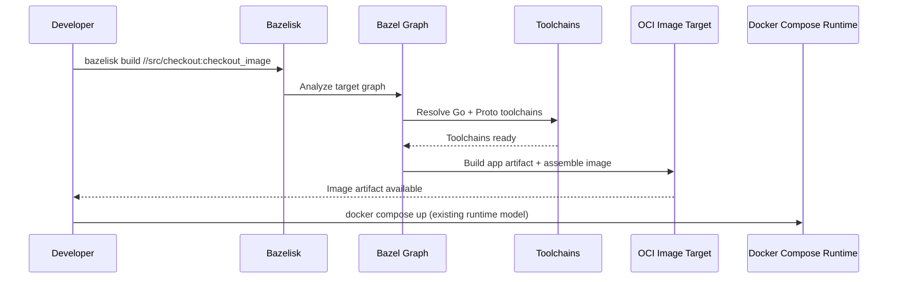

## 6.2 CI flow (planned GitHub Actions)

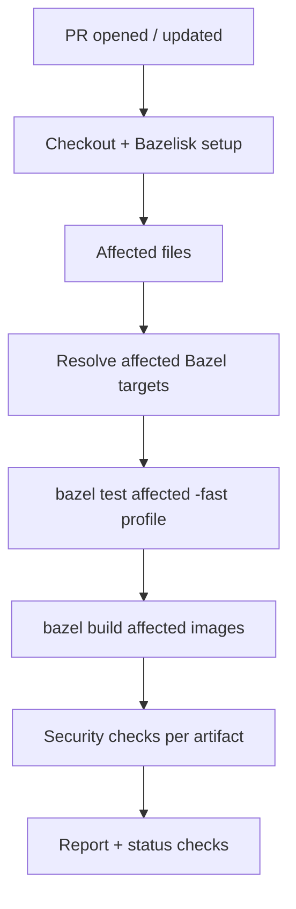

## 6.3 Release flow (planned)

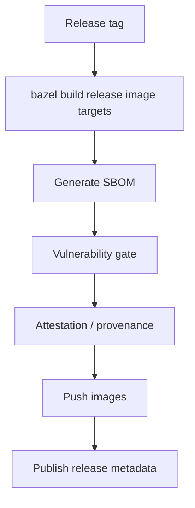

---

## 7) Detailed architecture by source tree domain

## 7.1 Application services (`src/*`)

Each service gets:

- Local `BUILD.bazel`
- Language-native compile targets
- Optional library/test split
- OCI image target
- Optional push target

General pattern:

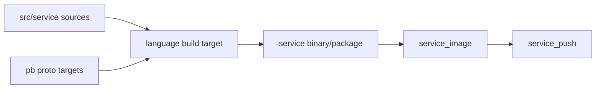

## 7.2 Infrastructure/config components under `src/`

Components like `frontend-proxy`, `kafka`, `opensearch`, `jaeger`, `prometheus`, `grafana`, `otel-collector`, `postgresql` can be modeled in two ways:

1. Pure OCI assembly targets from config files.
2. Transitional Dockerfile passthrough wrapped by Bazel target macros.

Recommendation:

- Start with wrapper targets to retain behavior.
- Progressively migrate to declarative OCI assembly where practical.

## 7.3 Proto domain (`pb/`)

Centralized proto graph:

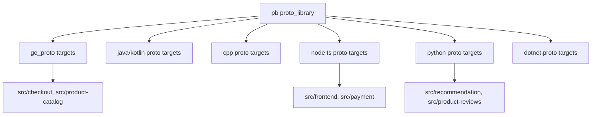

---

## 8) Language architecture deep dive (per ecosystem)

This section explains:

1. How each language lane generally builds today.
2. How Bazel integrates realistically in this repo.
3. What targets and scripts should exist.

## 8.1 Go lane (`checkout`, `product-catalog`)

Current default style:

- `go.mod` based dependency resolution
- `go build` in Dockerfile or local
- limited unit tests

Bazel integration model:

- `go_library` and `go_binary` targets per service
- `go_test` where tests exist
- proto deps imported via Go proto targets
- image target consumes built binary

Planned target pattern:

- `//src/checkout:checkout_lib`
- `//src/checkout:checkout_bin`
- `//src/checkout:checkout_unit_tests`
- `//src/checkout:checkout_image`

## 8.2 Node/TypeScript lane (`frontend`, `payment`, `react-native-app`)

Current default style:

- `npm` scripts (`build`, `lint`, test commands)
- Next.js frontend + Cypress e2e
- React Native uses Expo/Jest/Gradle lanes

Bazel integration model:

- JS/TS compile and package targets
- explicit lockfile-driven external deps
- Cypress tests wrapped as Bazel test targets
- React Native lane split:
  - JS bundle/test under Bazel
  - native mobile packaging staged as advanced integration

Important realism:

- Mobile native builds can remain partially external at first; Bazel orchestrates wrappers for reproducibility until full convergence.

## 8.3 Python lane (`recommendation`, `product-reviews`, `llm`, `load-generator`)

Current default style:

- `requirements.txt`
- runtime scripts in service containers

Bazel integration model:

- Python library/binary targets
- hermetic dependency resolution from pinned requirements lock strategy
- test targets where suites exist
- service image targets from Bazel-built artifacts

For `load-generator`:

- treat Locust job as runnable Bazel binary target and optional integration workload target.

## 8.4 Java/Kotlin lane (`ad`, `fraud-detection`)

Current default style:

- Gradle wrapper workflows
- build tasks produce application artifacts (including fat jar pattern in Kotlin service)

Bazel integration model:

- Java/Kotlin targets replace Gradle compile path over time
- keep Gradle wrapper compatibility in transition
- wire proto/jar dependencies through Bazel graph
- image targets consume built jars

Interview-strength note:

- Gradle can remain as fallback for a migration period, but CI should progressively gate on Bazel outputs.

## 8.5 .NET lane (`accounting`, `cart`)

Current default style:

- `csproj`, `dotnet restore/build/publish`
- xUnit tests in `cart` (currently skipped)

Bazel integration model (pragmatic):

- Stage 1: Bazel wrapper targets invoking controlled dotnet build/publish steps hermetically.
- Stage 2: move toward richer native rule usage where maturity and ROI align.
- Keep proto generation and image assembly in Bazel graph immediately.

## 8.6 Rust lane (`shipping`)

Current default style:

- `Cargo.toml`
- `cargo test` documented

Bazel integration model:

- Rust crate build target and tests via Bazel rules
- lockfile-aligned dependency behavior
- service image from compiled binary

## 8.7 C++ lane (`currency`)

Current default style:

- Dockerfile + CMake/make style build path

Bazel integration model:

- Native C++ targets for compile/link where feasible
- proto integration via C++ proto/grpc targets
- deterministic compiler/toolchain settings in Bazel platform config

## 8.8 Ruby lane (`email`)

Current default style:

- Bundler install + Ruby server script

Bazel integration model:

- Start with Bazel wrapper for deterministic bundle + runtime packaging
- model artifact/image outputs in Bazel graph
- evolve to richer native rules only if needed

## 8.9 PHP lane (`quote`)

Current default style:

- Composer and runtime in Dockerfile path

Bazel integration model:

- Wrapper strategy first:
  - dependency install action
  - app package target
  - image target
- enforce dependency lock and policy checks in CI

## 8.10 Elixir lane (`flagd-ui`)

Current default style:

- `mix` and Phoenix build/release path

Bazel integration model:

- Transitional hermetic wrapper for `mix deps` + compile/release actions
- explicit cache directories and immutable inputs
- OCI image assembled from generated release output

---

## 9) Per-service architecture mapping table

| Service path | Primary language | Current build style | Planned Bazel build target(s) | Planned test target(s) | Planned image target |
|---|---|---|---|---|---|
| `src/accounting` | .NET | `dotnet build/publish` + Dockerfile | `accounting_bin`, `accounting_pkg` | future unit tests target | `accounting_image` |
| `src/ad` | Java | Gradle | `ad_lib`, `ad_bin` | `ad_unit_tests` (if present) | `ad_image` |
| `src/cart` | .NET | csproj + Dockerfile | `cart_bin`, `cart_pkg` | `cart_unit_tests` | `cart_image` |
| `src/checkout` | Go | go build | `checkout_lib`, `checkout_bin` | `checkout_unit_tests` | `checkout_image` |
| `src/currency` | C++ | CMake/make in Dockerfile | `currency_lib`, `currency_bin` | `currency_tests` | `currency_image` |
| `src/email` | Ruby | bundler + ruby run | `email_pkg`, `email_bin` | `email_tests` (if added) | `email_image` |
| `src/flagd-ui` | Elixir | mix/phoenix | `flagdui_release` | `flagdui_tests` | `flagdui_image` |
| `src/fraud-detection` | Kotlin | Gradle shadow jar | `fraud_lib`, `fraud_bin` | `fraud_unit_tests` | `fraud_image` |
| `src/frontend` | TS/Next.js | npm scripts + Dockerfile | `frontend_app` | `frontend_lint`, `frontend_e2e` | `frontend_image` |
| `src/frontend-proxy` | Envoy config | Dockerfile | `frontend_proxy_cfg` | config checks | `frontend_proxy_image` |
| `src/image-provider` | nginx/config | Dockerfile | `image_provider_cfg` | config checks | `image_provider_image` |
| `src/kafka` | infra image | Dockerfile | `kafka_image_assembly` | smoke checks | `kafka_image` |
| `src/llm` | Python | requirements + Dockerfile | `llm_lib`, `llm_bin` | `llm_tests` | `llm_image` |
| `src/load-generator` | Python | locust + Dockerfile | `loadgen_bin` | `loadgen_tests` | `loadgen_image` |
| `src/opensearch` | infra image | Dockerfile | `opensearch_cfg` | config checks | `opensearch_image` |
| `src/payment` | Node.js | npm + Dockerfile | `payment_lib`, `payment_bin` | `payment_tests` | `payment_image` |
| `src/product-catalog` | Go | go build | `product_catalog_lib`, `product_catalog_bin` | `product_catalog_tests` | `product_catalog_image` |
| `src/product-reviews` | Python | requirements + Dockerfile | `product_reviews_lib`, `product_reviews_bin` | `product_reviews_tests` | `product_reviews_image` |
| `src/quote` | PHP | composer + Dockerfile | `quote_pkg`, `quote_bin` | `quote_tests` | `quote_image` |
| `src/react-native-app` | TS + mobile native | npm/expo + android gradle | `rn_js_bundle`, `rn_tests` | `rn_tests` | optional app artifact target |
| `src/recommendation` | Python | requirements + Dockerfile | `recommendation_lib`, `recommendation_bin` | `recommendation_tests` | `recommendation_image` |
| `src/shipping` | Rust | cargo | `shipping_lib`, `shipping_bin` | `shipping_tests` | `shipping_image` |

Notes:

- Naming is illustrative architecture naming; exact labels can be standardized by macros.
- Infra/config services can use reduced test scopes (`config`, `smoke`) with policy checks.

---

## 10) Script and automation architecture (planned)

## 10.1 Script domains under `tools/bazel/ci`

| Script | Purpose | Called by |
|---|---|---|
| `affected_targets.sh` | Compute impacted Bazel targets from changed files | PR CI |
| `ci_fast.sh` | Run fast checks (`unit`, lint, no slow tests) | PR CI |
| `ci_full.sh` | Full build/test matrix for merge or nightly | merge/nightly |
| `ci_release.sh` | Release build, security gates, publish | release pipelines |

## 10.2 Security script domain

| Script | Purpose |
|---|---|
| `sbom.sh` | Generate SBOM per image |
| `scan.sh` | Vulnerability scan per artifact |
| `policy_check.sh` | Enforce image/runtime/dependency policy |

## 10.3 Test orchestration scripts

| Script | Purpose |
|---|---|
| `run_trace_tests.sh` | Bazel-compatible trace suite execution wrapper |
| `run_cypress.sh` | Bazel-compatible Cypress wrapper |
| `test_selectors.sh` | Common tag filters and suite selection |

---

## 11) Command architecture: complete command matrix

## 11.1 Developer command matrix (planned)

| Intent | Command |
|---|---|
| Build all | `bazelisk build //...` |
| Build one service | `bazelisk build //src/checkout:checkout_bin` |
| Build one service image | `bazelisk build //src/checkout:checkout_image` |
| Test all non-slow | `bazelisk test //... --test_tag_filters=-slow,-manual` |
| Run unit tests only | `bazelisk test //... --test_tag_filters=unit` |
| Run integration trace tests | `bazelisk test //test/tracetesting:all --test_tag_filters=trace` |
| Run e2e only | `bazelisk test //src/frontend:frontend_e2e --test_tag_filters=e2e` |
| Build with CI profile locally | `bazelisk build //... --config=ci` |
| Release-style local validation | `bazelisk build //... --config=release` |

## 11.2 CI command matrix (planned)

| CI stage | Command pattern |
|---|---|
| Affected target resolution | `tools/bazel/ci/affected_targets.sh` |
| Fast PR validation | `tools/bazel/ci/ci_fast.sh` |
| Full validation | `tools/bazel/ci/ci_full.sh` |
| Release | `tools/bazel/ci/ci_release.sh` |
| Publish one image | `bazelisk run //src/<svc>:<svc>_push --config=release` |

## 11.3 Operational compatibility command matrix

| Intent | Transitional command |
|---|---|
| Keep current runtime | `make start` / `docker compose up` |
| Build legacy + Bazel side-by-side | `make build` and `bazelisk build //...` |
| Existing trace run during transition | `make run-tracetesting` |

---

## 12) Diagram set: migration sequence and state transitions

## 12.1 Phase transition diagram

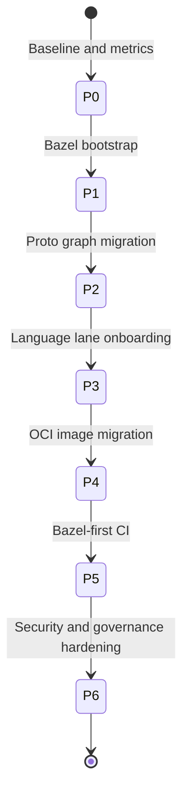

## 12.2 CI evolution diagram


## 12.3 Multi-language onboarding wave diagram

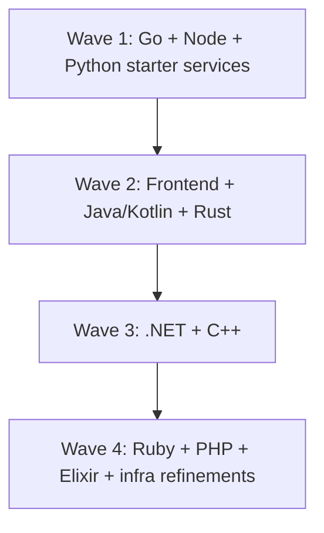

---

## 13) Language-specific build behavior: default vs Bazel integration

## 13.1 Comparative table

| Language | Default ecosystem behavior | Bazel integration strategy | Advanced considerations |
|---|---|---|---|
| Go | module graph in `go.mod`; package compile/test | `go_library`, `go_binary`, `go_test`; proto deps in graph | strict deps, cross-compilation profiles |
| Node/TS | package manager + script lifecycle | explicit package lock ingestion; TS/JS build/test targets | Cypress sandboxing, Next.js cache tuning |
| Python | pip + requirements; runtime scripts | hermetic py deps + `py_library`/`py_binary` style targets | wheel caching, interpreter constraints |
| Java/Kotlin | Gradle tasks and wrapper | JVM targets in Bazel, proto/jar graph integration | annotation processing, toolchain pinning |
| .NET | `dotnet restore/build/publish` | staged wrappers then deeper native rule usage | SDK pinning and NuGet lock strategy |
| Rust | cargo build/test with lockfile | crate targets and tests in Bazel | reproducibility and feature-flag matrix |
| C++ | CMake/make toolchain and flags | native C++ Bazel rules + pinned toolchain | ABI settings, remote cache compatibility |
| Ruby | bundler dependency install and app run | deterministic wrapper lane in Bazel | gem cache hermeticity |
| PHP | composer + runtime packaging | wrapper lane with explicit lock + packaging | extension/runtime compatibility |
| Elixir | mix deps/compile/release | staged wrappers for mix/phoenix release | BEAM/runtime version constraints |

---

## 14) Test architecture for this repository

## 14.1 Test graph model

```mermaid
flowchart TD
    T0[//... tests] --> T1[unit]
    T0 --> T2[integration]
    T0 --> T3[e2e]
    T0 --> T4[trace]
    T0 --> T5[manual/slow]
    T2 --> T4
    T3 --> T5
```

## 14.2 Planned mapping

- Unit tests:
  - Go service tests
  - Elixir tests
  - future expanded tests in .NET/Java/Kotlin/Python/Node lanes
- Integration tests:
  - trace test suite wrappers in `test/tracetesting`
- E2E tests:
  - frontend Cypress targets

## 14.3 Test execution profiles

| Profile | Included tags | Excluded tags | Typical usage |
|---|---|---|---|
| `fast` | `unit` | `slow,manual,trace,e2e` | PR quick checks |
| `standard` | `unit,integration` | `manual,slow` | main branch |
| `extended` | `unit,integration,trace,e2e` | `manual` | nightly/pre-release |
| `release` | all required by release policy | `manual` unless explicitly called | release pipeline |

---

## 15) OCI image architecture

## 15.1 Image assembly model

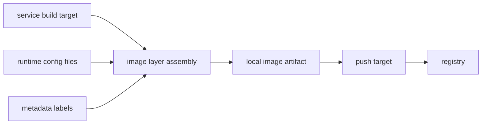

## 15.2 Policy model per image

Mandatory checks before publish:

- Base image allowlist policy pass
- Vulnerability severity gate pass
- SBOM generated
- provenance metadata generated
- naming/tag policy pass

---

## 16) Security architecture (Bazel + CI)

## 16.1 Security pipeline diagram

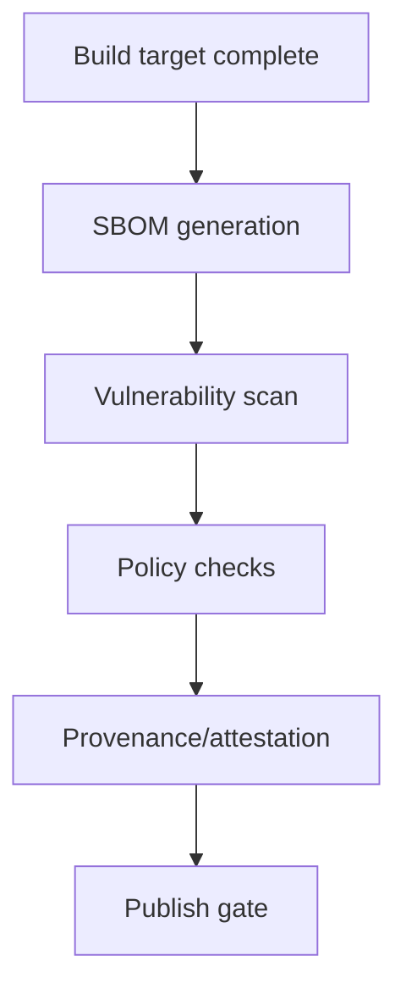

## 16.2 Security controls matrix

| Control | Scope | Gate type |
|---|---|---|
| Dependency version pinning | module + language deps | blocking |
| License policy | source and dependencies | blocking |
| Vulnerability threshold | image + dependency graph | blocking for high/critical release profile |
| Provenance | release artifacts | blocking release |
| Image metadata policy | all publishable images | blocking |

---

## 17) CI/CD architecture: GitHub Actions and future Zuul

## 17.1 GitHub Actions target architecture

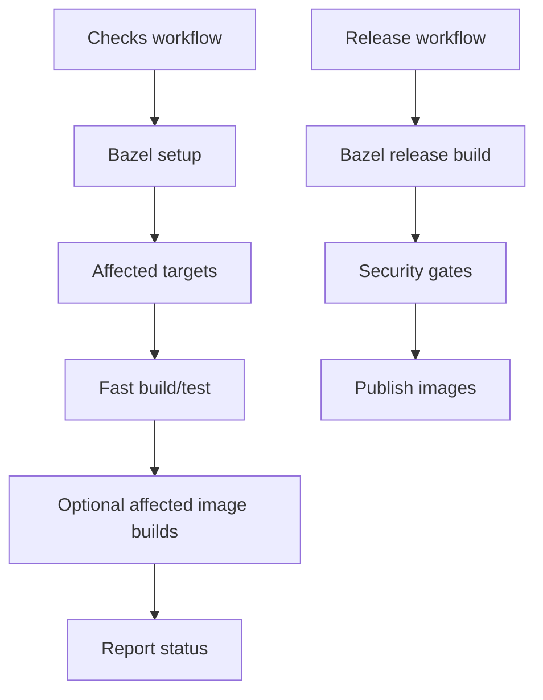

## 17.2 Zuul-ready architecture

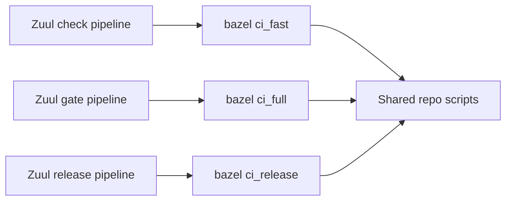

Design point:

- CI orchestrator can change (GitHub Actions, Zuul), but build engine and target contracts stay Bazel-centric.

---

## 18) Planned folder-level diagrams by key domains

## 18.1 `pb/` domain diagram

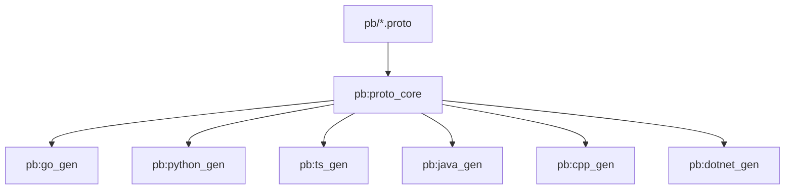

## 18.2 `src/` domain diagram

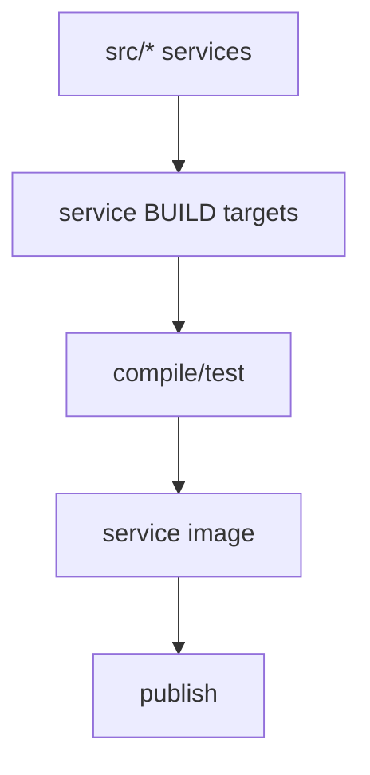

## 18.3 `test/` domain diagram

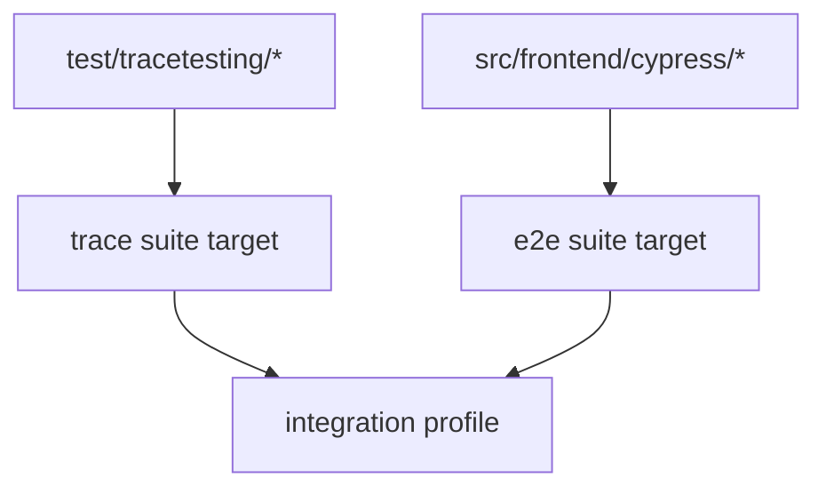

---

## 19) Build and dependency graph conventions

Conventions:

1. Every service target explicitly declares dependencies.
2. Shared proto and utility dependencies are centralized to avoid drift.
3. No implicit transitive dependency reliance in service targets.
4. Test targets must consume the same artifacts used by runtime image targets where applicable.

Graph hygiene:

- No cyclic dependencies between service packages.
- Strict layer ordering:
  - proto/common -> service libs -> service bins -> images -> publish.

---

## 20) Migration planning tables by implementation step

## 20.1 Step catalog

| Step | Scope | Output artifact | Validation command |
|---|---|---|---|
| S1 | bootstrap | root Bazel config files | `bazelisk info` |
| S2 | proto | `pb` build graph | `bazelisk build //pb:all` |
| S3 | first services | Go/Node/Python initial targets | `bazelisk build //src/...` subset |
| S4 | test integration | test tags and suites | `bazelisk test //... --test_tag_filters=unit` |
| S5 | image integration | OCI targets for migrated services | `bazelisk build //src/<svc>:<svc>_image` |
| S6 | CI rollout | bazel fast/full scripts | CI passing in PR/main |
| S7 | security gates | sbom/scan/provenance steps | release candidate policy pass |
| S8 | Zuul portability | shared scripts and jobs | equivalent check/gate results |

## 20.2 Service onboarding checklist template

| Checklist item | Status |
|---|---|
| `BUILD.bazel` added | pending |
| compile target passes | pending |
| test target passes | pending |
| image target passes | pending |
| CI fast profile includes service | pending |
| CI full profile includes service | pending |
| security policy checks mapped | pending |

---

## 21) Advanced architecture options (future-ready)

1. Remote cache and remote execution separation:
   - cache first for immediate gains
   - remote execution for heavy compile lanes later
2. Build event protocol ingestion:
   - export BEP data for observability dashboarding
3. Monorepo ownership metadata:
   - map service ownership to Bazel packages for targeted approvals
4. Incremental policy strictness:
   - warning mode -> blocking mode with controlled rollout
5. Deterministic release promotion:
   - promote digest-addressed artifacts from candidate to production tags

---

## 22) Risks, constraints, and design mitigations

| Risk | Impact | Mitigation |
|---|---|---|
| Some language lanes have weaker native Bazel ecosystem support | slower migration | staged wrappers with hermetic boundaries |
| Parallel CI during migration increases complexity | temporary maintenance overhead | strict phase exit criteria |
| Team familiarity gap | adoption friction | templates, macros, short command catalog |
| Non-hermetic scripts bypass graph guarantees | reproducibility risk | move scripts under Bazel actions and policy checks |
| Test flakiness in integration/e2e | noisy CI | tag strategy + retry policy + quarantine lane |

---

## 23) Architecture acceptance criteria

This target architecture is considered ready when:

1. A majority of `src/` services have Bazel build targets with parity.
2. Proto generation/consumption is Bazel-graph-driven.
3. CI default checks are Bazel-first for build/test.
4. OCI image publish pipeline is Bazel orchestrated for migrated services.
5. Security gates are integrated in release path.
6. Same Bazel scripts can run in both GitHub Actions and Zuul job models.

---

## 24) Executive technical summary

This architecture gives a realistic path from current OpenTelemetry Astronomy Shop build reality to a high-end Bazel monorepo platform:

- It preserves current runtime practices while modernizing build/test.
- It handles polyglot complexity through clear layering and conventions.
- It introduces reproducibility, incremental CI, and stronger supply-chain controls.
- It is CI-orchestrator agnostic, enabling future Zuul gated workflows without changing build semantics.

This is precisely the kind of design that demonstrates senior Bazel platform engineering capability in a real, complex monorepo.

