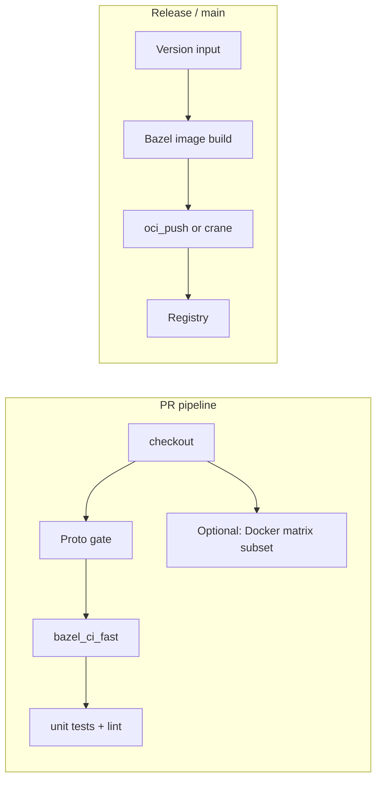

# M4 milestone — CI Bazel-first; image matrix alignment; test and push depth

This document is the **M4 milestone playbook** for `docs/planification/5-bazel-migration-task-backlog.md`. It mirrors the role of **`m3-completion.md`**, but for the next program phase:

1. **Summarizes** the **end-of-M3 state** in this fork (what is already true before M4 work starts).  
2. **Maps** every backlog item tagged **M4** (and adjacent **M5** items that touch M4 sequencing) to **concrete deliverables**.  
3. **Plans** **CI architecture**, **local commands**, **tagging/push semantics**, **ordering**, and **risks** so implementers can execute without guesswork.

> **Backlog definition — M4:**  
> *“CI default path is Bazel-first (build/test); Docker matrix reduced or delegated.”*  
> (`docs/planification/5-bazel-migration-task-backlog.md` §2.)

M4 is **not** “rebuild every service from scratch”: M3 already added **`bazel build` / `bazel test` / `oci_image`** for the majority of application services. M4 **shifts the authority** of PR and release pipelines toward Bazel, **aligns** published image names with the existing **`component-build-images.yml`** contract where agreed, and **closes** remaining test and automation gaps called out in the backlog.

### Implementation status (this fork — M4 slice landed)

| Deliverable | Status | Where |
|-------------|--------|--------|
| **BZ-611** `ci_full.sh` / `ci_fast.sh` | **Done** | **`tools/bazel/ci/`**, **`tools/bazel/ci/README.md`** |
| **BZ-613** PR Bazel disk cache | **Done** | **`.github/workflows/checks.yml`** → **`bazel_ci`** |
| **BZ-612** affected-targets script | **Done** | **`tools/bazel/ci/affected_targets.sh`** (hint step on PRs) |
| **Blocking Bazel CI** | **Done** | Job **`bazel_ci`** replaces **`bazel_smoke`** (`continue-on-error` removed) |
| **BZ-081** cart xUnit | **Done** | **`//src/cart:cart_dotnet_test`**, **`run_cart_dotnet_test.sh`** |
| **BZ-122** matrix doc | **Done** | **`docs/bazel/oci-policy.md`** § BZ-122 |
| **BZ-123** push pattern | **Done** | **`//src/checkout:checkout_push`**, **`docs/bazel/oci-registry-push.md`** |
| **BZ-110** infra inventory | **Done** | **`docs/bazel/service-tracker.md`** § Infra |
| **Epic K BZ-100–103** closure note | **Done** | **`docs/planification/5-bazel-migration-task-backlog.md`** fork note |
| **BZ-131** Cypress in Bazel | **Deferred** | **`docs/bazel/frontend-cypress-bazel.md`** |
| **BZ-631** Dockerfile matrix replacement | **M4 closed (delegation)** | Registry = Dockerfile matrix; **Bazel** = **`ci_full.sh`** proof; **phase 2** = optional **`oci_push`** rows (**§16**) |
| **BZ-133** full `//...` unit sweep | **Done (M5)** | **`ci_full.sh` / `ci_fast.sh`** use **`bazel test //... --config=unit --build_tests_only`**; **`//src/frontend:lint`** tagged **`unit`** |

### Formal closure (this fork)

For **program tracking**, this repository treats **M4 as complete** for the **scoped** definition in **`m4-completion.md`**: **blocking Bazel CI** (**`bazel_ci`** + **`ci_full.sh`**), **BZ-081**, **BZ-110** inventory, **BZ-122** documentation, **BZ-123** push **pattern**, **BZ-611–613**, and **explicit deferral** of **BZ-131** (see **`docs/bazel/frontend-cypress-bazel.md`**).

The **verbatim** backlog line *“Docker matrix reduced or delegated”* is satisfied here by **delegation**: **registry / multi-arch** images remain **`component-build-images.yml`** (**Dockerfile** matrix); **Bazel** **`oci_image`** graphs are **proven on every PR** via **`ci_full.sh`**. **Reducing** matrix rows in favor of **`oci_push`** is **optional hardening** (**BZ-631** phase 2) — see [§16](#16-questions-only-maintainers-can-answer-strict-m4--phase-2).

---

## Table of contents

1. [End-of-M3 snapshot (handoff)](#1-end-of-m3-snapshot-handoff)  
2. [M4 success criteria](#2-m4-success-criteria)  
3. [M4 backlog task matrix](#3-m4-backlog-task-matrix)  
4. [Target architecture — CI and artifacts](#4-target-architecture--ci-and-artifacts)  
5. [Workstream A — Epic I: .NET `cart` tests (BZ-081)](#5-workstream-a--epic-i-net-cart-tests-bz-081)  
6. [Workstream B — Epic K: backlog closure (BZ-100–103)](#6-workstream-b--epic-k-backlog-closure-bz-100103)  
7. [Workstream C — Epic L: infra / config images (BZ-110)](#7-workstream-c--epic-l-infra--config-images-bz-110)  
8. [Workstream D — Epic M: image rollout + push (BZ-122, BZ-123)](#8-workstream-d--epic-m-image-rollout--push-bz-122-bz-123)  
9. [Workstream E — Epic N: frontend E2E and unit consolidation (BZ-131, BZ-133)](#9-workstream-e--epic-n-frontend-e2e-and-unit-consolidation-bz-131-bz-133)  
10. [Workstream F — Epic O: CI scripts, cache, matrix (BZ-611–613, BZ-631)](#10-workstream-f--epic-o-ci-scripts-cache-matrix-bz-611613-bz-631)  
11. [JVM and Python test depth (optional M4 stretch)](#11-jvm-and-python-test-depth-optional-m4-stretch)  
12. [Suggested order inside M4](#12-suggested-order-inside-m4)  
13. [Verification cheat sheet](#13-verification-cheat-sheet)  
14. [Risks, scope boundaries, and M5 handoff](#14-risks-scope-boundaries-and-m5-handoff)  
15. [Related documents](#15-related-documents)  
16. [Questions only maintainers can answer (strict M4 / phase 2)](#16-questions-only-maintainers-can-answer-strict-m4--phase-2)

---

## 1. End-of-M3 snapshot (handoff)

**Authoritative narrative:** `docs/bazel/milestones/m3-completion.md`.

**Per-service table:** `docs/bazel/service-tracker.md`.

**OCI policy and base digests:** `docs/bazel/oci-policy.md` and root **`MODULE.bazel`** (`oci.pull`).

### 1.1 What M3 already delivered (this fork)

| Area | State |
|------|--------|
| **Application services** | Go (**checkout**, **product-catalog**), Node (**payment**, **frontend**), Python ×4, JVM (**ad**, **fraud-detection**), .NET (**accounting**, **cart** build+image), Rust (**shipping**), C++ (**currency**), Ruby (**email**), Elixir (**flagd-ui**), PHP (**quote**), Envoy (**frontend-proxy**), nginx (**image-provider**), Expo (**react-native-app** — JS checks + optional APK) have documented **`BUILD.bazel`** graphs per **M3** doc. |
| **Images** | **`rules_oci`** **`oci_image`** + **`oci_load`** (and **`repo_tags`** like **`otel/demo-<svc>:bazel`**) for migrated services; see **M3** §9 and **BZ-097** §7.7 / §9.14. |
| **Tests** | **`go_test`**, **`rust_test`**, **`cc_test`**, **`rb_test`**, various **`sh_test`** smokes, **`//src/frontend:lint`**, tagged per **`docs/bazel/test-tags.md`** (**BZ-130**). |
| **CI today (post-M4)** | **`.github/workflows/checks.yml`** job **`bazel_ci`** (**blocking**) runs **`tools/bazel/ci/ci_full.sh`** with **Bazel disk cache** (**BZ-613**). |
| **Docker image matrix** | **`.github/workflows/component-build-images.yml`** remains the **registry** path (multi-arch **Dockerfile** builds). **Bazel** proves **`oci_image`** targets in **`ci_full.sh`**; **dual-build** matrix: **`docs/bazel/oci-policy.md`** (**BZ-122**). |

### 1.2 Explicit gaps carried into M4

| Gap | Backlog anchor |
|-----|----------------|
| ~~**`bazel_smoke` is non-blocking**~~ | **Addressed:** job **`bazel_ci`** runs **`ci_full.sh`** and is **required** (see **`checks.yml`**). |
| ~~**No `bazel test //src/cart/...` for xUnit**~~ | **Addressed:** **`//src/cart:cart_dotnet_test`**. |
| **Image tags: `:bazel` vs upstream** | **Documented** (**BZ-122** table in **`oci-policy.md`**); Compose/registry still use Dockerfile matrix tags. |
| **`oci_push` in release workflows** | **Pattern** added (**`checkout_push`**); **BZ-633** (M5) wires **`release.yml`**. |
| **Cypress not a Bazel target** | **Deferred** — **`docs/bazel/frontend-cypress-bazel.md`** (**BZ-131**). |
| **`component-build-images.yml` Dockerfile-first for publish** | **Delegated** for M4 closure; **phase 2** = replace rows with **`oci_push`** / multi-arch policy (**BZ-631**). |
| **Infra images (kafka, opensearch, …)** | **BZ-110** — rows in **`docs/bazel/service-tracker.md`** § Infra. |
| **Tracetest as Bazel** | **BZ-132** — backlog **M5**; M4 may only **document** hybrid. |
| **Full `bazel test //... --config=unit` parity across every language** | **BZ-133** — **done** in **M5** (**`m5-completion.md`**); M4 advanced **cart** + **frontend** tags. |

---

## 2. M4 success criteria

Use these as **definition of done** for “M4 achieved” in this fork (adjust with maintainers if scope is trimmed):

1. **CI authority:** **Done** — **`bazel_ci`** (**blocking**) runs **`ci_full.sh`**.  
2. **BZ-081:** **Done** — **`//src/cart:cart_dotnet_test`**.  
3. **BZ-122 / BZ-631:** **Done** — matrix in **`oci-policy.md`**; **release** canonical path = **Dockerfile** matrix until phase 2; **Bazel** = local **`:bazel`** tags + CI proof build.  
4. **BZ-123 (minimal):** **Done** — **`//src/checkout:checkout_push`**, **`docs/bazel/oci-registry-push.md`**. **BZ-633** (release wiring) remains **M5**.  
5. **BZ-611:** **Done** — **`tools/bazel/ci/`**, invoked from **`checks.yml`**.  
6. **BZ-612 / BZ-613:** **Done** — **`affected_targets.sh`** (PR hint) + **`actions/cache`** on **`~/.cache/bazel`**; refresh **BZ-003** baselines when convenient.  
7. **BZ-110:** **Done** — **`docs/bazel/service-tracker.md`** § Infra.  
8. **BZ-131 (stretch):** **Deferred** with doc — **`docs/bazel/frontend-cypress-bazel.md`** (acceptable for this fork’s M4 closure).

---

## 3. M4 backlog task matrix

Tasks with **Milestone: M4** in `docs/planification/5-bazel-migration-task-backlog.md`, plus **this fork’s** alignment notes.

| Epic | ID | Task | Milestone | Acceptance criteria (from backlog) | Fork note |
|------|-----|------|-----------|-----------------------------------|-----------|
| **I** | **BZ-081** | `cart` + xUnit tests | M4 | `bazelisk test //src/cart/...` runs tests or documents skip | **Done** — **`//src/cart:cart_dotnet_test`** |
| **K** | **BZ-100** | `currency` C++ | M4 | Functional parity | **Effectively done** M3 (**BZ-092**); M4 = verify + doc closure |
| **K** | **BZ-101** | `email` Ruby | M4 | Runnable via Bazel | **Done** M3 (**BZ-093**) |
| **K** | **BZ-102** | `quote` PHP | M4 | Same | **Done** M3 (**BZ-095**) |
| **K** | **BZ-103** | `flagd-ui` Elixir | M4 | Release + tests tagged | **Done** M3 (**BZ-094**) |
| **L** | **BZ-110** | Infra services under `src/` | M4 | Each image Bazel, wrapper, or ticketed | **Done** — tracker § Infra (**Dockerfile defer**) |
| **M** | **BZ-122** | Roll out image targets / naming | M4 | Tracker matrix updated | **Done** — **`oci-policy.md`** table |
| **M** | **BZ-123** | Push targets + secrets | M4 | Release can invoke push on policy | **Done** — **`checkout_push`** + **`oci-registry-push.md`** |
| **N** | **BZ-131** | Cypress as Bazel test | M4 | Target documented | **Deferred** — **`frontend-cypress-bazel.md`** |
| **N** | **BZ-133** | Consolidate unit tests | M5 | `bazel test //... --test_tag_filters=unit` | M4 **contributes** cart + any new **`unit`** targets |
| **O** | **BZ-611** | `ci_fast.sh` / `ci_full.sh` | M4 | Documented; runnable locally | **Done** |
| **O** | **BZ-612** | `affected_targets.sh` | M4 | Used in PR workflow | **Done** (hint step) |
| **O** | **BZ-613** | PR cache | M4 | Measurable improvement documented | **Done** (cache action; refresh **BZ-003** optionally) |
| **O** | **BZ-631** | `component-build-images.yml` Bazel matrix | M4 | N services on Bazel path | **M4 closed** — **delegation** (Dockerfile publish + Bazel proof in **`ci_full`**); **matrix replacement** = phase 2 (**§16**) |

**Out of M4 strict scope (backlog):** **BZ-132** (Tracetest) **M5**; **BZ-633** (release publish) **M5**; **BZ-720+** security **M5**.

---

## 4. Target architecture — CI and artifacts

### 4.1 Conceptual flow



- **M4 goal:** **`bazel_ci_fast`** (name TBD) becomes the **primary** signal for **build + unit tests** on PRs.  
- **Docker matrix** (**`component-build-images.yml`**) either **shrinks** (services moved to Bazel) or **remains** for non-migrated / infra images until **BZ-110** catches up.

### 4.2 Artifact naming (BZ-122)

Today Bazel **`oci_load`** uses tags such as **`otel/demo-checkout:bazel`**. Upstream demo images typically use **`otel/demo-<service>:<version>`** and **`ghcr.io/open-telemetry/demo/...`**.

**M4 decision record (to implement in docs + CI):**

| Concern | Option A | Option B |
|---------|----------|----------|
| **Local dev** | Keep **`:bazel`** suffix to avoid clashing with Docker-loaded **`:latest`** | Same tag as Compose; overwrite locally only |
| **CI publish** | **`oci_push`** with **`repo_tags`** = matrix **`tag_suffix`** + **`version`** input | Dual publish (Dockerfile + Bazel) during transition |
| **Multi-arch** | Bazel **linux/amd64** only first (current pattern in many `oci_image` **base** labels) | **`platform`** transitions + multi-arch manifest (harder) |

Document the chosen row in **`docs/bazel/oci-policy.md`** when BZ-122 closes.

### 4.3 Where scripts live

| Path | Purpose |
|------|--------|
| **`tools/bazel/ci/ci_fast.sh`** | PR path: e.g. `bazelisk test //... --config=ci` with tag filters, plus **`bazelisk build`** for image targets that must stay green |
| **`tools/bazel/ci/ci_full.sh`** | Optional nightly / pre-release: broader `bazelisk build //...` or full image build |
| **`tools/bazel/ci/affected_targets.sh`** | Input: base ref + head ref; output: list of Bazel targets or query expression |

---

## 5. Workstream A — Epic I: .NET `cart` tests (BZ-081)

**Goal:** `bazel test` runs **`src/cart/tests/cart.tests.csproj`** (xUnit) with **`tags = ["unit"]`** (and likely **`requires-network`** if restore hits NuGet — align with **`dotnet_publish`**).

**Approach options:**

1. **`sh_test`** wrapper: invoke **`dotnet test`** on the test project with **`DOTNET_ROOT`** / SDK discovery mirroring **`//tools/bazel:dotnet_publish.bzl`**.  
2. **Community / future `rules_dotnet`** test rule if the repo adopts it for **.NET 10**.  
3. **`genrule` / `run_binary`** — less ideal for test caching.

**CI:** Once the target exists, add it to **`ci_fast.sh`** and to **`checks.yml`** (or the blocking Bazel job).

**Commands (implemented):**

```bash
bazel test //src/cart:cart_dotnet_test --config=ci
bazel test //src/cart:cart_dotnet_test --config=unit
```

Requires **.NET 10** SDK on **`PATH`** / **`DOTNET_ROOT`** (same as **`cart_publish`**).

---

## 6. Workstream B — Epic K: backlog closure (BZ-100–103)

No greenfield implementation required for **email**, **quote**, **flagd-ui**, **currency** in this fork — they match M3 deliverables (**BZ-092–095** numbering in **`m3-completion.md`**).

**M4 tasks:**

- Update **`docs/planification/5-bazel-migration-task-backlog.md`** cross-reference or add a **fork note** that **BZ-100–103** are satisfied by **BZ-092–095** work (avoid duplicate epics).  
- **`service-tracker.md`**: ensure **CI** column reflects **blocking** vs **non-blocking** when M4 flips CI.

---

## 7. Workstream C — Epic L: infra / config images (BZ-110)

**Scope (backlog):** Map **non-app** services — examples: **`src/kafka`**, **`src/opensearch`**, plus grafana, jaeger, prometheus, postgresql, otel-collector, flagd under **`src/`** (tracker currently excludes some).

**Per service, choose one:**

| Strategy | When to use |
|----------|-------------|
| **`oci_image` from public base + `pkg_tar`** | Config files are static and licensing allows redistribution |
| **`genrule` + `docker build` passthrough** | Complex upstream Dockerfile; temporary bridge |
| **Explicit defer** | Low value for Bazel; keep Dockerfile matrix only |

**Deliverable:** `docs/bazel/service-tracker.md` (or **`oci-policy.md`**) section **Infra images** with columns: **Path**, **Strategy**, **Bazel target** (or **—**), **Ticket**.

---

## 8. Workstream D — Epic M: image rollout + push (BZ-122, BZ-123)

### 8.1 BZ-122 — Naming and matrix documentation

1. Produce a **single table**: service **`tag_suffix`** (from **`component-build-images.yml`**) ↔ **`oci_load` `repo_tags`** ↔ Dockerfile path.  
2. Decide **canonical** image for **compose** when both exist.  
3. Update **`docs/bazel/oci-policy.md`** **Pilot** / rollout section.

### 8.2 BZ-123 — Push pattern

**`rules_oci`** provides **`oci_push`** (see BCR docs for current API). Typical shape:

- **Authenticate** in CI with **`docker/login-action`** or **`crane auth`**.  
- **Run** `bazel run //src/<svc>:<svc>_push` with **`--repo_tags`** override **or** fixed tags in **`BUILD.bazel`**.

**Secrets (document in `docs/bazel/` or internal runbook):**

- **`GITHUB_TOKEN`** (GHCR) vs **Docker Hub** PAT.  
- **Read-only** vs **write** on **`main`** / **tag** only.

**M4 minimum:** one **`oci_push`** target documented + optional workflow dispatch; **full** **`release.yml`** integration = **BZ-633 (M5)**.

---

## 9. Workstream E — Epic N: frontend E2E and unit consolidation (BZ-131, BZ-133)

### 9.1 BZ-131 — Cypress

**Current:** **`npm_frontend`** uses **`lifecycle_hooks_exclude = ["cypress"]`** so Bazel does not download Cypress in default installs (**M3** frontend doc).

**Options:**

- **`js_test`** or **`sh_test`** that runs **`npx cypress run`** with **`tags = ["e2e", "manual"]`** initially.  
- Headed vs headless; CI runner may need **browser deps** or **Cypress Docker image** — document constraints.

### 9.2 BZ-133 — Unit consolidation (M4 slice)

- Add **`cart`** tests (**BZ-081**).  
- Optionally **`java_test`** / **`kt_jvm_test`** stubs for JVM services (larger scope — see §11).  
- Ensure **`docs/bazel/test-tags.md`** lists all **`unit`** targets after changes.

**Command:**

```bash
bazel test //... --test_tag_filters=unit --config=ci
```

*(May exclude **`manual`** or **`no-sandbox`** tests per `.bazelrc` — document actual flags.)*

---

## 10. Workstream F — Epic O: CI scripts, cache, matrix (BZ-611–613, BZ-631)

### 10.1 BZ-611 — `ci_fast.sh` / `ci_full.sh`

**Suggested `ci_fast.sh` contents (evolve as needed):**

```bash
#!/usr/bin/env bash
set -euo pipefail
cd "$(dirname "$0")/../../.."
bazelisk build //:smoke --config=ci
bazelisk build //pb:demo_proto //pb:go_grpc_protos //pb:demo_py_grpc //pb:demo_java_grpc --config=ci
# …delegate to a single file listing “M4 PR gate” targets, or use tag filters…
bazelisk test //... --config=ci --test_tag_filters=unit,-manual
```

**`ci_full.sh`:** extend with **all** `*_image` targets or **`bazel build //src/...`** patterns used in today’s **`bazel_smoke`**.

### 10.2 BZ-612 — Affected targets

**Techniques:**

- **`bazel cquery`** with **`rdeps(//..., //path/...)`** on changed paths from `git diff --name-only`.  
- Or **Path** filters in Actions + **fixed** target list per area (simpler, less optimal).

**Output:** newline-separated labels for **`bazel test $(cat targets.txt)`**.

### 10.3 BZ-613 — Cache

- **GitHub Actions:** `actions/cache@v4` keyed on **`MODULE.bazel.lock`**, **`.bazelversion`**, OS.  
- **Paths:** `~/.cache/bazel` **or** explicit **`--disk_cache`** directory in repo **`.gitignore`**.

### 10.4 BZ-631 — `component-build-images.yml`

**Migration pattern:**

- Add **parallel** job **or** matrix row: **“Bazel build image for service X”** → load / push with same **`version`** / **`tag_suffix`** as Docker row.  
- **Remove** Docker row only when Bazel path is **verified** on **main** for enough releases.

---

## 11. JVM and Python test depth (optional M4 stretch)

Not strictly **M4** in backlog for **BZ-070/071** / **BZ-061**, but often requested:

| Area | Idea |
|------|------|
| **JVM** | Add **`java_test`** / **`kt_jvm_test`** under **`src/ad`**, **`src/fraud-detection`** for existing unit tests (if any) or smoke tests |
| **Python** | Add **`py_test`** for **`recommendation`**, **`product-reviews`**, etc., when test modules exist |

Track as **optional** if **BZ-133** M5 deadline is tight.

---

## 12. Suggested order inside M4

1. **BZ-611** — scripts that **encode** the same commands as **`bazel_smoke`** (thin refactor, low risk).  
2. **BZ-081** — **`cart`** tests (unblocks **BZ-133** slice).  
3. **BZ-122** — documentation matrix + tag naming decision.  
4. **BZ-631** — wire **one** service image in **`component-build-images.yml`** via Bazel as proof.  
5. **BZ-123** — **`oci_push`** pattern + secrets doc.  
6. **BZ-612 / BZ-613** — affected + cache on PR workflow.  
7. **Promote Bazel job** from **`continue-on-error: true`** to **required** (coordinate with maintainers).  
8. **BZ-110** — infra inventory rows.  
9. **BZ-131** — Cypress Bazel (or documented deferral).  
10. **Epic K** — backlog / tracker closure for **BZ-100–103**.

---

## 13. Verification cheat sheet

**Local (developer):**

```bash
# After scripts land:
./tools/bazel/ci/ci_fast.sh

# Full local parity with current smoke (until scripts absorb it):
bazelisk build //:smoke --config=ci
bazelisk test //... --test_tag_filters=unit --config=ci
```

**Proto (unchanged from M1):**

```bash
bazelisk build //pb:demo_proto //pb:go_grpc_protos --config=ci
```

**Images (sample):**

```bash
bazelisk build //src/checkout:checkout_image --config=ci
bazelisk run //src/checkout:checkout_load
```

**`oci_push` (checkout):**

```bash
bazelisk run //src/checkout:checkout_push -- --repository ghcr.io/myorg/demo --tag dev
```

See **`docs/bazel/oci-registry-push.md`**.

---

## 14. Risks, scope boundaries, and M5 handoff

| Risk | Mitigation |
|------|------------|
| **Flaky `dotnet test` / NuGet** | Tag **`requires-network`**, cache NuGet in CI |
| **Duplicate CI time** (Docker + Bazel) | Phase migration: Bazel-only for migrated services, then drop Docker rows |
| **Multi-arch drift** | Document **amd64-first**; add **arm64** in M5/M6 if needed |
| **Cypress size** | Keep **`manual`** / nightly job |

**M5 (see `m5-completion.md`):** **BZ-133** unit sweep, **BZ-633**/**720**/**721**/**722**/**800**/**811**/**810**/**812** landed in this fork; **BZ-132** Tracetest and strict scan gating remain follow-ups.

---

## 15. Related documents

| Document | Purpose |
|----------|---------|
| `docs/planification/5-bazel-migration-task-backlog.md` | Task IDs and milestone boundaries |
| `docs/bazel/milestones/m3-completion.md` | M3 implementation narrative |
| `docs/bazel/service-tracker.md` | B/T/I/CI per service + **BZ-110** infra table |
| `docs/bazel/oci-policy.md` | BZ-120 / BZ-122 dual matrix |
| `docs/bazel/oci-registry-push.md` | **BZ-123** **`oci_push`** / secrets |
| `docs/bazel/frontend-cypress-bazel.md` | **BZ-131** deferral notes |
| `docs/bazel/test-tags.md` | BZ-130 conventions |
| `tools/bazel/ci/README.md` | **BZ-611** script usage |
| `.github/workflows/checks.yml` | **`bazel_ci`** job (**M4**) |
| `.github/workflows/component-build-images.yml` | Dockerfile matrix (**BZ-631**) |
| `docs/bazel/milestones/m5-completion.md` | **M5** playbook — release (**BZ-633**), security (**BZ-720–723**), tests (**BZ-132/133**), cache (**BZ-800**), Make/proto (**BZ-811/812**) |

---

## 16. Questions only maintainers can answer (strict M4 / phase 2)

Nothing in this section **blocks** declaring **M4 complete** for this fork (see **Formal closure** above). These are the decisions needed if you want to go **beyond** closure and match a **stricter** reading of the backlog (“**reduce** the Docker matrix” / full **BZ-631**) or expand test scope.

1. **Multi-arch:** Today many **`oci_image`** **base** labels pin **linux/amd64** only. Do you **require linux/arm64** parity with **`component-build-images.yml`** before **dropping** any Dockerfile row for a given service?  
2. **BZ-631 ordering:** Which **first** service(s) should publish via **`bazel run …:push`** (or CI **`crane`**) to **GHCR** / **Docker Hub** — **checkout** only, or a batch (e.g. Go + static binaries first)?  
3. **BZ-131 Cypress:** Should the next sprint **add** a **`manual`** **`bazel test`** / nightly job, or keep **Makefile** / **Dockerfile.cypress** only until **M5**?  
4. **BZ-633:** Is there a **hard date** or **release** after which **tagged** images must come from Bazel, or is **Dockerfile** publishing acceptable long-term alongside Bazel **proof** builds?

Reply with choices (even brief); then **Agent mode** can implement **phase 2** (workflow + **`oci_push`** rows, Cypress wrapper, or **`release.yml`** hooks) accordingly.

---

*Update this file as M4 tasks land: check off success criteria §2, adjust §12 order if dependencies change, and keep §13 commands synchronized with real target names.*
