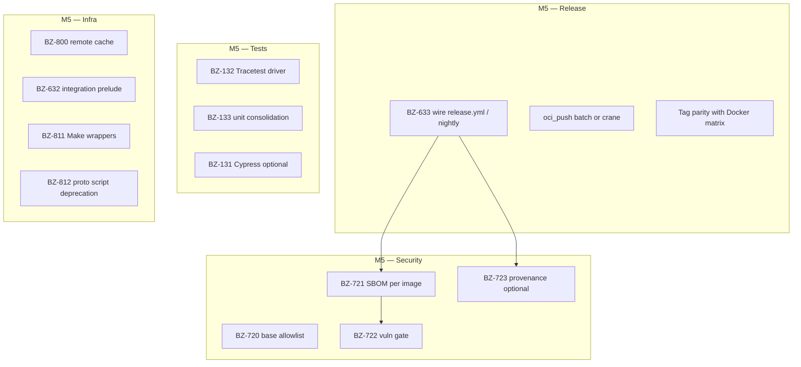
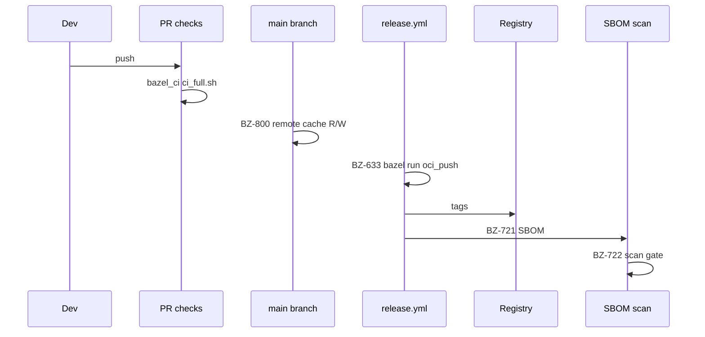

# M5 milestone — release Bazel-first; security gates; test and cache depth

This document is the **M5 milestone playbook** for `5-bazel-migration-task-backlog.md`. It mirrors **`m3-completion.md`** / **`m4-completion.md`**: backlog alignment, handoff, workstreams, commands, CI touchpoints, and **M5 vs M6** boundaries. The table below records what is **implemented in this fork**; narrative sections below remain the program guide.

### Implementation status (this fork — M5 slice landed)

| Deliverable | Status | Where |
|-------------|--------|-------|
| **BZ-633** Bazel push on release | **Done (skeleton)** | **`.github/workflows/bazel-release-oci.yml`**; optional secret **`BAZEL_CHECKOUT_PUSH_REPOSITORY`** |
| **BZ-721** SBOM | **Done (checkout)** | Same workflow — **`anchore/sbom-action`** on **`otel/demo-checkout:bazel`** |
| **BZ-722** Vulnerability scan | **Done (informational)** | **`anchore/scan-action`** with **`fail-build: false`** — tighten thresholds when waivers exist |
| **BZ-720** Base allowlist | **Done** | **`tools/bazel/policy/`**, **`docs/bazel/oci-base-allowlist.md`**, **`//tools/bazel/policy:oci_allowlist_test`** |
| **BZ-133** Unit consolidation | **Done** | **`ci_full.sh`** / **`ci_fast.sh`** → **`bazel test //... --config=unit --build_tests_only`** |
| **BZ-800** Remote cache | **Documented** | **`docs/bazel/remote-cache.md`**, **`.bazelrc`** **`try-import %workspace%/.bazelrc.user`** |
| **BZ-811** Makefile wrappers | **Done** | **`Makefile`** — **`bazel-ci-full`**, **`bazel-ci-fast`**, **`bazel-test-unit`**, **`bazel-check-oci-allowlist`** |
| **BZ-810** Contributor quickstart | **Done** | **`docs/bazel/quickstart.md`** |
| **BZ-812** Proto script notice | **Done** | **`CONTRIBUTING.md`** (Bazel subsection) |
| **BZ-632** Integration prelude | **Placeholder** | Comment in **`.github/workflows/run-integration-tests.yml`**; full compose path **TBD** with **BZ-131** / **BZ-132** |
| **BZ-131** Cypress in Bazel | **Deferred** | **`docs/bazel/frontend-cypress-bazel.md`** |
| **BZ-132** Tracetest driver | **Not started** | Backlog + **§5** below |
| **BZ-723** Provenance | **Not wired** | Org-specific; enable when **BZ-633** registry contract requires attestations |
| **BZ-631** phase 2 | **Optional** | Same **M4** delegation — expand **`oci_push`** beyond checkout when ready |

**Formal closure (this fork):** **M5** is treated as **met** for the **scoped** definition above: **release-adjacent** Bazel OCI workflow for **checkout**, **SBOM + informational scan**, **allowlist enforcement**, **unit graph consolidation**, **remote-cache docs**, **Make/CONTRIBUTING/quickstart** UX, and explicit **deferral** of **Tracetest/Cypress** drivers and **strict** vuln gating.

---

## Table of contents

1. [Backlog definition and program “Definition of Done”](#1-backlog-definition-and-program-definition-of-done)  
2. [Handoff from M4 (this fork)](#2-handoff-from-m4-this-fork)  
3. [M5 scope summary](#3-m5-scope-summary)  
4. [M5 backlog task matrix](#4-m5-backlog-task-matrix)  
5. [Epic N — Tests (BZ-132, BZ-133)](#5-epic-n--tests-bz-132-bz-133)  
6. [Epic O — CI/CD: integration + release (BZ-632, BZ-633)](#6-epic-o--cicd-integration--release-bz-632-bz-633)  
7. [Epic P — Security and supply chain (BZ-720–723)](#7-epic-p--security-and-supply-chain-bz-720723)  
8. [Epic Q — Remote cache (BZ-800)](#8-epic-q--remote-cache-bz-800)  
9. [Epic R — Make facade and proto script deprecation (BZ-811, BZ-812)](#9-epic-r--make-facade-and-proto-script-deprecation-bz-811-bz-812)  
10. [BZ-631 phase 2 (optional M5 track)](#10-bz-631-phase-2-optional-m5-track)  
11. [BZ-131 Cypress (carryover from M4 deferral)](#11-bz-131-cypress-carryover-from-m4-deferral)  
12. [Target architecture (release + security + tests)](#12-target-architecture-release--security--tests)  
13. [Suggested implementation order inside M5](#13-suggested-implementation-order-inside-m5)  
14. [Verification cheat sheet](#14-verification-cheat-sheet)  
15. [Risks, dependencies, and M6 handoff](#15-risks-dependencies-and-m6-handoff)  
16. [Related documents](#16-related-documents)

---

## 1. Backlog definition and program “Definition of Done”

### 1.1 Milestone M5 (§2 program table)

> **M5:** *Release path Bazel-first; security gates (SBOM/scan/policy) wired.*

### 1.2 Whole-program Definition of Done (backlog §23) — M5-relevant bullets

| # | Criterion | M5 role |
|---|-----------|---------|
| 3 | **Release** publishes images built via **Bazel** (**BZ-633**) | **Core M5** |
| 5 | **Security** minimum: **SBOM** + **scan** on release images (**BZ-721–722**); **provenance** if required (**BZ-723**) | **Core M5** |
| 6 | **Documentation**: **BZ-812** legacy script sunset; **BZ-810** contributor path (may need refresh) | **M5 / doc** |
| 2 | CI **Bazel fast path** (**BZ-613**) | **Largely M4 done**; M5 may add **remote cache** (**BZ-800**) |
| 1 | Tracker **B+T+I** | **Ongoing**; **BZ-133** tightens **test** discovery |
| 4 | **Proto** single-path | **Policy**; may overlap **BZ-812** / codegen docs |
| 7 | **BZ-814** metrics retrospective | **M6** (depends on M5 achieved) — list as **post-M5** |

---

## 2. Handoff from M4 (this fork)

**Authoritative M4 narrative:** `docs/bazel/milestones/m4-completion.md` (**Formal closure** + **§16** maintainer questions for phase 2).

| Area | State at end of M4 |
|------|---------------------|
| **PR CI** | **`bazel_ci`** blocking; **`tools/bazel/ci/ci_full.sh`**; disk **cache** on **`~/.cache/bazel`** |
| **Cart tests** | **`//src/cart:cart_dotnet_test`** (**BZ-081**) |
| **Image proof** | **`ci_full.sh`** builds **`oci_image`** targets; **registry** still **`component-build-images.yml`** (**Dockerfile** matrix) — **delegation** |
| **Push pattern** | **`//src/checkout:checkout_push`** + **`docs/bazel/oci-registry-push.md`** (**BZ-123**); **also** **`bazel-release-oci.yml`** (**BZ-633**) with optional registry secret |
| **Cypress** | **Deferred** — **`docs/bazel/frontend-cypress-bazel.md`** (**BZ-131**) |
| **Tracetest** | Not Bazel-driven yet — **BZ-132** |
| **Unit sweep** | **`ci_full.sh`** runs **`bazel test //... --config=unit --build_tests_only`** (**BZ-133**) |

**Implication for M5:** the **release** and **security** epics are the main **new** muscle; **tests** (**132/133**) and **integration workflow** (**632**) depend on **compose + images** strategy.

---

## 3. M5 scope summary



**Out of explicit M5 backlog (M6):** **BZ-801** (RBE), **BZ-813** (Zuul blueprint), **BZ-814** (final retro). Mention them only as **follow-ups**.

---

## 4. M5 backlog task matrix

| Epic | ID | Task | Milestone | Acceptance criteria (from backlog) | Fork / dependency notes |
|------|-----|------|-----------|-----------------------------------|-------------------------|
| **N** | **BZ-132** | Tracetest as Bazel test or **`sh_test`** driver | M5 | CI can invoke trace tests via Bazel or **documented hybrid** | Depends on **BZ-130**; compose / image source must be defined (**BZ-632** aligns) |
| **N** | **BZ-133** | Consolidate unit tests under **`bazel test`** | M5 | **`bazelisk test //... --test_tag_filters=unit`** runs **all** unit tests | Add **`py_test`**, **`java_test`**, etc. where missing; tag **`unit`** |
| **O** | **BZ-632** | **`run-integration-tests.yml`**: optional Bazel prelude | M5 | Integration workflow passes; Bazel-built images when **flag** enabled | Backlog **depends on BZ-131, BZ-132** — order: **BZ-131** or document Cypress still Docker; then **132/632** |
| **O** | **BZ-633** | **Release / nightly** call Bazel **push** targets | M5 | **Tagged releases** publish **Bazel-built** images | Depends on **BZ-123** (pattern exists: **`checkout_push`**) |
| **P** | **BZ-720** | Base image **allowlist** + label policy | M5 | **Documented list**; **enforced** on Bazel image targets | Depends on **BZ-120** |
| **P** | **BZ-721** | **SBOM** per published image | M5 | **SBOM artifact** per release image | Depends on **BZ-123** |
| **P** | **BZ-722** | **Vulnerability scan** gate | M5 | CI **fails** per policy; **waivers** documented | Depends on **BZ-721** |
| **P** | **BZ-723** | **Provenance / attestation** | M5 | Attestation stored (**optional org**) | Depends on **BZ-633** |
| **Q** | **BZ-800** | **Remote cache** endpoint + auth | M5 | **Documented** `.bazelrc` override; **CI** uses secrets | Depends on **BZ-613** (local cache done M4) |
| **R** | **BZ-811** | **Makefile** thin wrappers | M5 | **`make bazel-build`**, etc.; **documented** | Depends on **M4 scope agreed** (done) |
| **R** | **BZ-812** | Deprecation schedule **proto** helper scripts | M5 | **README/CONTRIBUTING** notice; **sunset date** | Depends on **BZ-038** |

**M4 backlog items often continued in M5 (not duplicated as new IDs):**

| ID | Note |
|----|------|
| **BZ-131** | Milestone **M4** in backlog; **deferred** in this fork — treat as **prerequisite or parallel** to **BZ-632** |
| **BZ-631** | Milestone **M4**; this fork **closed** via **delegation** — **phase 2** (Bazel rows / **`oci_push`** in matrix) is a **strong M5 enabler** for **BZ-633** |

---

## 5. Epic N — Tests (BZ-132, BZ-133)

### 5.1 BZ-132 — Tracetest

| Field | Detail |
|-------|--------|
| **Goal** | Run **`test/tracetesting`** (or equivalent) from a **Bazel**-invoked driver so CI has a single orchestration story. |
| **Options** | (a) **`sh_test`** that starts compose + runs tracetest CLI; (b) **`genrule`/`run_binary`** wrapper; (c) **documented hybrid** — Makefile entry remains canonical until deps are hermetic. |
| **Inputs** | **`run-integration-tests.yml`** today; **`docker compose`** images (Dockerfile-built vs Bazel-loaded — **BZ-632**). |
| **Acceptance** | At least one path: **`bazel test //...`** **or** workflow step documented with same contracts as **`make run-tracetesting`**. |
| **Tags** | Likely **`integration`** or **`trace`**, **`manual`** initially; not **`unit`**. |

### 5.2 BZ-133 — Unit consolidation

| Field | Detail |
|-------|--------|
| **Goal** | **`bazel test //... --test_tag_filters=unit`** runs **every** intended unit test (no silent skips). |
| **Gaps in this fork (examples)** | Python services may lack **`py_test`**; JVM may lack **`java_test`** / **`kt_jvm_test`**; ensure **`cart_dotnet_test`** remains **`unit`**. |
| **Acceptance** | Document **allowlist** of known exceptions; CI job runs **`--config=unit`** on **`//...`** or a curated **`//src/...`** union. |
| **CI** | Add job or extend **`ci_fast.sh`** with **`bazel test //... --config=unit`** once graph is clean. |

### 5.3 BZ-131 — Cypress (carryover)

Not **M5 ID** in matrix above but **blocks** backlog ordering for **BZ-632**. Plan: **`manual`** **`js_test`** / **`sh_test`** + optional nightly workflow; see **`docs/bazel/frontend-cypress-bazel.md`**.

---

## 6. Epic O — CI/CD: integration + release (BZ-632, BZ-633)

### 6.1 BZ-632 — Integration workflow prelude

| Field | Detail |
|-------|--------|
| **Files** | **`.github/workflows/run-integration-tests.yml`** (and any Makefile entrypoints). |
| **Goal** | **Flag** (e.g. `USE_BAZEL_IMAGES=true`) to **build/load** Bazel images before compose, **or** document **pull** strategy when flag false. |
| **Risk** | Image **tags** / **digests** must match what **Tracetest** and **compose** expect (**BZ-122** matrix). |
| **Depends** | **BZ-132** direction; **BZ-131** if frontend E2E is in the same pipeline. |

### 6.2 BZ-633 — Release and nightly publish Bazel images

| Field | Detail |
|-------|--------|
| **Files** | **`release.yml`**, **`nightly-release.yml`**, possibly **`component-build-images.yml`** refactor. |
| **Goal** | **Tagged** releases run **`bazel run //src/<svc>:<svc>_push`** (or **batch** script) with **registry** + **tags** matching current **`version-suffix`** / **`latest-suffix`** convention. |
| **Prereqs** | **`oci_push`** (or **crane**) for **each** published service **or** a phased subset with **documented** remainder still Dockerfile. |
| **Secrets** | **GHCR** / **Docker Hub** — align with **`docs/bazel/oci-registry-push.md`**. |
| **Multi-arch** | If **arm64** is required, M5 must add **platform transitions** / **`oci_image_index`** per service (**maintainer decision** — see **M4 §16**). |

---

## 7. Epic P — Security and supply chain (BZ-720–723)

### 7.1 BZ-720 — Base image allowlist

| Field | Detail |
|-------|--------|
| **Goal** | No **`oci.pull`** / **`oci_image` `base`** outside an **approved** list (script scanning **`MODULE.bazel`** + **`BUILD.bazel`** or **policy test**). |
| **Output** | Doc table + **CI** step **failing** PRs that introduce unknown bases. |

### 7.2 BZ-721 — SBOM per image

| Field | Detail |
|-------|--------|
| **Tooling** | **Syft**, **cyclonedx-cli**, or org standard; run on **tarball** from **`oci_image`** or after **`docker load`**. |
| **Output** | **Artifacts** attached to **release** or **GH Actions** summary. |

### 7.3 BZ-722 — Vulnerability scan

| Field | Detail |
|-------|--------|
| **Tooling** | **Grype**, **Trivy**, or org scanner against SBOM or image ref. |
| **Policy** | **Thresholds** per branch (PR **warning** vs **release** **fail**); **waivers** file in repo. |

### 7.4 BZ-723 — Provenance (optional)

| Field | Detail |
|-------|--------|
| **Trigger** | Org requires **SLSA** / **Sigstore** / **GH attestations**. |
| **Depends** | **BZ-633** stable **release** path. |

**Suggested order inside Epic P:** **720** (policy) → **721** (SBOM) → **722** (scan) → **723** (optional).

---

## 8. Epic Q — Remote cache (BZ-800)

| Field | Detail |
|-------|--------|
| **Goal** | **`--remote_cache=`** with **read** for PRs, **read/write** for **`main`** / release runners. |
| **Deliverables** | **`.bazelrc`** **user** fragment documented; **CI secrets** for endpoint + token; **not** committing secrets. |
| **Out of M5** | **BZ-801** **RBE** — **M6** decision/PoC only. |

---

## 9. Epic R — Make facade and proto script deprecation (BZ-811, BZ-812)

### 9.1 BZ-811 — Makefile thin wrappers

| Field | Detail |
|-------|--------|
| **Examples** | `make bazel-build`, `make bazel-test`, `make bazel-ci-full` → delegate to **`tools/bazel/ci/ci_full.sh`**. |
| **Acceptance** | **README** / **CONTRIBUTING** mention **Make** and **raw Bazel** equivalently. |

### 9.2 BZ-812 — Proto script deprecation

| Field | Detail |
|-------|--------|
| **Goal** | **`docker-gen-proto.sh`** / **`ide-gen-proto.sh`** marked **legacy**; **Bazel** /**`make docker-generate-protobuf`** path documented; **sunset date**. |
| **Coordination** | **BZ-038** / **M1** dual-run may evolve to **Bazel-only** gate. |

### 9.3 BZ-810 — Quickstart (refresh)

Backlog milestone **M2**; for **whole-program DoD §6**, M5 should **verify** a single **“clone → Bazel build test service”** doc path (may extend **`CONTRIBUTING.md`** or **`docs/bazel/`**).

---

## 10. BZ-631 phase 2 (optional M5 track)

**Not a separate backlog ID** — continuation of **M4 delegation**.

| Step | Task |
|------|------|
| 1 | Pick **N** services for **`oci_push`** to **GHCR/Docker** (start with **static** binaries: **checkout**, **payment**, …). |
| 2 | Add **`oci_push`** targets or **multirun** batch; align **tags** with **`component-build-images.yml`**. |
| 3 | **Remove** or **skip** corresponding **Dockerfile** matrix rows when **multi-arch** policy allows. |
| 4 | **Unblocks** **BZ-633** “all images Bazel” or **reduces** dual-build cost. |

---

## 11. BZ-131 Cypress (carryover from M4 deferral)

| Step | Task |
|------|------|
| 1 | **`sh_test`** / **`js_test`** **`//src/frontend:…`** with **`tags = e2e, manual`**. |
| 2 | Nightly or **`workflow_dispatch`** job with **browser** deps or **Cypress action**. |
| 3 | Then revisit **BZ-632** dependency chain. |

---

## 12. Target architecture (release + security + tests)



---

## 13. Suggested implementation order inside M5

1. **BZ-633** skeleton: **`release.yml`** step **`bazel run //src/checkout:checkout_push`** on **tag** (smallest **E2E** proof).  
2. **BZ-720** + **BZ-721** on that **same** image (allowlist + SBOM).  
3. **BZ-722** policy on **release** only; tune **PR** severity later.  
4. **BZ-800** remote cache (speeds all subsequent work).  
5. **BZ-133** expand **`unit`** graph; add **`bazel test //... --config=unit`** to CI.  
6. **BZ-131** then **BZ-132** then **BZ-632** (integration **flag**).  
7. **BZ-811** / **BZ-812** / **BZ-810** refresh (developer UX).  
8. **BZ-723** if required.  
9. **BZ-631** phase 2 in parallel once **multi-arch** decision is fixed.

---

## 14. Verification cheat sheet

```bash
# BZ-720 allowlist (also runs at start of ci_full.sh / ci_fast.sh)
python3 tools/bazel/policy/check_oci_allowlist.py

# BZ-633 — same flags the release workflow uses with bazelisk run --config=ci
bazel run //src/checkout:checkout_push -- --repository <REG> --tag <TAG>

# BZ-133 — unit-tagged tests only
bazel test //... --config=ci --config=unit --build_tests_only

# Full CI parity + Make wrappers (BZ-811)
make bazel-ci-full
```

**Automation:** **`.github/workflows/bazel-release-oci.yml`** (release + **`workflow_dispatch`**) builds **`checkout`**, loads **`otel/demo-checkout:bazel`**, uploads **SBOM**, runs **Anchore** scan, optionally **pushes** when **`BAZEL_CHECKOUT_PUSH_REPOSITORY`** is set.

**Remote cache (BZ-800):** see **`docs/bazel/remote-cache.md`** and **`.bazelrc.user`**.

---

## 15. Risks, dependencies, and M6 handoff

| Risk | Mitigation |
|------|------------|
| **Dual build** (Docker + Bazel) cost until **BZ-631** phase 2 | Phase **BZ-633** per **subset** of images first |
| **Tracetest flakiness** | **`manual`** / nightly; compose health waits |
| **Scanner noise** | Waivers + **severity** thresholds |
| **Fork vs upstream** | Keep **docs** explicit when workflows differ from **open-telemetry/opentelemetry-demo** |

**M6 preview:** **BZ-801** RBE, **BZ-813** Zuul blueprint, **BZ-814** retrospective (**requires M5 achieved** per backlog).

---

## 16. Related documents

| Document | Purpose |
|----------|---------|
| `5-bazel-migration-task-backlog.md` | Source of truth for IDs and milestones |
| `docs/bazel/milestones/m4-completion.md` | M4 closure + **§16** maintainer decisions |
| `docs/bazel/milestones/m3-completion.md` | Service + OCI narrative |
| `docs/bazel/oci-policy.md` | BZ-122 matrix; **BZ-720** feeds off **`MODULE.bazel`** |
| `docs/bazel/oci-registry-push.md` | **BZ-123** / **BZ-633** push mechanics |
| `docs/bazel/oci-base-allowlist.md` | **BZ-720** allowlist + checker |
| `docs/bazel/quickstart.md` | **BZ-810** contributor commands |
| `docs/bazel/remote-cache.md` | **BZ-800** remote cache |
| `docs/bazel/frontend-cypress-bazel.md` | **BZ-131** |
| `docs/bazel/service-tracker.md` | Per-service status |
| `tools/bazel/ci/README.md` | **CI scripts** (**unit** sweep + **release** pointers) |
| `.github/workflows/bazel-release-oci.yml` | **BZ-633** / **721** / **722** automation |
