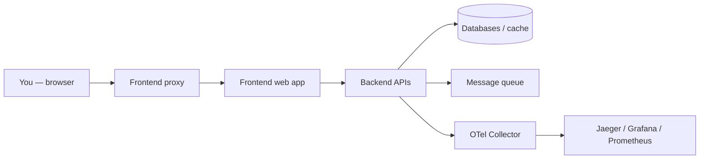
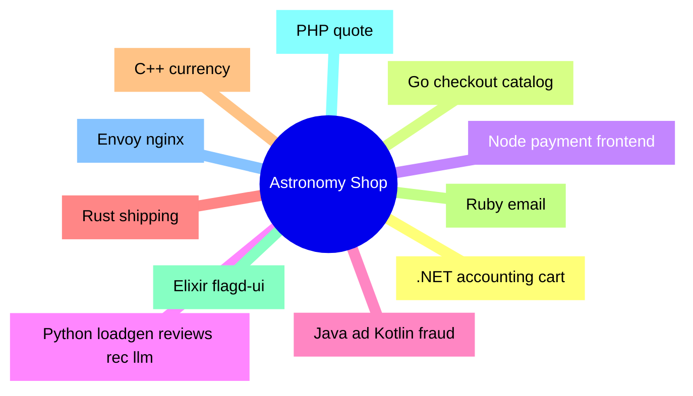
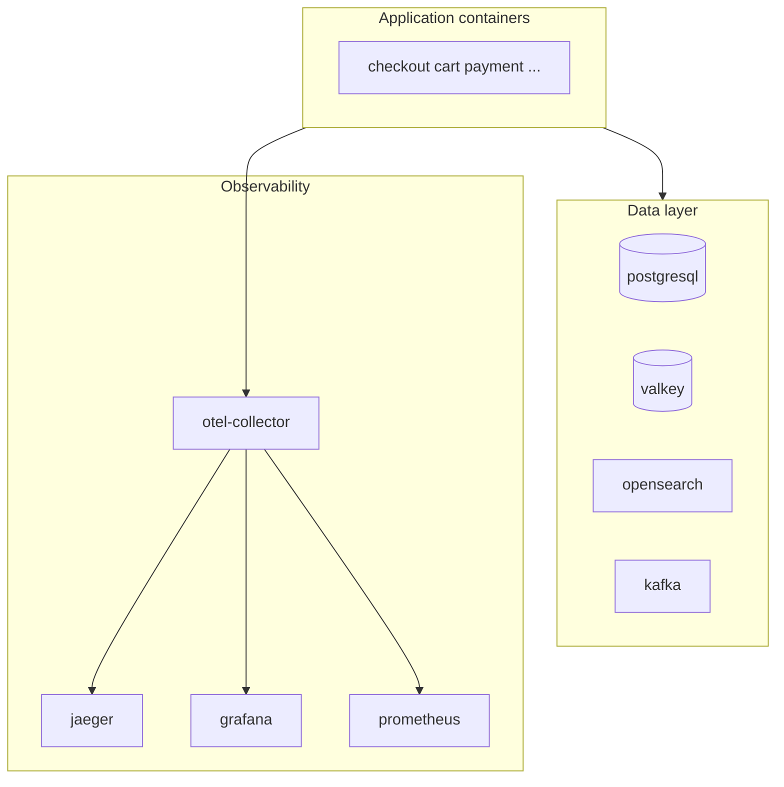

# 01 — The OpenTelemetry Astronomy Shop: what this project actually is

Welcome to the first chapter. Here I introduce the **real product** behind all the build-system work: the **OpenTelemetry Astronomy Shop Demo**. Once you know what the app is and which pieces exist, the later chapters about **Bazel** will make sense. I explain terms as we go, keep the language plain, and use diagrams so you can “see” the system.


---

## In one breath: what is OpenTelemetry?

**OpenTelemetry** (often shortened to **OTel**) is an open standard and a set of tools to **observe** software that runs in many places at once.

- **Observe** here means: collect **signals** about what the code is doing — mainly **traces** (request paths through services), **metrics** (numbers over time), and **logs**.  
- It is **not** a single database or a single vendor product. It is a **common way** to export that data so tools like **Jaeger**, **Grafana**, **Prometheus**, and many others can use it.

**Simple analogy:** imagine a shop with many employees. OpenTelemetry is like giving everyone the **same kind of name tag and logbook** so, when something goes wrong, you can follow a customer’s order from the door to the stock room without guessing who touched it.

---

## What is the “Astronomy Shop”?

The **OpenTelemetry Astronomy Shop** is a **fake online store** that sells space-themed products. It lives inside the Git repository called **OpenTelemetry Demo** (upstream: `open-telemetry/opentelemetry-demo`). This fork is the same demo, plus my **Bazel** migration work.

The official README says it clearly:

> A **microservice-based distributed system** meant to show how **OpenTelemetry** looks in a setup that feels close to the real world — not a toy “hello world”, but many services talking to each other.

**Three goals** the upstream project states (I’m paraphrasing in simpler words):

1. **Show** realistic instrumentation and observability.  
2. **Let** vendors and tool makers plug in their products on top of a shared example.  
3. **Give** OTel contributors a living app to test new versions.

So: it is a **learning and demo vehicle**, but a **serious** one — big enough to hurt if you try to build it wrong, which is exactly why it is a great place to learn **Bazel**.

---

## Quick terms (you will see them everywhere)

| Term | Plain meaning |
|------|----------------|
| **Microservice** | A small program that does **one main job** (e.g. “take payment”). Many microservices together form the full app. |
| **Monorepo** | **One Git repository** that holds many services and shared code (this demo is a monorepo). |
| **Docker Compose** | A file (`docker-compose.yml`) that says “start these containers together” so you can run the whole shop on your laptop. |
| **Container** | A packaged runtime: your service + its dependencies, isolated from the rest of the machine. |
| **Instrumentation** | Code or libraries that **automatically record** spans, metrics, etc., and send them to the collector. |
| **OpenTelemetry Collector** | A hub service that **receives** telemetry from apps, can process it, and **exports** it to Jaeger, Prometheus, etc. |
| **Feature flags** | Toggle behavior without redeploying everything; here **flagd** helps turn features on/off for demos. |
| **Bazel** | A build system that knows a **dependency graph** and rebuilds only what changed. This series teaches it **through** this shop repo. |

---

## What does the user actually do in the demo?

A person opens the **web UI** (the **frontend**). They browse products, add to cart, check out, maybe leave a review. Behind each click, **many services** run: catalog, cart, payment, shipping, email, and more. Each step can emit **traces** so you can watch the story in **Jaeger** or dashboards in **Grafana**.




---

## Application services (the “shop” code)

These are the **main programs** under `src/` that implement business logic. I list the **Compose service name**, **role in one line**, **typical language**, and **folder** so you can open the code.

| Service (Compose) | What it does (short) | Language / stack | Code folder |
|--------------------|----------------------|-------------------|-------------|
| **accounting** | Money / accounting side of orders | .NET | `src/accounting` |
| **ad** | Serves ads (demo content) | Java | `src/ad` |
| **cart** | Shopping cart | .NET | `src/cart` |
| **checkout** | Checkout flow, talks to Kafka, etc. | Go | `src/checkout` |
| **currency** | Currency conversion | C++ | `src/currency` |
| **email** | Sends email notifications | Ruby | `src/email` |
| **fraud-detection** | Fraud checks | Kotlin (JVM) | `src/fraud-detection` |
| **frontend** | Web UI (Next.js style app) | Node / TypeScript | `src/frontend` |
| **frontend-proxy** | Entry proxy (Envoy) | Envoy config | `src/frontend-proxy` |
| **image-provider** | Serves images (nginx) | nginx | `src/image-provider` |
| **load-generator** | Synthetic traffic | Python | `src/load-generator` |
| **payment** | Payments | Node | `src/payment` |
| **product-catalog** | Product list / details | Go | `src/product-catalog` |
| **product-reviews** | Reviews | Python | `src/product-reviews` |
| **quote** | Shipping cost quotes | PHP | `src/quote` |
| **recommendation** | Recommendations | Python | `src/recommendation` |
| **shipping** | Shipping logic | Rust | `src/shipping` |
| **flagd** | Feature flag backend (runtime image from upstream demo) | Config in repo | `src/flagd` (e.g. `demo.flagd.json`) |
| **flagd-ui** | UI for feature flags | Elixir / Phoenix | `src/flagd-ui` |
| **llm** | LLM-related demo piece | Python | `src/llm` |

That is **a lot of languages in one repo**. That is the point: the demo proves OpenTelemetry across ecosystems — and for me it became the perfect **stress test** for Bazel.




---

## Infrastructure and observability services

`docker-compose.yml` also starts **databases**, **queues**, and **observability** stacks. They are not “the shop” in a business sense, but the demo does not run without them.

| Service | Plain role |
|---------|------------|
| **kafka** | Message streaming (checkout and friends use it). |
| **postgresql** | Relational database. |
| **valkey-cart** | In-memory store for cart data (Redis-class). |
| **opensearch** | Search / analytics backend used in the demo setup. |
| **flagd** | Feature flags service (paired with **flagd-ui**). |
| **otel-collector** | Receives telemetry from apps; heart of the OTel story. |
| **jaeger** | Trace UI (follow one request across services). |
| **grafana** | Dashboards. |
| **prometheus** | Metrics collection / querying. |



---

## How people usually run the demo (without Bazel yet)

Most contributors use **Docker Compose** and **Make**:

```sh
git clone <repo>
cd opentelemetry-demo
make start   # or follow upstream docs for docker compose
```

That path builds images from **Dockerfiles** and starts the stack. **This still works** in my fork. I did not replace “run the shop” with Bazel — I **added** Bazel so the same code can also be built and tested through **one build graph**.

---

## What *this* series is about (short)

This knowledge base walks through **that Bazel layer**:

- how the repo is wired as a **Bazel workspace**,  
- how **each language family** hooks in,  
- how **container images** are built with **rules_oci**,  
- how **CI** runs the same commands I run locally.

I write it like a **project walkthrough** you could publish on a site: diagrams, commands, and “here is what this term means” — not a pile of pointers to other files. Later chapters go deeper; this chapter is only the **map of the territory**.

---

## Who this is for

- You want to **learn Bazel** on a **real polyglot** repo, not a five-file tutorial.  
- You already know **Docker** or **Make** a little — enough to follow commands.  
- You are okay with **I**-style narration: I’m sharing how **I** approached the migration, not writing corporate policy.

If you have never heard of Bazel, stay with this series: **chapter 04** introduces the core ideas in plain language. **Chapter 02** describes what the repo looked like **before** Bazel owned the build graph.

---

**Next:** [`02-what-this-repo-was-before-bazel.md`](./02-what-this-repo-was-before-bazel.md)
