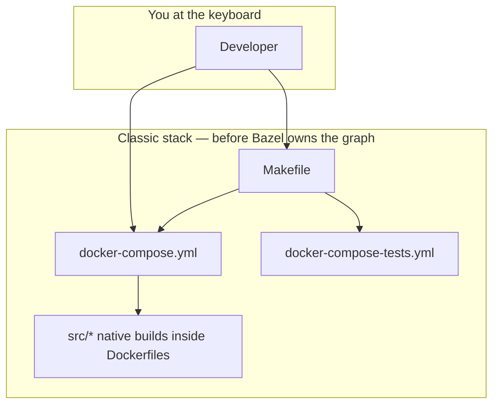
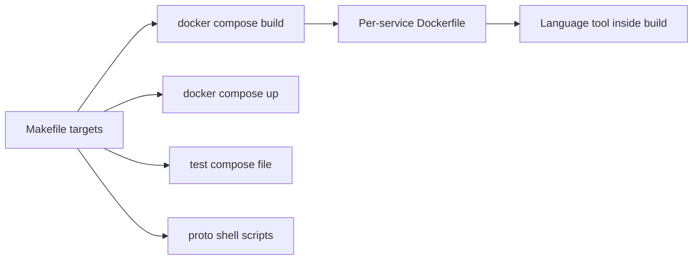
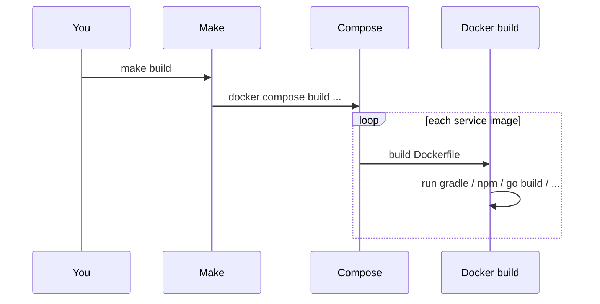
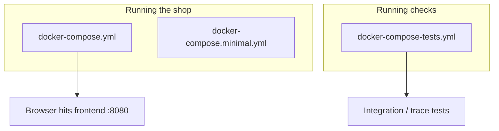
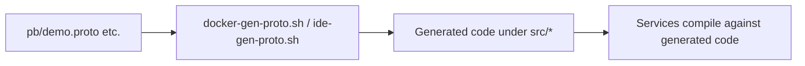
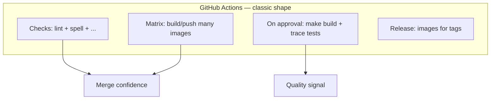
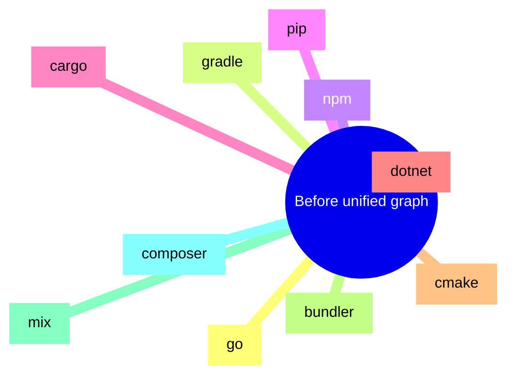
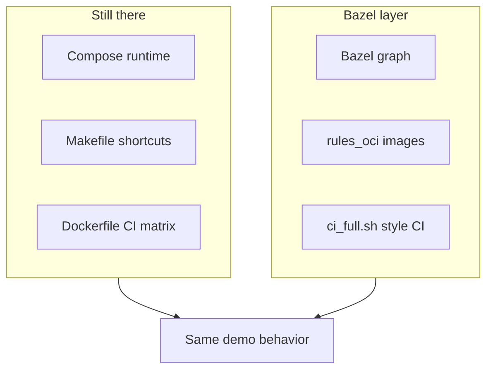

# 02 — How the Astronomy Shop repo worked **before** Bazel

In [chapter 01](./01-the-opentelemetry-astronomy-shop-demo.md) we met the **Astronomy Shop** itself: many services, many languages, Docker Compose, observability stack. This chapter is about **how that repo was actually built and tested** in the “classic” setup — the one that was already there when I started adding Bazel.

Think of it as a **backstage tour**: same show, but now we look at ropes, pulleys, and the fact that fifteen different build tools never signed a contract with each other.

I keep the language simple, drop diagrams everywhere, and **spell out terms** when they first appear. By the end you should know **exactly** what problem Bazel is meant to solve here — without me telling you to “go read another PDF”.


---

## The big picture in one sentence

**Before Bazel, the repo was driven by a root `Makefile` + `docker compose` + per-service native tools (Gradle, npm, Cargo, …). CI mostly meant “build a lot of Docker images and run trace tests” — not “walk one unified build graph”.**

That worked for the community demo. It is also **messy** if you want one tool to understand **the whole monorepo** at once.



---

## What “orchestration” means here

**Orchestration** = who decides **what runs, in what order**.

In this project, **no single engine** knew “if I change file X, rebuild Y and Z”. Instead:

| Layer | Role in plain words |
|-------|----------------------|
| **Makefile** | Friendly **entry menu**: `make build`, `make start`, `make check`, protobuf helpers, etc. |
| **Docker Compose** | “Start these **containers** together with these **images**.” |
| **Dockerfiles** | Each service’s **recipe** for installing deps and compiling **inside** the image build. |
| **Language tools** | Gradle, `dotnet`, `cargo`, `npm`, Composer, Mix, `pip`, … each inside its own world. |

So the **real** dependency graph lived partly in **Compose `depends_on`**, partly in **Dockerfile steps**, partly in your head.



---

## The root `Makefile` (your main remote control)

The Makefile is not magic — it is mostly **shortcuts** so you do not memorize long `docker compose ...` lines. It also wires **repo hygiene** (spelling, markdown, licenses).

**Terms:**

- **Target** (Make sense): a name you type after `make`, like `make build`.  
- **`.PHONY`**: tells Make “this is not a file named `build`”.

Things contributors actually use:

| Command | What it does (simple) |
|---------|------------------------|
| `make build` | Runs **`docker compose build`** with the repo’s env files (` .env`, `.env.override`). |
| `make start` | **`docker compose up -d`** — starts the full demo (UI on port 8080, Jaeger, Grafana links printed). |
| `make stop` | Brings the stack down (and test compose too). |
| `make check` | Runs **misspell → markdownlint → license check → linkspector** in order. |
| `make run-tests` | Uses **`docker-compose-tests.yml`**: frontend tests container, then **trace-based** tests. |
| `make run-tracetesting` | Same test compose file, **traceBasedTests** service (optional `SERVICES_TO_TEST`). |
| `make docker-generate-protobuf` | Runs **`./docker-gen-proto.sh`** — regenerates protobuf outputs in a controlled way. |
| `make generate-protobuf` | Runs **`./ide-gen-proto.sh`** — IDE-oriented proto generation. |
| `make clean` | Deletes **known generated** proto folders under some `src/` paths (Go genproto, Python pb2, frontend TS protos). |

Example of what `make build` really is (conceptually):

```makefile
build:
	docker compose --env-file .env --env-file .env.override build
```

So: **Make does not compile Go**. It asks Docker to build images whose Dockerfiles compile Go.




---

## Three Compose files you should know

1. **`docker-compose.yml`** — the **main** Astronomy Shop: app services + databases + Kafka + observability (Jaeger, Grafana, Prometheus, OTel Collector, …).  
2. **`docker-compose.minimal.yml`** — a **smaller** slice for machines that cannot run everything.  
3. **`docker-compose-tests.yml`** — **automated tests** as containers (e.g. Cypress-style frontend tests, **Tracetest**-style trace checks).

**Tracetest** (in this context): tests that hit the running system and assert things about **distributed traces** — very on-brand for OpenTelemetry.



---

## Where the code lives (`src/`, shared proto, tools)

- **`src/<service>/`** — one folder per service (or infra piece): its source, its **Dockerfile** (often selected via env vars in Compose), sometimes its own `package.json`, `Cargo.toml`, etc.  
- **`pb/`** — shared **Protocol Buffers** definitions; many services speak gRPC using the same messages.  
- **`internal/tools/`** — small **Go** tools the Makefile builds for misspell / addlicense.  
- **Root `package.json`** — Node tooling for **repo-wide** checks (markdownlint, linkspector, …).

**Protobuf recap:** a `.proto` file describes message shapes and RPCs. Code generators turn that into **Go structs**, **Java classes**, **Python modules**, etc. If those generated files get **out of sync**, builds look fine until runtime explodes — so the repo has **scripts** and CI checks around generation.

---

## How protobufs were handled (the classic path)

Two shell scripts show up everywhere:

- **`docker-gen-proto.sh`** — generate via Docker so everyone gets the **same** toolchain versions.  
- **`ide-gen-proto.sh`** — friendlier for **local IDE** workflows.

The Makefile exposes them as `make docker-generate-protobuf` and `make generate-protobuf`.

There is also a **cleanliness** idea: run generation, then ensure **Git** shows no surprise diffs (the Makefile has a `check-clean-work-tree` style guard used in CI flows around protos).




---

## CI before “Bazel owns the merge gate”

On GitHub Actions the picture looked roughly like this:

1. **Checks workflow** — runs doc spelling, markdown, YAML, license, link checks, sanity scripts, and (in the classic story) builds **many container images** through a **reusable workflow** that walks the Dockerfile matrix. It also cares about **protobuf cleanliness** (regenerate protos, fail if the tree is dirty).  
2. **Integration tests** — triggered after a **review approval** on a PR: build images, prune Docker a bit, run **`make run-tracetesting`**.  
3. **Release / nightly** — publish images using the same reusable image build pattern for tagged releases or nightly builds.

**What that means in human words:**

- CI was **great** at proving “the Docker world builds”.  
- It was **not** a single **Bazel graph** that knows “this test only needs these three targets”.  
- **Change detection** leaned on **which Dockerfiles** or paths changed — not on a fine-grained dependency graph.



---

## The polyglot surface (why one brain hurts)

Here is the same list you saw in chapter 01, but now framed as **“each speaks its own build dialect”**:

| Area | Typical native tool inside Dockerfile / local dev |
|------|-----------------------------------------------------|
| Go services | `go build` |
| Java / Kotlin | **Gradle** |
| Node / TS | **npm** / **pnpm** patterns |
| Python | **pip** / virtualenv habits |
| Rust | **cargo** |
| .NET | **dotnet** SDK |
| C++ | **cmake** / compiler |
| Ruby | **bundler** |
| Elixir | **mix** |
| PHP | **composer** |

None of these tools **know** about the others. The **only** place they shake hands is “we all ended up in images that Compose can start”.



That is **ideal** for learning Bazel: if you can tame *this* zoo, a single-language repo feels like a vacation.

---

## Makefile vs Bazel (the mindset flip)

I had to stop thinking **only** in this pattern:

> “Step 1, step 2, step 3 — if step 2 fails, stop.”

Bazel wants:

> “Here are **outputs** I need; here are **rules** that produce them; you figure out the **DAG** and what is already cached.”

| Question | Makefile + Docker world | Bazel world (preview) |
|----------|-------------------------|------------------------|
| What rebuilds when I change one file? | Often “whatever you / CI trigger” | Targets whose **declared deps** changed |
| Where is the dependency info? | Split across Dockerfiles, Compose, habit | In **`BUILD.bazel`** + `MODULE.bazel` |
| Can I cache a compile across machines? | Mostly image layers | **Action cache** + optional **remote cache** |
| Is it easier day one? | Often **yes** | Often **no** — until the graph pays rent |

I am not saying Make is “bad”. I am saying it **does not try** to be a single monorepo compiler. Bazel does — and charges an upfront tax.

---

## What I kept when I added Bazel

I did **not** delete Compose or the Makefile menu. In practice:

- **Running the shop** for real demos is still **`make start`** / Compose.  
- **Registry images** for multi-arch releases still follow the **Dockerfile matrix** story in many setups.  
- **Bazel** adds: `bazel build`, `bazel test`, `oci_image` targets, CI scripts that run the same graph locally and in GitHub.

So the story is **layered**, not replaced.




---

## “Why was this painful enough to justify Bazel?”

A few honest pain points — the kind you can say in an interview without sounding dramatic:

1. **Many languages ⇒ many ways to be “green locally, red in CI”.**  
2. **No single graph ⇒ hard to answer** “what should I run for *this* diff?” beyond rough path filters.  
3. **Heavy container builds** for every check ⇒ slow feedback unless caches are perfect.  
4. **Generated protos** ⇒ easy to drift unless generation is **part of the build story**.  
5. **Supply chain** ⇒ pinning bases and dependencies is easier when the build system **owns** fetches.

Bazel is not the only fix for all of that — but it is a **coherent** fix if you commit to the model.

---

## Tiny glossary (chapter 02 edition)

| Term | Quick meaning |
|------|----------------|
| **Dockerfile** | Instructions to build **one** image (OS + deps + compile). |
| **Image** | Saved result of a build; containers run from images. |
| **Matrix build** | CI builds **many** images (one per service or group) in parallel jobs. |
| **gRPC** | RPC style often used between services; `.proto` files define contracts. |
| **Hermetic** | Build does not secretly use random files on the laptop; inputs are declared. (Docker builds are *somewhat* isolated; Bazel pushes this idea further.) |

---

## How this connects to the next chapters

**Chapter 03** is about **how I planned** the migration before touching too much code: goals, phases, and how I kept myself from boiling the ocean.

After that, the series walks through **Bazel workspace files**, **proto rules**, **each language**, **OCI images**, and **CI** — always tying back to **this** baseline so you never wonder “what existed before?”.

---

**Previous:** [`01-the-opentelemetry-astronomy-shop-demo.md`](./01-the-opentelemetry-astronomy-shop-demo.md)  
**Next:** [`03-how-i-used-the-planning-doc-series.md`](./03-how-i-used-the-planning-doc-series.md)
