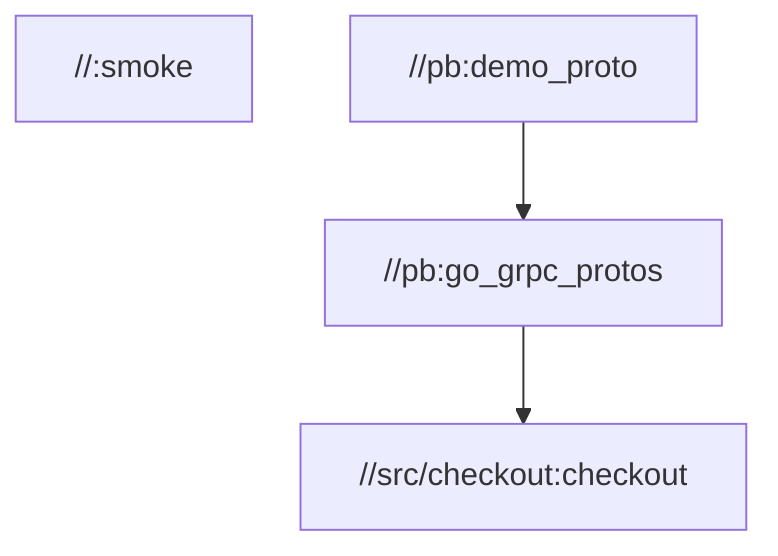
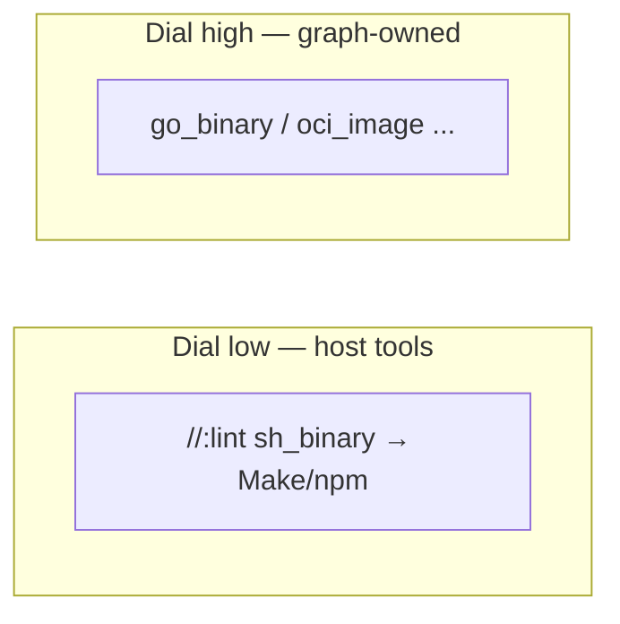
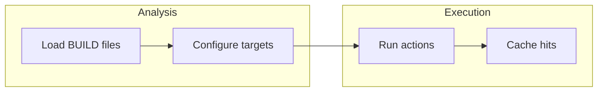
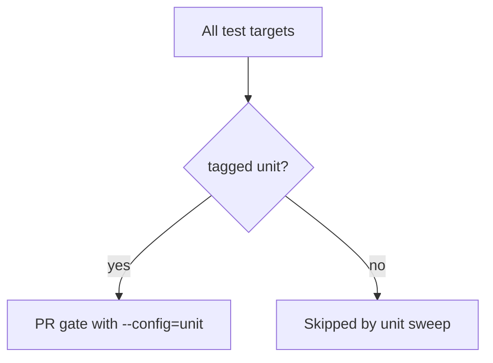
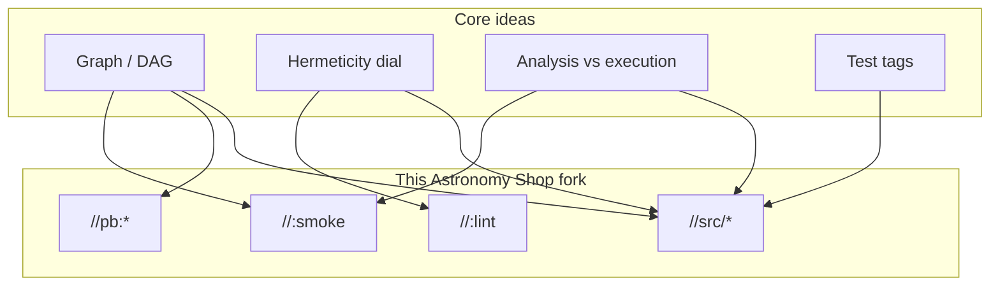

# 04 — Bazel core ideas I wish I knew on day one

[Chapter 03](./03-how-i-used-the-planning-doc-series.md) gave you **milestones**, **task IDs**, and **Bzlmod**. This chapter is the **day-one vocabulary** I wish someone had drilled into me before I edited my first `BUILD.bazel`.

I still think in terms of **four big ideas** — but each one now has **pictures**, **repo examples**, and **commands** so it sticks.


---

## Bridge from chapter 03

- **Planning** said *what order* to work in (M0 → M1 → …).  
- **This chapter** says *how Bazel thinks* while you do that work.

If chapter 03 is the **map**, chapter 04 is the **legend** on the corner of the map.

---

## Idea 1 — Everything is a **graph** (DAG)

Bazel does not run “a script from top to bottom.” It builds a **directed acyclic graph** (**DAG**):

- **Directed:** if target A depends on B, the edge has a direction (A → B).  
- **Acyclic:** you cannot have A → B → C → A (cycles are rejected).  
- **Nodes** are **targets** (libraries, binaries, tests, generated files, images).  
- **Edges** are **declared dependencies** (`deps`, `srcs`, `data`, …).

**Why I care:** Bazel can **parallelize** safe work, **skip** work when nothing changed, and **explain** what broke by pointing at a target — not at “step 7 of a Makefile.”

**Interview line:** *“Incremental builds are correct if dependency edges are honest.”*

### Target **labels** (how you spell a node)

A label looks like **`//path/to/package:target_name`**:

- **`//`** = workspace root.  
- **`src/checkout`** = **package** (folder with `BUILD.bazel`).  
- **`:checkout`** = **target name** inside that file.

Example you can actually build in this repo after the workspace is set up:

```bash
bazelisk build //src/checkout:checkout --config=ci
```

The **smallest** proof the workspace loads is the root **smoke** target — a tiny `genrule` that only writes a text file:

```python
# Root BUILD.bazel (excerpt — same idea as in the repo)
genrule(
    name = "smoke",
    outs = ["smoke.txt"],
    cmd = "echo bazel-m0-smoke-ok > $@",
)
```

```bash
bazelisk build //:smoke --config=ci
```

If that passes, Bazel can **load rules**, **run an action**, and **write an output**. That was the whole point of the first bootstrap milestone: *prove the engine runs.*



As the graph grows, **upstream** targets (proto codegen) feed **downstream** ones (services). You do not list that order by hand — Bazel derives it.

### `BUILD.bazel` and **rules**

Each `BUILD.bazel` file is a **menu** of targets for one folder. A **rule** (like `go_binary`, `genrule`, `sh_binary`, `oci_image`) is the **template** that creates targets with the right shape (inputs, outputs, actions).

**Plain words:** the rule is the **cookie cutter**; the target is the **cookie**.

---

## Idea 2 — **Hermeticity** is a dial, not a boolean

**Hermetic** means: an action only sees **inputs you declared**. No secret reads from random paths, no “oh I had that env var set.” That gives **reproducible** builds and **safe caching**.

**Real life:** full hermeticity is hard for a polyglot demo. This repo **turns the dial** on purpose.

### Example: lint targets that are **not** hermetic (by design)

Early on, the repo exposes **`//:markdownlint`**, **`//:yamllint`**, … and a meta **`//:lint`** as **`sh_binary`** targets that call **Make** and **host** tools (`npm`, Python, Go-built `misspell` / `addlicense`). That matches “whatever `make check` already meant” so contributors do not fight two different markdownlint versions on day one.

**Trade-off:** those actions **depend on the host** (Node 20+, Python + yamllint, etc.). They are **weaker** for remote cache purity than a fully hermetic Node rule — but **strong** for migration speed and trust.

**Interview line:** *“We staged hermeticity: parity first, then replace wrappers with native rules where ROI is clear.”*

### Example: leaning **toward** hermeticity for real compiles

When **`go_binary`**, **`rust_binary`**, **`py_binary`**, etc. own compilation, inputs are **mostly** declared in the graph. OCI bases are pinned by **digest** in the module file so image builds do not float on `:latest`.

So: **same repo**, **different strictness** on different targets — that is normal.



---

## Idea 3 — **Analysis** vs **execution** (two different headaches)

### Analysis (and loading)

Bazel **reads** `BUILD.bazel` files, runs **Starlark**, wires **dependencies**, picks **toolchains**. No compiler yet — just “what *would* we build?”

**When it hurts:** huge `//...` queries, first load after a big `MODULE.bazel` change, or accidentally making Bazel scan giant folders (that is why **`.bazelignore`** exists in this repo — skip `node_modules`, `.git`, `.next`, Pods, etc.).

### Execution

Now Bazel **runs** compilers, linkers, test runners, shell commands for `genrule`, image tooling, …

**When it hurts:** cold cache, linking a massive JVM graph, first `oci.pull` fetch.

**People say “Bazel is slow”** — ask *which phase*. Often it is **first-time fetch** or **analysis**, not the steady **incremental** path.



### What actually helps speed (in this project)

- **Disk cache** on CI runners (same machine, warm runs).  
- **Remote cache** later (optional `.bazelrc.user` — chapter 32 in this series).  
- **Smaller queries** (`//src/checkout/...` instead of always `//...` when debugging).

---

## Idea 4 — **Tags** steer **tests** (and a trap you must know)

Tests are targets too. This repo uses **tags** so one command can mean “only fast PR tests” or “only integration.”

### What is in `.bazelrc` (real snippets)

Build/test **configs** stack. The repo enables **Bzlmod** globally and sets **Java/C++** flags so gRPC codegen does not trip over old compiler defaults:

```text
common --enable_bzlmod
common --host_cxxopt=-std=c++17
common --cxxopt=-std=c++17
```

Go and .NET builds often need the **host PATH** (and `DOTNET_ROOT` for SDK 10) visible inside actions — so you will see:

```text
common --action_env=GOEXPERIMENT=
common --repo_env=GOEXPERIMENT=
common --action_env=PATH
common --action_env=DOTNET_ROOT
```

For **tests**, CI uses something like `--config=ci` (show errors, not a wall of log). **Unit filtering** is:

```text
test:ci --test_output=errors

test:unit --test_tag_filters=unit,-integration,-e2e,-trace,-slow,-manual
test:integration --test_tag_filters=integration,-e2e,-trace,-slow,-manual
test:e2e --test_tag_filters=e2e
test:trace --test_tag_filters=trace
```

So:

```bash
bazelisk test //... --config=ci --config=unit --build_tests_only
```

means: “run tests that are tagged **`unit`**, and **exclude** integration / e2e / trace / slow / **manual**.”

### The trap

**`--config=unit` does not run untagged tests.** If someone adds a `sh_test` and forgets `tags = ["unit"]`, CI will **silently skip** it in the unit sweep. I hit that with ESLint — the fix was adding **`unit`** next to **`lint`** on the `js_test`.

Tag cheat sheet (how we use them here):

| Tag | Meaning |
|-----|---------|
| **`unit`** | Fast path; default for small tests you want on every PR. |
| **`integration`** | Needs local services / Compose / DB — not the default PR gate. |
| **`e2e`** | Browser / full stack. |
| **`trace`** | Trace-validation style tests. |
| **`slow`** | Allowed to skip on tight gates. |
| **`manual`** | Only when you ask for it explicitly. |
| **`requires-network`** | Bazel tag: may need NuGet, npm registry, etc. — often paired with **`unit`** for pragmatic `sh_test` wrappers. |
| **`no-sandbox`** | Sometimes needed for host toolchains (use carefully). |



---

## Extra ideas that saved me (call them 5–8)

### 5 — **Incremental** builds are the product

Change one file under `src/checkout` → Bazel rebuilds **only** targets whose **transitive inputs** changed (roughly). You are not paying a full monorepo compile for a typo in one service.

### 6 — **Caching** is a contract

If you **lie** about inputs, cache entries can be **wrong** (stale outputs). Hermeticity and honest `deps` are how you keep cache **trustworthy**.

### 7 — **Protobufs** are graph nodes too

After the proto milestone, **`//pb:demo_proto`** and **`//pb:go_grpc_protos`** are real targets. Go services depend on generated code through those edges — not on “whatever file happened to be on disk from last week’s script run.” CI builds those targets **alongside** the older cleanliness checks so the two worlds agree.

### 8 — **`bazelisk`** is not optional in my head

The repo pins a **Bazel version** in **`.bazelversion`**. **Bazelisk** downloads that version. Everyone gets the **same** compiler front-end behavior — fewer “works on my laptop” mysteries.

---

## Vocabulary cheat sheet (expanded)

| Term | Plain meaning |
|------|----------------|
| **Workspace** | Repo root that contains `MODULE.bazel` (and `WORKSPACE` if you ever see legacy). |
| **Package** | Directory with a `BUILD.bazel` file. |
| **Target** | Named buildable thing: `//pkg:name`. |
| **Rule** | Starlark factory for targets (`go_library`, `genrule`, …). |
| **Action** | One command Bazel runs (compile, link, test, shell step). |
| **Artifact** | Output of an action (often under `bazel-bin` / `bazel-out`). |
| **Provider** | Structured data passed between rules (advanced Starlark). |
| **Toolchain** | Compiler/runtime Bazel selects for a target (Go SDK, JDK, …). |
| **Visibility** | Who may depend on a target (`//visibility:public` vs private). |

---

## Commands I run when my brain is full

```bash
# What targets exist under a tree, and what kind are they?
bazelisk query --output=label_kind "//src/checkout/..."

# Load the workspace without a heavy build
bazelisk build //:smoke --config=ci

# Proto slice (after protos are wired)
bazelisk build //pb:demo_proto //pb:go_grpc_protos --config=ci
```

---

## One diagram to rule them all



---

## What comes next

**Bzlmod** (`MODULE.bazel`, lockfile, extensions) is entirely in **[chapter 03 · Part B](./03-how-i-used-the-planning-doc-series.md#part-b-bzlmod-and-the-workspace-loading-layer)** — there is no separate chapter 05 (removed to avoid repeating the same lesson).

**Chapter 06** starts the **milestone story in the repo**: smoke, lint wrappers, governance tasks, and CI that **whispers** before it **shouts**.

---

**Previous:** [`03-how-i-used-the-planning-doc-series.md`](./03-how-i-used-the-planning-doc-series.md)  
**Next:** [`06-milestone-m0-smoke-lint-and-ci-whisper.md`](./06-milestone-m0-smoke-lint-and-ci-whisper.md)
