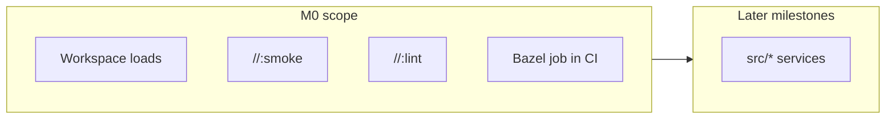
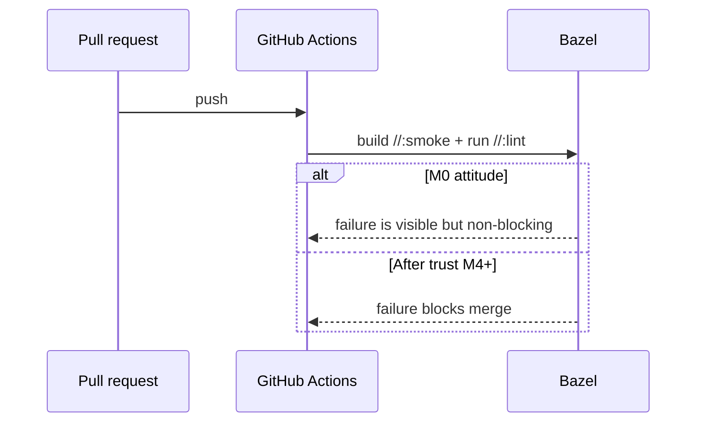
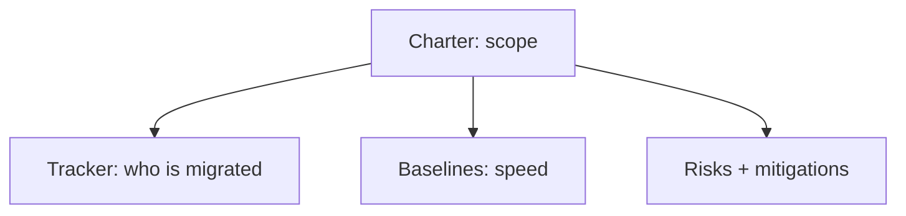
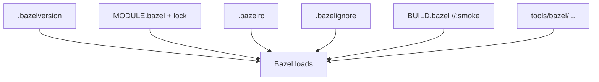
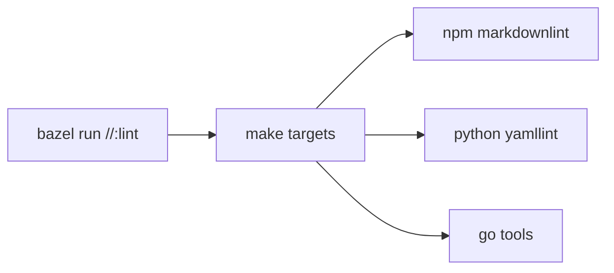
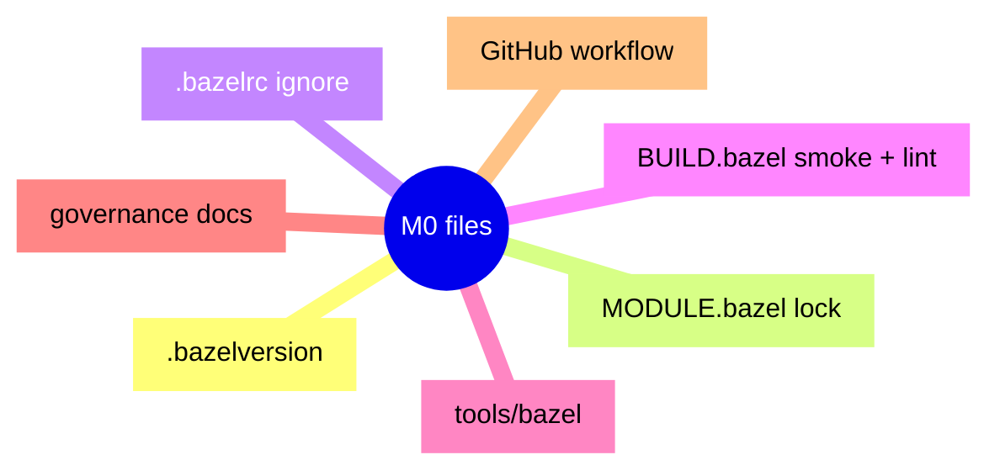

# 06 — Milestone M0: smoke, lint wrappers, and CI that whispers before it shouts

**Previous:** [`04-bazel-core-ideas-i-wish-i-knew-on-day-one.md`](./04-bazel-core-ideas-i-wish-i-knew-on-day-one.md) · Bzlmod / `MODULE.bazel` lives in [chapter 03 · Part B](./03-how-i-used-the-planning-doc-series.md#part-b-bzlmod-and-the-workspace-loading-layer) (there is no separate chapter 05 — I removed it so we do not repeat ourselves).

This chapter is the **first landing** story: what “**M0**” means in this fork, **what files appeared**, **which task IDs** they map to, and **why CI started as a whisper**.


---

## What M0 means in one sentence

> **Bazel runs in the repo** — you can load the workspace, build a trivial target, and optionally run lint through Bazel — and **CI runs that path** without blocking the whole merge queue on day one.

**Not in M0 yet:** migrating real services (`checkout`, `frontend`, …). Docker Compose and the Makefile stay the **boss** for “run the Astronomy Shop.” M0 only proves **the Bazel engine is plugged in**.



---

## Why I wanted CI to “whisper” first

If the first Bazel job **blocks** every PR while I am still learning, I train the team to **ignore** or **fight** Bazel. Better pattern:

1. **Run** the job on every relevant PR so it is **visible**.  
2. Set **`continue-on-error: true`** so a red Bazel line does **not** veto unrelated fixes.  
3. Once the graph is **trusted**, flip to **blocking** (that is the **M4** story later).



---

## Program setup (Epic A) — the human paperwork

Before touching Starlark, I locked **scope** and **inventory** so future me could not pretend the migration was “just configs.”

| ID | What I needed | What it gave me |
|----|----------------|-----------------|
| **BZ-001** | Charter | **Purpose:** Bazel becomes the main **build/test** engine; **Compose** stays for **running** the demo during the transition. **Scope:** build graph, tests, protos, images, CI — not random product behavior changes. **Branches:** `main` + optional `feat/bazel-*` for big chunks; short-lived PRs preferred. **Per-service “done”:** build in Bazel, tests where they exist (with tags), image in Bazel or a written waiver, **runtime parity** with the old path unless we mean to change it. |
| **BZ-002** | Service tracker | A **table of every major `src/*` service**: language, how it used to build (Dockerfile, Gradle, …), proto yes/no, status starting at **NS** (not started). This became my **scoreboard**. |
| **BZ-003** | Baselines | A place to write **numbers**: cold vs warm `make build`, trace test duration, `bazelisk build //:smoke`, `bazelisk run //:lint`, plus a sample CI run ID. Empty cells at first are fine — the habit is **measure before you argue about speed**. |
| **BZ-004** | Risk register | Six risks I actually believed in (rule maturity per language, **dual pipeline** drift, cache poisoning, flaky trace tests, onboarding fear, **non-hermetic lint** skew) — each with a **mitigation** I could repeat in PR reviews. |



---

## Workspace bootstrap (Epic B) — files that make Bazel exist

| ID | Piece | What we did |
|----|--------|-------------|
| **BZ-010** | **`.bazelversion`** | Pinned **Bazel 7.4.1** (check your tree — this is the pin I used). Everyone runs **`bazelisk`** so that file is the contract. |
| **BZ-011** | **`MODULE.bazel`** | Declared **`module(name = "otel_demo", version = "0.0.0")`** — Bzlmod module identity. Language rules (`rules_go`, `protobuf`, …) arrive in **M1** and after. |
| **BZ-012** | **Root `BUILD.bazel` + smoke** | **`genrule` `//:smoke`** writes `smoke.txt` with content **`bazel-m0-smoke-ok`**. If this fails, the workspace is not healthy. |
| **BZ-013** | **`.bazelrc`** | **`common --enable_bzlmod`**, **`build:ci`** (color, no curses), placeholders for `dev` / `release` / `integration`, **`test:ci --test_output=errors`**. CI passes **`--config=ci`**. |
| **BZ-014** | **`.bazelignore`** | Stops Bazel from walking huge trees: `.git`, `node_modules` (root + frontend/payment/RN), Bazel symlinks, RN Pods, `.venv`, `src/shipping/target`, `.gradle`, `.next`, `out`. **Faster `query` and analysis.** |
| **BZ-015** | **`tools/bazel/` skeleton** | Folders like **`defs/`**, **`ci/`**, **`platforms/`** plus **`lint/*.sh`** — a place for shared Starlark and shell glue to grow. |
| **BZ-016** | **Build style note** | Prefer **Buildifier** on `BUILD.bazel` / `.bzl`, Apache headers on new files — small discipline, big diffs later. |

**Smoke target** (same idea as in the repo):

```python
genrule(
    name = "smoke",
    outs = ["smoke.txt"],
    cmd = "echo bazel-m0-smoke-ok > $@",
)
```

```bash
bazelisk version
bazelisk build //:smoke --config=ci
bazelisk query //...
```



---

## Hygiene targets (Epic C) — `sh_binary` bridges to Make

I exposed **lint and checks** as Bazel targets that **delegate to Make**, so **`bazel run //:lint`** and **`make check`** stay aligned.

| ID | Target | What it runs |
|----|--------|----------------|
| **BZ-020** | **`//:markdownlint`** | `make markdownlint` (via `tools/bazel/lint/markdownlint.sh`) |
| **BZ-021** | **`//:yamllint`** | `make yamllint` |
| **BZ-022** | **`//:misspell`**, **`//:checklicense`** | `make misspell` / `make checklicense` (Go tools built under `internal/tools`) |
| **BZ-023** | **`//:sanitycheck`** | `python3 internal/tools/sanitycheck.py` |
| **BZ-024** | **`//:lint`** | All of the above **in order** — see script below |

**Meta `//:lint` script** (core idea — runs from repo root):

```bash
ROOT="${BUILD_WORKSPACE_DIRECTORY:?Run with: bazel run //:lint}"
cd "$ROOT"
make markdownlint
make yamllint
make misspell
make checklicense
exec python3 internal/tools/sanitycheck.py
```

**Important:** `bazel run` sets **`BUILD_WORKSPACE_DIRECTORY`** for you. If you run the shell script by hand, you must `cd` to the repo root yourself.

**Design choice:** these targets are **not hermetic**. They trust **Node, Python, Go, yamllint** on the host. That matches [chapter 04](./04-bazel-core-ideas-i-wish-i-knew-on-day-one.md): **dial hermeticity low** for parity, raise it later on real compile rules.

### Prerequisites (if you want `//:lint` green locally)

- **Node.js 20+** — older Node can break `markdownlint-cli` / dependencies (regex / `string-width` issues showed up on Node 16).  
- **`npm install`** at repo root.  
- **Python 3** + **yamllint** (`make install-yamllint` helps).  
- **Go** — for compiling misspell / addlicense helpers.

**Minimal Bazel-only check** (no lint toolchain):

```bash
bazelisk build //:smoke --config=ci
bazelisk query //...
```



---

## CI slice (Epic O) — the `bazel_smoke` job

In **GitHub Actions** (checks workflow), a job roughly:

1. Checks out the repo.  
2. Installs **Go**, **Node**, **Python**, runs **`npm install`**, **`make install-yamllint`**.  
3. Installs **Bazelisk**.  
4. Runs **`bazelisk version`**, **`bazelisk build //:smoke --config=ci`**, **`bazelisk run //:lint`**.  
5. Uses **`continue-on-error: true`** so the rest of the merge gate can still pass while Bazel is maturing.

The aggregate “build-test” style job still **waits on** this Bazel job so it **runs** every time — you see signal even when it does not block.

**After M1**, the same CI path **adds** proto builds (`//pb:demo_proto`, `//pb:go_grpc_protos`) to the Bazel step — I will tell that story in chapter 08.

---

## Files that showed up (inventory mental model)

Think in **layers**:

- **Pin & module:** `.bazelversion`, `MODULE.bazel`, `MODULE.bazel.lock`  
- **Config & speed:** `.bazelrc`, `.bazelignore`  
- **Targets:** root `BUILD.bazel`  
- **Glue:** `tools/bazel/lint/*.sh`, small READMEs under `tools/bazel/`  
- **Governance writing:** charter, tracker, baselines, risk register, build-style note  
- **CI:** workflow update for the Bazel job  
- **Git:** ignore patterns for Bazel output symlinks



---

## What we verified

- **`bazelisk build //:smoke --config=ci`** succeeds.  
- **`bazelisk query //...`** lists `//:smoke`, `//:lint`, and the individual lint binaries.  
- **`bazelisk run //:lint`** succeeds when Node 20+ and the other tools are present — failures on old Node are **environment**, not “the graph is wrong.”

---

## What comes right after M0 (preview only)

The next milestone chapter (**08**) walks **protobufs in Bazel** and **Go gRPC codegen** under `pb/`, then service migration. Here is the teaser list so M0 does not feel like a dead end:

1. Add **`proto_library`** and **Go** gRPC targets under **`//pb:*`**.  
2. Teach CI to **build those targets** alongside the legacy proto cleanliness flow.  
3. Start **`src/checkout`** and **`src/product-catalog`** on Bazel in earnest.

---

**Next:** [`07-governance-charter-baselines-and-risk.md`](./07-governance-charter-baselines-and-risk.md) — I go deeper on the charter, baselines, risks, and tracker **as living documents** (not just file names).
