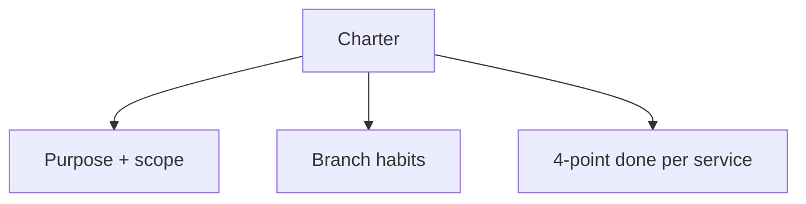
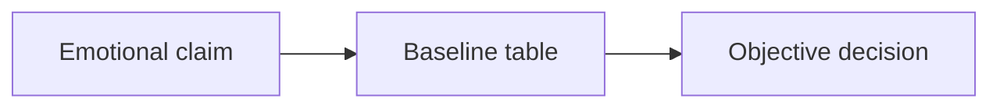
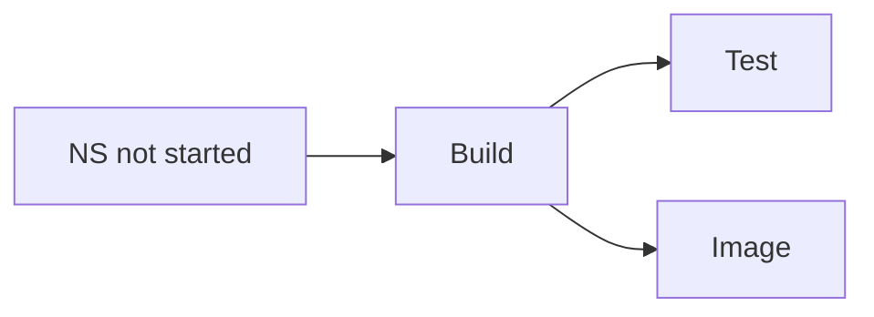
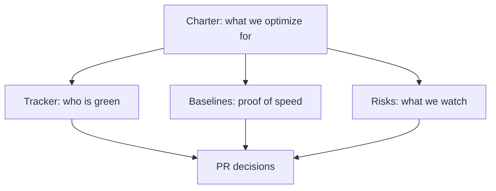

# 07 — Governance: charter, baselines, risk register, and the service tracker

**Previous:** [`06-milestone-m0-smoke-lint-and-ci-whisper.md`](./06-milestone-m0-smoke-lint-and-ci-whisper.md)

Chapter 06 listed **BZ-001–004** as “paperwork” next to the smoke target. Here I unpack **why each piece matters**, what I actually wrote down, and how I used it when someone asked *“are we allowed to change that?”*

I used to think this stuff was HR for code. On this migration it became my **steering wheel**.

---

## The charter — purpose, scope, and “done” per service

**Purpose (how I phrased it):** move this fork toward **Bazel as the primary build and test engine**, while **Docker Compose** and existing contributor habits still work **during** the transition. Nobody gets ambushed: the demo still starts the way people expect.

**Scope — in:**

- Build graph, tests, protobuf codegen, OCI images, CI on GitHub Actions, later supply-chain hardening.

**Scope — out (unless we explicitly expand):**

- Rewriting demo **business behavior** for fun.  
- Replacing upstream Helm/Kubernetes documentation as a side quest.

**Branch strategy:**

- **`main`** stays the stable line; Bazel work lands through PRs.  
- Optional long-ish branches named like **`feat/bazel-*`** for big slices (e.g. proto milestone).  
- Prefer **short-lived** branches — long forks rot.

**Definition of done — per service** (each row under `src/<service>` on the tracker should eventually satisfy):

1. **Build** via Bazel (library/binary or equivalent).  
2. **Test** via Bazel where tests exist (with the **tag** story from chapter 04).  
3. **Image** buildable in Bazel, **or** a clear written waiver.  
4. **Runtime parity** with the pre-Bazel path (Compose/K8s) unless we **intentionally** change behavior.

When I wanted to “just fix the Dockerfile while I’m here,” the charter reminded me **scope creep** is how migrations die.

**Roles table** (sponsor, tech lead, CI contact) can stay `_TBD_` in a personal fork — in a company you fill names so decisions have a **home**.

**Communication habit I kept:** put **`BZ-xxx`** in PR titles or descriptions so git history stays searchable.

---

## Baselines — turn “Bazel feels slow” into numbers

Arguments about speed are emotional. **Baselines** are boring tables — and that is the point.

**How to measure (repeatable):**

- **Local `make build`:** time it **cold** (no images) vs **warm** (images already there). Note machine CPU / disk.  
- **Local trace tests:** `make run-tracetesting` when the stack is already up — isolates “test time” from “first build time.”  
- **GitHub Actions:** pick a representative **Checks** run on `main`, copy run ID + date + rough duration.  
- **Bazel:** time **`bazelisk build //:smoke`** after a clean fetch; time **`bazelisk run //:lint`** when npm/python/go are warm.

**Example table shape** (cells start as TBD — filling them is the discipline):

| Metric | Cold | Warm | Notes |
|--------|------|------|-------|
| `make build` | _fill in_ | _fill in_ | Docker engine, CPU |
| `make run-tracetesting` | _fill in_ | _fill in_ | |
| `bazelisk build //:smoke` | _fill in_ | _fill in_ | First Bazel fetch hurts |
| `bazelisk run //:lint` | _fill in_ | _fill in_ | Needs Node 20+, tools |

**When to refresh:** at least after **big graph jumps** (proto milestone, CI-Bazel-first milestone). Otherwise you argue from memory.

---

## Risk register — the six I actually tracked

I wrote these so PR review had **vocabulary** for “what could go wrong.”

| ID | Risk | Impact | Likelihood | Mitigation (short) |
|----|------|--------|------------|---------------------|
| **R1** | **Rule maturity** differs by language (Ruby, PHP, Elixir, .NET, …) | Schedule slip | Medium | Start with **wrappers** (`sh_test`, host tools); move to native rules when stable; waivers in tracker |
| **R2** | **Dual pipeline** — Make/Docker **and** Bazel | Confusion, drift | High | Time-box early milestones; **delete duplicate gates** as Bazel proves itself |
| **R3** | **Remote cache** misconfig / poisoning | Bad artifacts | Low | Authenticated cache, read-only for PRs, careful write policy |
| **R4** | **Flaky** trace / Cypress tests | Red CI | Medium | Tags, quarantine, retries; split infra vs app failures |
| **R5** | **Onboarding** friction (“I don’t know Bazel”) | Fewer PRs | Medium | Knowledge base chapters, Ubuntu dev checklist, thin **Make** wrappers |
| **R6** | **Non-hermetic** `bazel run //:lint` | Local vs CI skew | Medium | Document Node/Python/Go versions; replace with native Bazel actions later |

**How I use the table in reviews:** **R2** (dual pipeline) and **R1** (rule maturity) get the most airtime early; **R3** matters when remote cache turns on; **R4–R6** are standing reminders for CI and lint design.

---

## Service tracker — the scoreboard

The tracker is a **table**: every major service under `src/`, language, **how it used to build** (Dockerfile, Gradle, npm, …), **proto consumer** yes/no, and **status**.

**Status codes I used mentally:**

- **NS** — not started in Bazel.  
- **P** — proto wired only.  
- **B** — builds in Bazel.  
- **T** — tests in Bazel.  
- **I** — OCI image in Bazel.  
- **CI** — included in the **blocking** CI script when we got there.

Watching a row move **NS → B/T/I** is the **psychological fuel** for a long migration.

---

## How the four pieces fit together

**If I could keep only two artifacts besides code:** the **service tracker** and the **risk register**. The charter is the **constitution**; baselines are the **speedometer**.

---

## What I tell “manager me”

- **Charter** stops scope arguments from re-opening every week.  
- **Baselines** stop “Bazel is slow” from being pure vibe.  
- **Risks** make trade-offs **explicit** (dual pipeline, hermeticity).  
- **Tracker** makes progress **visible**.

---

**Next:** [`08-milestone-m1-protobufs-as-the-spine.md`](./08-milestone-m1-protobufs-as-the-spine.md) — protos become first-class graph nodes, and CI starts speaking Bazel for `//pb:*`.
