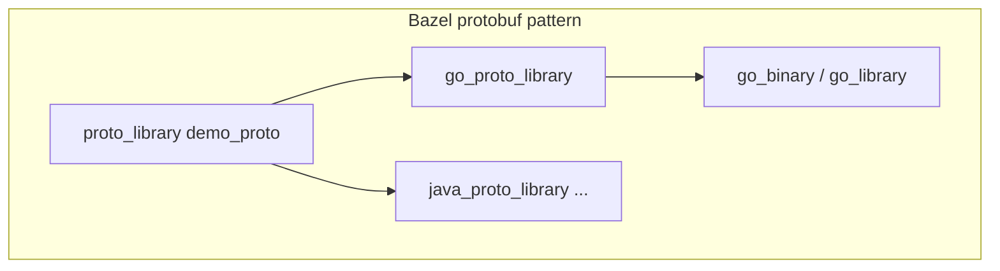
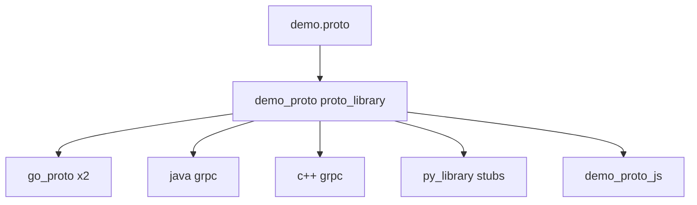
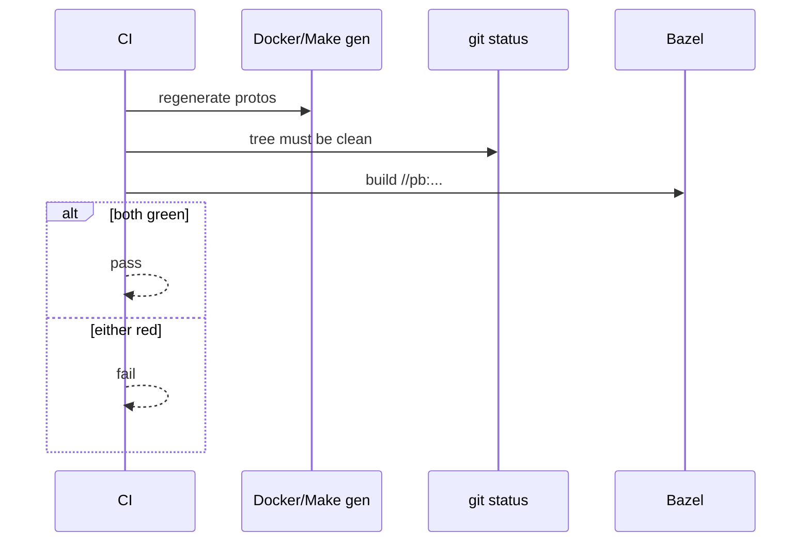

# 08 — Milestone M1: protobufs as the spine (`//pb` + policy)

**Previous:** [`07-governance-charter-baselines-and-risk.md`](./07-governance-charter-baselines-and-risk.md)

Microservices demos **lie** if each service pretends it invented its own API. In the Astronomy Shop, many services share **`pb/demo.proto`**: same messages, same RPCs, different language stubs. If only Docker scripts generate code, you can get **silent drift** — “my Go build used different `protoc` options than your CI.”

**M1 goal:** put that shared contract **inside the Bazel graph** so `bazel build //pb:...` is a **real gate**, and keep the old world **running in parallel** until services fully depend on Bazel outputs.

---

## Bazel basics — what a `proto_library` is

**Protocol Buffers** (protobuf) are a way to describe data shapes and RPCs in a **`.proto` file**. A compiler (`protoc`) plus **plugins** turns that into Go structs, Java classes, Python modules, etc.

In Bazel, the usual pattern is:

1. **`proto_library`** — declares the `.proto` **sources** and their proto **dependencies**. No language yet — just the schema graph.  
2. **Language rules** — e.g. `go_proto_library`, `java_proto_library`, `cc_proto_library` — **depend on** the `proto_library` and register **compilers** (which `protoc` plugins to run).  
3. **Your service** — `go_library` / `java_library` / … **depends on** the generated code target, not on random files under `src/` that nobody declared.



**Label recap:** `//pb:demo_proto` means **package** `pb`, **target** `demo_proto`. You will see that exact target in this repo.

---

## Why M1 mattered before “real” services

Chapter **06** proved Bazel could run. Chapter **07** locked governance. **M1** answers: *can Bazel compile the thing every service argues about?*

If **`//pb:demo_proto`** fails, every downstream **`go_library`** that imports generated types is **theater** — you are not testing the graph you think you are.

---

## Canonical file and policy (transitional model)

**Single source of truth for the API:** **`pb/demo.proto`**. Nothing else should invent a parallel “demo.proto” for the same RPCs.

**Transitional split (what we actually did):**

| Layer | Role |
|-------|------|
| **`pb/demo.proto`** | The **contract** everyone shares. |
| **Docker + `make clean docker-generate-protobuf`** | Still the path that produces **committed** files under `src/*` (Go `genproto/`, Python `demo_pb2*.py`, TS, etc.). CI **`protobufcheck`** insists the tree is **clean** after regeneration. |
| **Bazel `//pb:*`** | **Parallel proof** the same `.proto` builds under the Bazel graph — first **descriptor / Go gRPC**, later more languages as the graph grew. |

**Why not “Bazel-only generated files” on day one?** Dockerfiles and images still **copy committed** outputs. Moving to “only `bazel-out`” means **M2+** service `BUILD` files and image rules must **package** Bazel outputs — a second migration step.

**Drift note:** M1 did **not** promise byte-identical Go between Bazel output and checked-in `genproto/` (different plugin patch levels can differ cosmetically). The plan was **trust Bazel for the graph**, keep Docker path for **committed** trees until you intentionally cut over.

---

## What landed in `pb/BUILD.bazel` (concepts + real shape)

### Root: `proto_library`

```python
proto_library(
    name = "demo_proto",
    srcs = ["demo.proto"],
)
```

This is **BZ-030** in spirit: one **`demo_proto`** target every language rule hangs off.

### Go + gRPC (`rules_go`)

Two **`go_proto_library`** targets exist because upstream uses **two different Go import paths** for the **same** `.proto` output tree (checkout vs product-catalog module roots):

```python
_GO_GRPC_COMPILERS = [
    "@rules_go//proto:go_proto",
    "@rules_go//proto:go_grpc_v2",
]

go_proto_library(
    name = "demo_go_proto_checkout",
    compilers = _GO_GRPC_COMPILERS,
    importpath = "github.com/open-telemetry/opentelemetry-demo/src/checkout/genproto/oteldemo",
    protos = [":demo_proto"],
)

go_proto_library(
    name = "demo_go_proto_product_catalog",
    compilers = _GO_GRPC_COMPILERS,
    importpath = "github.com/opentelemetry/opentelemetry-demo/src/product-catalog/genproto/oteldemo",
    protos = [":demo_proto"],
)
```

**Compiler note:** current **`rules_go`** uses **`go_proto`** + **`go_grpc_v2`** (gRPC Go v2 stubs), not old `//proto:go_grpc_compiler` names you might see in ancient docs.

### `filegroup` for one CI command

```python
filegroup(
    name = "go_grpc_protos",
    srcs = [],
    data = [
        ":demo_go_proto_checkout",
        ":demo_go_proto_product_catalog",
    ],
)
```

CI can run **`bazel build //pb:go_grpc_protos`** and **both** Go codegen targets build.

### How the graph grew after the first M1 slice

The same `pb/BUILD.bazel` today also wires **Java gRPC** (`java_proto_library`, `java_grpc_library`), **C++ gRPC** (`cc_proto_library`, `cc_grpc_library`), **Python** `py_library` over committed `pb/python/demo_pb2*.py`, **`js_library`** for `demo.proto` (payment / Node), and **`exports_files`** for raw proto paths. Same **spine** (`:demo_proto`); more **edges** as M3 work landed.



---

## Commands you can run today

```bash
# Descriptor + proto root
bazelisk build //pb:demo_proto --config=ci

# Both Go gRPC codegen targets (M1 bundle)
bazelisk build //pb:go_grpc_protos --config=ci

# Java bundle (as wired in current pb/BUILD.bazel)
bazelisk build //pb:java_grpc_protos --config=ci
```

**After editing `MODULE.bazel` heavily:**

```bash
bazelisk mod tidy
```

---

## Dual-run CI (gentle migration)

Instead of deleting the legacy protobuf gate overnight, CI **keeps** the Docker/Make cleanliness step **and** **adds** Bazel:

1. Regenerate protos the **old** way, assert **clean git tree** (no forgotten manual edits).  
2. **Also** run **`bazelisk build //pb:demo_proto //pb:go_grpc_protos --config=ci`** (and more as the graph grows).

If Bazel fails, the build fails — but you still **proved** the same source file is valid in **both** worlds while teams adjust.



The **Checks** workflow’s Bazel job also started building **`//pb:...`** together with **`//:smoke`** (still **non-blocking** in the early “whisper” phase — chapter **06**).

---

## Task IDs you can grep in history

| ID | Meaning |
|----|---------|
| **BZ-030** | `proto_library` for `demo.proto` |
| **BZ-031** | Go `go_proto_library` + gRPC for both import paths |
| **BZ-037** | Written **policy** for canonical proto vs committed gen vs Bazel proof |
| **BZ-038** | CI **dual-run** protobuf gate |
| **BZ-032–036** | Other languages — **deferred** at first; many are **done** in the tree now under `pb/` |

---

## Failure mode: import paths vs Bazel labels

Go code says `import ".../genproto/oteldemo"`. Bazel needs a **`deps`** edge to **`//pb:demo_go_proto_checkout`** (or product-catalog). **Gazelle** does not always guess that; chapter **09** shows the **`# gazelle:resolve`** fix.

---

## What M2 takes from here

Once **`//pb:...`** is solid, **`src/checkout`** and **`src/product-catalog`** get **`go_library`** targets that **`deps = ["//pb:demo_go_proto_..."]`** instead of pretending generated code is hand-maintained magic. That is the **next** chapter arc (**09–10**).

---

**Next:** [`09-gazelle-go-importpaths-and-sanity.md`](./09-gazelle-go-importpaths-and-sanity.md)
