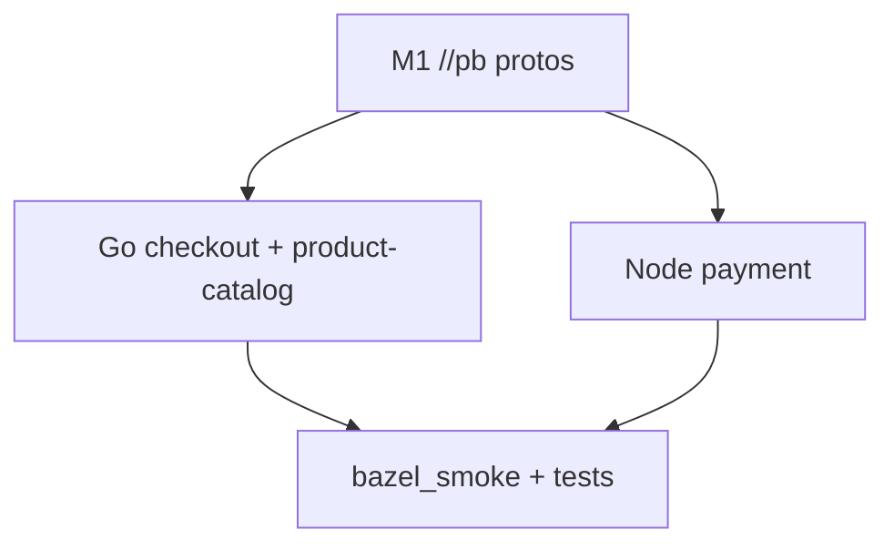
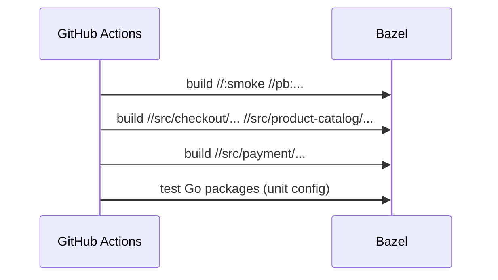

# 10 — Milestone M2: the “first language wave” (proof you can ship)

**Previous:** [`09-gazelle-go-importpaths-and-sanity.md`](./09-gazelle-go-importpaths-and-sanity.md)

In the program table, **M2** means: *first language wave (**Go + one more**) fully **buildable** / **testable** in Bazel.*

For me this milestone was **psychological**. **M0–M1** proved Bazel exists and that **`demo.proto`** lives in the graph. **M2** proved I could carry **real services** end-to-end — Go microservices **and** a Node service — without treating Bazel as a side hobby.

**Ground truth checklist:** `docs/bazel/milestones/m2-completion.md` (task IDs **BZ-040**–**BZ-042**, **BZ-050**).

---

## Bazel basics — two “shapes” of service in one milestone

**Go (rules_go):** `go_library` compiles packages; `go_binary` links an executable; `go_test` runs tests. Dependencies are **`deps`** to other `go_library` targets or **`@go_deps`** externals.

**Node (aspect_rules_js):** Dependencies come from **pnpm’s lockfile**, exposed via **`npm_link_all_packages`**. A **`js_binary`** declares an **`entry_point`** and **`data`** (sources, `node_modules`, and any extra files such as protos).



---

## Go wave: what “fully” meant

Not “every binary in the universe.” It meant:

- **`bazel build`** over **`//src/checkout/...`** and **`//src/product-catalog/...`**
- **`bazel test`** where unit tests exist (including **`--config=unit`** — see **BZ-130** / **`docs/bazel/test-tags.md`**)
- **Protobuf consumption** via **`//pb:demo_go_proto_checkout`** / **`//pb:demo_go_proto_product_catalog`** and Gazelle directives from chapter **09**

**Toolchain snapshot (M2):** **rules_go 0.59.0**, **gazelle 0.48.0**, **Go 1.25.0** via **`go_sdk.download`**, aligned with **`go.work`**.

### Commands — Go acceptance

```bash
bazelisk build //src/checkout/... //src/product-catalog/... --config=ci
bazelisk test  //src/checkout/... //src/product-catalog/... --config=ci --config=unit
```

**Fast sanity** (from chapter **09**):

```bash
bazelisk test //src/checkout/money:money_test --config=ci --config=unit
```

---

## Node wave: `payment` with aspect_rules_js

The demo already had **`package-lock.json`**. **aspect_rules_js** is built around **pnpm**, so the migration added **`pnpm-lock.yaml`** (e.g. `pnpm import` from the payment directory — see **m2-completion**). **`MODULE.bazel`** uses **`npm_translate_lock`** with **`//src/payment:pnpm-lock.yaml`** as input; **`bazel mod tidy`** maintains **`use_repo(npm, ...)`** as the lock evolves.

### `js_binary` and proto **`data`**

The payment service loads **`demo.proto`** for gRPC reflection–style loading. In Docker, the file sits **next to** the app. In Bazel **runfiles**, paths differ. The repo solves both with:

1. **`//pb:demo_proto_js`** — a **`js_library`** wrapping **`demo.proto`** so cross-package files satisfy rules_js **copy_to_bin** semantics (see **`pb/BUILD.bazel`**).
2. **Resolver logic in `index.js`** — try same-directory first (Docker), then a runfiles-relative path under **`pb/`**.

**`BUILD.bazel` excerpt:**

```29:36:src/payment/BUILD.bazel
js_binary(
    name = "payment",
    data = glob(["*.js"]) + [
        "//pb:demo_proto_js",
        ":node_modules",
    ],
    entry_point = "index.js",
)
```

### OpenTelemetry and Node entry

Under Docker, **`node --require ./opentelemetry.js`** may run before **`index.js`**. Under Bazel’s **`js_binary`**, the repo **`require('./opentelemetry.js')`** at the top of **`index.js`** so the SDK initializes early when the wrapper does not inject `--require`. Node’s module cache avoids double init when both paths apply — see **m2-completion** for the nuance.

### Node / OCI follow-on in-tree

**M2** established the runnable **`//src/payment:payment`**. Later work (**BZ-121**) added **`js_image_layer`** + **`oci_image`** for distroless-style images; the **`MODULE.bazel`** base image digest tracks the Dockerfile’s Node 22 line. That is **beyond** the original “binary + tests” bar but is the natural continuation when you treat Bazel as the build spine.

### Commands — Node acceptance

```bash
bazelisk build //src/payment:payment --config=ci
PAYMENT_PORT=8080 bazelisk run //src/payment:payment
```

**Combined smoke** (subset of what CI exercises):

```bash
bazelisk build //:smoke //pb:demo_proto //pb:go_grpc_protos \
  //src/checkout/... //src/product-catalog/... //src/payment/... --config=ci
```

---

## CI: `bazel_smoke` grows with M2

The **Checks** workflow’s Bazel job builds **M0/M1** targets **plus** the M2 graphs and runs **Go tests**. Early phases used **`continue-on-error`** so the migration could “whisper” (chapter **06**); tightening that to **hard fail** is a later milestone story (**M4** in the KB arc).



---

## Test tags (**BZ-130**)

Go **`go_test`** targets carry **`tags = ["unit"]`** where appropriate so contributors can run:

```bash
bazelisk test --config=unit //...
```

without pulling every integration test into a quick loop. Full convention: **`docs/bazel/test-tags.md`**.

---

## Git tells the story honestly

In history you may see a checkpoint commit in the spirit of **“M2: First language wave (Go + one more) fully buildable / testable in Bazel.”** That is the moment I allowed myself to believe **M3** (many more languages) was a sequencing problem, not a fantasy.

---

## Lesson I repeat in interviews

**Milestones should be demonstrable.** If you cannot type a **small set of commands** that prove the milestone, it is not a milestone — it is a mood.

---

## Follow-ups (called out in m2-completion)

- **protobufcheck** could also build **`//src/payment:payment`** for parity with **`bazel_smoke`** (trade-off: cold npm fetch time).  
- **More Node services** (frontend, etc.) repeat the **pnpm lock + package `BUILD`** pattern or adopt a **workspace-wide** npm root.

---

**Next:** [`11-build-style-buildifier-and-bazelignore.md`](./11-build-style-buildifier-and-bazelignore.md)
