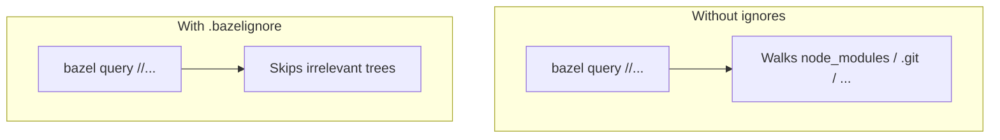

# 11 — Build style: Buildifier, headers, and `.bazelignore` speed

**Previous:** [`10-milestone-m2-first-language-wave.md`](./10-milestone-m2-first-language-wave.md)

By **M2** the graph touches **Go**, **Node**, **protobuf**, and CI. **Starlark** diffs become the wallpaper of the migration. This chapter is the **hygiene layer**: format consistently, respect license headers, and **stop Bazel from walking megabytes of irrelevant trees**.

Canonical short reference: **`docs/bazel/build-style.md`** (**BZ-016**).

---

## Bazel basics — why “style” is not vanity

Bazel reads **`BUILD.bazel`**, **`MODULE.bazel`**, and **`*.bzl`** as **program text**. Small formatting differences create **noisy diffs**, hide real logic changes in review, and make **`git blame`** useless.

**Buildifier** is the community formatter (part of **buildtools**). It does not change **semantics**; it normalizes spacing, argument order, and line breaks so humans argue about **dependencies**, not commas.


---

## Buildifier — command and habit

From the repo root:

```bash
buildifier -r .
```

**`-r`** recurses into subdirectories. Scope to a subtree when you only touched one area:

```bash
buildifier -r pb src/checkout docs
```

**Install options** (pick what your org standardizes):

```bash
# Go toolchain
go install github.com/bazelbuild/buildtools/buildifier@latest
```

Or download a release binary from [github.com/bazelbuild/buildtools](https://github.com/bazelbuild/buildtools).

**CI note:** **`docs/bazel/build-style.md`** states that **full CI enforcement** of Buildifier may land in a later milestone; even without a bot, running it **before push** saves everyone time.

---

## Conventions called out in this fork

From **`docs/bazel/build-style.md`**:

- Prefer **Bzlmod** (`MODULE.bazel`) over legacy **`WORKSPACE`** dependency wiring.  
- Keep **Apache-2.0** license headers on **new** build files and shell wrappers, consistent with upstream.  
- Name migration docs under **`docs/bazel/`** with milestone prefixes (`m0-`, `m1-`, …) when they are part of the program narrative.

These are **team habits**, not Bazel requirements — but they keep this fork auditable next to OpenTelemetry governance.

---

## Apache-2.0 headers (short example)

New **`BUILD.bazel`** files in this repo typically start like:

```starlark
# Copyright The OpenTelemetry Authors
# SPDX-License-Identifier: Apache-2.0

load("@rules_go//go:def.bzl", "go_binary", "go_library")
```

**Why it matters:** The **`checklicense`** wrapper (`bazel run //:checklicense`) and upstream expectations stay **boring**. A missing header is the kind of failure that blocks a PR for a one-line fix.

---

## `.bazelignore`: why I stopped indexing the universe

**Bazel** discovers packages by walking the workspace. Some directories are **huge** and **never** part of the build graph:

- **`node_modules`** (multiple trees in a polyglot demo)  
- **`.git`**, IDE metadata  
- **mobile** Pods, **Rust** `target/`, **Python** `.venv`  
- **Next.js** `.next` / `out`  
- Local **Bazel output** symlinks if they sit where the walker looks

Without ignores, commands like **`bazel query //...`** feel like they are **judging your life choices**. After ignores, they **return**.

**Mental model:** `.bazelignore` is a **prefix list** (like `.gitignore` semantics for Bazel’s workspace scanner). If a path is ignored, Bazel will not treat it as a package root or crawl it for `BUILD` files.



### Current `.bazelignore` (repo snapshot)

```1:36:.bazelignore
# Copyright The OpenTelemetry Authors
# SPDX-License-Identifier: Apache-2.0

# VCS and IDE
.git
.idea

# JavaScript (keep Bazel from scanning dependency trees)
node_modules
src/frontend/node_modules
src/payment/node_modules
src/react-native-app/node_modules

# Bazel output roots (symlinks at repo root)
/bazel-bin
/bazel-out
/bazel-testlogs
/bazel-otel_demo

# Mobile / RN
src/react-native-app/ios/Pods
src/react-native-app/.expo

# Python virtualenvs
.venv

# Rust
src/shipping/target

# Gradle
.gradle

# Next.js / frontend build output
.next
out
```

**When to add a line:** you introduced a new tool that drops **thousands of files** under the repo (another `node_modules`, a build output dir, a vendor tree you do not `BUILD`). If **`bazel query`** or analysis phase latency jumps after a merge, check whether the new folder needs an ignore.

### Commands to feel the difference

```bash
# Broad package discovery (should complete in reasonable time on a clean tree)
bazelisk query //...

# Optional: count packages (illustrative — output varies with graph)
bazelisk query 'kind(".*_library", //...)' 2>/dev/null | wc -l
```

---

## Opinionated note

If your repo has both **Bazel** and **large JavaScript** trees, **ignores are not optional** — they are **latency engineering**. The same applies to **Rust `target/`**, **Gradle caches**, and **generated mobile artifacts**. Fighting Bazel’s walker is a losing game; **tell it what to skip**.

---

**Next:** [`12-rules-oci-oci-pull-and-digests.md`](./12-rules-oci-oci-pull-and-digests.md)
