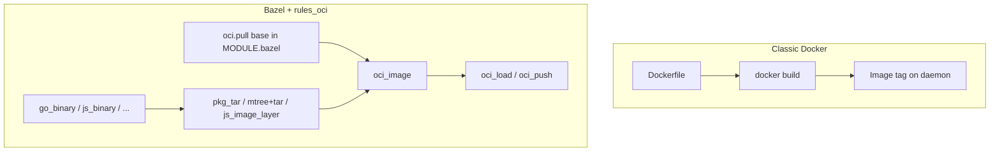
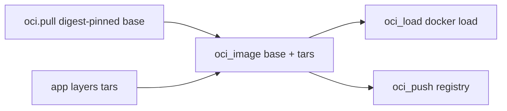

# 12 — `rules_oci`: what OCI is, `oci.pull`, digests, and Dockerfile vs Bazel

**Previous:** [`11-build-style-buildifier-and-bazelignore.md`](./11-build-style-buildifier-and-bazelignore.md)

Chapters **08–11** covered protos, Go/Node services, and repo hygiene. This chapter is the **container bridge**: how this fork turns **Bazel targets** into **OCI images** you can **`docker load`** or push — and how that relates to the **classic Dockerfile** world the demo was born in.

If you are learning **OCI** and **Bazel** together, read this as: *OCI names the artifact format; Bazel names the build graph that produces it; `rules_oci` is the glue.*

---

## What OCI is (without the acronym fog)

**OCI** means the **Open Container Initiative** specifications. In practice, people say “an OCI image” when they mean:

- A **filesystem bundle** arranged as **layers** (tar-like blobs stacked on top of a base).  
- **Metadata** (config JSON): entrypoint, env, working directory, exposed ports, user, labels.  
- A **manifest** that ties layers + config together and can be stored in a **registry** (Docker Hub, GCR, GHCR, …).

**Docker images** you build with `docker build` are **OCI-shaped** in modern Docker. The important learning point is not “Docker vs OCI” as enemies — it is **what you pin**:

| Pin type | Human-friendly? | Reproducible? |
|----------|-----------------|---------------|
| **Tag** (`:latest`, `:3.12-slim`) | Yes | **No** — the tag can move overnight. |
| **Digest** (`sha256:…`) | Harder to read | **Yes** — points at one immutable manifest. |

Supply-chain and SRE conversations almost always want **digest-pinned** bases. That is why this repo’s Bazel path uses **`oci.pull`** with **`digest =`** in **`MODULE.bazel`**.

---

## Bazel basics — an image is just another target

From **`docs/planification/3-bazel-concepts-for-otel-architecture.md`**: Bazel builds a **DAG** of targets with declared inputs and outputs. An **OCI image** is one more output type:

- **`go_binary`** → executable on disk.  
- **`oci_image`** → image **descriptor + layer blobs** Bazel can pass to **`oci_load`** or **`oci_push`**.

The **architecture blueprint** (`docs/planification/2-bazel-architecture-otel-shop-demo.md`) places **“OCI Image Graph”** beside language toolchains and protos: same graph, different rules at the leaves.



**Hermeticity angle** (`3-bazel-concepts`, §4.2): Bazel actions should not silently `docker pull` whatever the network feels like. **`oci.pull`** downloads a **declared** base into the **dependency graph**, so the image build’s inputs are **enumerable** — better for **cache keys** and **policy** (see **M5** / chapter **29**).

---

## Classic `Dockerfile` + `docker build` — mental model

A **Dockerfile** is a **linear recipe**:

1. **`FROM`** a base (often a **tag**).  
2. **`COPY` / `RUN` / `WORKDIR` / `EXPOSE` / `ENTRYPOINT`** — each step creates a **new layer**.  
3. **`docker build`** runs those steps on your machine (or in CI); the daemon caches layers heuristically.

**Why demos love `:latest`:** it is easy to type. **Why build systems hate it:** CI today and CI tomorrow may pull **different bytes** under the same name. The **integration blueprint** ([`docs/planification/1-bazel-integration.md`](../planification/1-bazel-integration.md)) calls out **supply-chain** and **pinned dependencies** as first-class goals; digest pinning is one concrete expression of that.

**How this repo still uses Dockerfiles:** **`component-build-images.yml`** remains the **authoritative** path for **published multi-arch** images (`linux/amd64`, `linux/arm64`) for most services. Bazel **`oci_image`** targets prove **reproducible** builds (often **linux/amd64** in practice for a given target), **`docker load`**-able tags, and optional **`oci_push`** — the **dual-build matrix** is documented in **`docs/bazel/oci-policy.md`** (**BZ-122**).

---

## This fork’s Bazel OCI stack — `rules_oci` in three moves

Official policy summary (**`docs/bazel/oci-policy.md`**, **BZ-120**):

| Piece | Role in this repo |
|-------|-------------------|
| **`rules_oci`** | **`oci_image`**, **`oci_load`**, **`oci_push`** — BCR module, Bzlmod-friendly. |
| **`oci.pull`** (in **`MODULE.bazel`**) | Declares **which base images** exist as repos, **pinned by digest**, for listed **platforms**. |
| **Layer data** | Language-specific: **`aspect_bazel_lib`** **`mtree_spec` / `tar`** (Go checkout), **`js_image_layer`** (payment), **`rules_pkg`** **`pkg_tar`** (Python/JVM/.NET/…), etc. |



---

## Example 1 — `oci.pull` for the checkout base (real `MODULE.bazel`)

The **checkout** service image uses **distroless static** (same family as **`src/checkout/Dockerfile`**). Bazel declares the base **by digest** so the graph does not depend on a moving tag:

```229:237:MODULE.bazel
oci.pull(
    name = "distroless_static_debian12_nonroot",
    digest = "sha256:a9329520abc449e3b14d5bc3a6ffae065bdde0f02667fa10880c49b35c109fd1",
    image = "gcr.io/distroless/static-debian12",
    platforms = [
        "linux/amd64",
        "linux/arm64",
    ],
)
```

After **`bazel mod tidy`**, you depend on that pull with a label like **`@distroless_static_debian12_nonroot_linux_amd64//:distroless_static_debian12_nonroot_linux_amd64`** on **`oci_image.base`** (platform-suffixed repo names are how **`rules_oci`** exposes multi-arch pulls).

**Interview line:** *“Tags are for humans; digests are for graphs.”*

---

## Example 2 — `checkout`: from `go_binary` to `oci_load` (real `src/checkout/BUILD.bazel`)

The **Go binary** is embedded in a **tar layer** at **`/usr/src/app`**, then stacked on the pinned distroless base — matching the **policy table** for **WORKDIR**, **entrypoint**, and **5050/tcp**:

```60:96:src/checkout/BUILD.bazel
# --- BZ-121: OCI image (rules_oci) — matches Dockerfile WORKDIR + ENTRYPOINT. ---
mtree_spec(
    name = "checkout_mtree_raw",
    srcs = [":checkout"],
    out = "checkout_mtree_raw.spec",
)

mtree_mutate(
    name = "checkout_mtree",
    mtree = ":checkout_mtree_raw",
    package_dir = "usr/src/app",
    srcs = [":checkout"],
)

tar(
    name = "checkout_layer",
    srcs = [":checkout"],
    mtree = ":checkout_mtree",
    out = "checkout_layer.tar",
)

oci_image(
    name = "checkout_image",
    base = "@distroless_static_debian12_nonroot_linux_amd64//:distroless_static_debian12_nonroot_linux_amd64",
    entrypoint = ["/usr/src/app/checkout"],
    exposed_ports = ["5050/tcp"],
    tars = [":checkout_layer"],
    visibility = ["//visibility:public"],
    workdir = "/usr/src/app",
)

# `bazel run //src/checkout:checkout_load` → tarball for `docker load`.
oci_load(
    name = "checkout_load",
    image = ":checkout_image",
    repo_tags = ["otel/demo-checkout:bazel"],
)
```

**Contrast with Dockerfile mentally:** Docker runs **`FROM` → `COPY` → `ENTRYPOINT`** in the daemon. Bazel runs **`go_binary`** → **`tar`** rule → **`oci_image`** as **separate targets** with explicit **`deps`**. If the binary did not change, the **layer tar** can be **cached**.

**Push target (M4 / BZ-123):** same **`checkout_image`** can feed **`oci_push`** — see comments in the file and **`docs/bazel/oci-registry-push.md`**.

---

## Commands you use every day

```bash
# Build the image target (CI config if you want parity with workflows)
bazelisk build //src/checkout:checkout_image --config=ci

# Produce a tarball / load into local Docker (requires Docker CLI/daemon — Tier A in docs/planification/4-bazel-dev-environment-ubuntu.md)
bazelisk run //src/checkout:checkout_load

# Confirm the tag the policy promises
docker images | grep otel/demo-checkout
```

**Ubuntu / env reminder** (`docs/planification/4-bazel-dev-environment-ubuntu.md`): **Tier A** already expects **Docker Engine** for Compose. **`oci_load`** is the same family of tooling — you are not replacing Docker overnight; you are adding a **second, graph-based** path.

---

## How this aligns with the migration story ([`docs/planification/`](../planification/))

- **`docs/planification/1-bazel-integration.md`** — phased move toward **“OCI image build standardized with Bazel image rules”** while **Compose stays stable** early.  
- **`docs/planification/2-bazel-architecture-otel-shop-demo.md`** — **“G → per-service OCI images → N registry push targets”** in the target diagram.  
- **`docs/planification/3-bazel-concepts-for-otel-architecture.md`** — **targets**, **hermeticity**, **pinning** — the same vocabulary **`oci.pull`** implements.  
- **`docs/planification/4-bazel-dev-environment-ubuntu.md`** — **Tier C** adds Bazel/Bazelisk; Docker remains the runtime surface for **`docker load`** / Compose.

**Milestones:** **M3** completion narrative (**`docs/bazel/milestones/m3-completion.md`**) covers Epic **M** (**BZ-120**–**121**) and pilots; **M4** (**`m4-completion.md`**) covers the **Dockerfile vs Bazel matrix** documentation and **`oci_push`** supplements (**BZ-122**, **BZ-123**, **BZ-631**). The single table you want for “who is dual-build vs Dockerfile-only” is **`docs/bazel/oci-policy.md`** § **BZ-122 / M4**.

---

## Why `:bazel` tags exist (collision avoidance)

**`oci_load.repo_tags`** uses names like **`otel/demo-checkout:bazel`** so a local **`docker images`** list does not fight Compose-pulled **`latest-*`** tags. Same idea is spelled out in **`oci-policy.md`**.

---

## M5 tie-in — allowlist enforcement

Every **`oci.pull`** **`name =`** should appear in **`tools/bazel/policy/oci_base_allowlist.txt`** (**BZ-720**) — automation and narrative in chapter **`29-milestone-m5-allowlist-sbom-release-workflow.md`**. If you add a new base digest in **`MODULE.bazel`**, update the allowlist in the **same** change.

---

## Pitfalls (learn these once)

1. **Assuming Bazel images == Dockerfile byte-identical** — Often they are **close** on runtime behavior but differ on **exact layers**, **users**, or **bundled agents** (e.g. JVM OTel agent in Docker vs not in Bazel by default — see **`oci-policy.md`** caveats).  
2. **Using `:latest` in `MODULE.bazel`** — Defeats the purpose of **`oci.pull`**; use **`digest`**.  
3. **Forgetting platform** — Multi-arch **pull** in **`MODULE.bazel`** does not mean every **`oci_image`** is exercised on every arch in CI; check **`oci-policy`** and workflows.  
4. **No Docker** — **`oci_load`** needs a working **Docker** (or compatible) path to import the tarball.

---

## Where to read next

- **Dual-build policy and full service matrix:** [`docs/bazel/oci-policy.md`](../bazel/oci-policy.md)  
- **Push / registry auth:** [`docs/bazel/oci-registry-push.md`](../bazel/oci-registry-push.md)  
- **OCI vs Dockerfile philosophy (deeper):** chapter **`27-oci-policy-dual-build-dockerfile-vs-bazel.md`**

---

**Next:** [`13-language-python-services-and-pip.md`](./13-language-python-services-and-pip.md)
