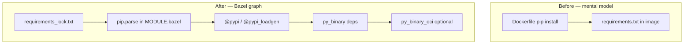

# 13 — Python services: before Bazel, `rules_python`, pip hubs, and OCI layers

**Previous:** [`12-rules-oci-oci-pull-and-digests.md`](./12-rules-oci-oci-pull-and-digests.md)

Chapters **08** and **12** covered **protobufs** and **container images**. This chapter is the **Python lane**: how the Astronomy Shop ran Python **before** Bazel, what **paradigm** we use now, and how **`rules_python` + Bzlmod** turn **`requirements_lock.txt`** into **`py_binary`** targets and **`oci_load`**-able images.

If your goal is to **manage a Python project with Bazel**, treat this as one concrete reference implementation — not the only possible layout, but one that matches **`docs/planification/1-bazel-integration.md`** (phased migration, pinned deps) and **M3 Epic G** in **`docs/bazel/milestones/m3-completion.md`** (**BZ-060**, **BZ-061**).

---

## How Python worked in this repo *before* Bazel (baseline)

The **integration blueprint** ([`docs/planification/1-bazel-integration.md`](../planification/1-bazel-integration.md)) describes the pre-migration world:

- **Orchestration:** **`Makefile`** + **Docker Compose** (`docker-compose.yml`, tests compose file).  
- **Per-service images:** each Python service has a **`Dockerfile`** that typically **`FROM python:…`**, **`COPY requirements.txt`**, **`pip install`**, then copies app code and sets **`CMD`**.  
- **Developer machines:** contributors might use a **venv** or system Python for ad hoc scripts; **Tier B** in **`docs/planification/4-bazel-dev-environment-ubuntu.md`** calls out Python for **yamllint**, sanity checks, and service work outside containers.

**Implications of that model:**

| Aspect | “Docker-first” Python |
|--------|------------------------|
| **Dependency truth** | Whatever **`pip install`** resolved in the image **at build time** (often unpinned or loosely pinned in `requirements.txt`). |
| **Local vs CI** | “Works in my container” does not automatically mean a **declared graph** on the host. |
| **Incremental builds** | Changing one service often triggers **image rebuilds** driven by CI directory heuristics, not a fine-grained DAG. |
| **Tests** | Not centralized under one command; integration-heavy posture (trace tests, Compose). |

None of that was “wrong” for a demo — it is simply a **different contract** than Bazel’s **explicit targets and cache keys**.

---

## Paradigm we are in now (Python + Bazel)

**Target architecture** (`docs/planification/2-bazel-architecture-otel-shop-demo.md`) places Python on the same **Bazel build graph** as Go, Node, JVM, etc.: **language toolchains** feed **libraries/binaries**, and **OCI** is a **leaf** when you package a **`py_binary`**.

Concretely in this fork:

1. **Toolchain:** **`rules_python`** registers a **hermetic-friendly** **Python 3.12** toolchain (`MODULE.bazel`).  
2. **Third-party code:** **`pip.parse`** reads a **lockfile** and exposes **`@pypi//…`** and **`@pypi_loadgen//…`** “hub” repositories — analogous to **`go_deps`** or **`npm`**, but for **wheels**.  
3. **First-party code:** each service has **`py_binary`** (and could add **`py_library`** / **`py_test`**) with **`deps`** listing **`@pypi//package:package`** and, for gRPC demos, **`//pb:demo_py_grpc`**.  
4. **Images:** macro **`py_binary_oci`** (`tools/bazel/py_oci.bzl`) wraps **`pkg_tar(include_runfiles=True)`** + **`oci_image`** on **`python:3.12-slim-bookworm`** (digest-pinned) — chapter **12**.



**Concept primer alignment** (`docs/planification/3-bazel-concepts-for-otel-architecture.md`): each **`py_binary`** is a **node** with **declared inputs**; Bazel can **cache** and **parallelize** because those inputs are **not** “whatever was on `$PYTHONPATH` yesterday.”

---

## Bazel basics — the three pieces you must internalize

### 1) `python.toolchain`

Registers **which interpreter version** Bazel uses for Python actions. This repo pins **3.12** to match the **slim-bookworm** OCI base and Dockerfiles called out in **`docs/bazel/oci-policy.md`**.

```42:47:MODULE.bazel
python = use_extension("@rules_python//python/extensions/python.bzl", "python")
python.toolchain(
    configure_coverage_tool = False,
    is_default = True,
    python_version = "3.12",
)
```

### 2) `pip.parse` (the “pip hub”)

Each **`pip.parse`** block points at a **lockfile** label and creates a **hub** name. **`use_repo`** then exposes repos you reference as **`@pypi//…`**.

```49:60:MODULE.bazel
pip = use_extension("@rules_python//python/extensions:pip.bzl", "pip")
pip.parse(
    hub_name = "pypi",
    python_version = "3.12",
    requirements_lock = "//tools/python:requirements_lock.txt",
)
pip.parse(
    hub_name = "pypi_loadgen",
    python_version = "3.12",
    requirements_lock = "//tools/python:requirements_loadgen_lock.txt",
)
use_repo(pip, "pypi", "pypi_loadgen")
```

**Why two hubs?** **BZ-060** chose a **shared lock** for the three “app” Python services + **`llm`**, and a **separate lock** for **load-generator** (Locust + Playwright stack) so heavy or conflicting pins do not force one mega-resolve for every service. See **`tools/python/README.md`**.

### 3) `py_binary` / `py_library`

Your **`deps`** are **Bazel labels**, not free-form pip names. Example — **recommendation** (gRPC + OTel + FlagD), with protos from **`//pb`**:

```9:37:src/recommendation/BUILD.bazel
py_binary(
    name = "recommendation",
    srcs = [
        "metrics.py",
        "recommendation_server.py",
    ],
    main = "recommendation_server.py",
    visibility = ["//visibility:public"],
    deps = [
        "//pb:demo_py_grpc",
        "@pypi//grpcio:grpcio",
        "@pypi//grpcio_health_checking:grpcio_health_checking",
        "@pypi//openfeature_hooks_opentelemetry:openfeature_hooks_opentelemetry",
        "@pypi//openfeature_provider_flagd:openfeature_provider_flagd",
        "@pypi//openfeature_sdk:openfeature_sdk",
        "@pypi//opentelemetry_api:opentelemetry_api",
        "@pypi//opentelemetry_exporter_otlp_proto_grpc:opentelemetry_exporter_otlp_proto_grpc",
        "@pypi//opentelemetry_sdk:opentelemetry_sdk",
    ],
)

# BZ-121: OCI — python:3.12-slim-bookworm + py_binary runfiles (rules_pkg).
py_binary_oci(
    name = "recommendation",
    binary = ":recommendation",
    entrypoint_basename = "recommendation",
    exposed_ports = ["9001/tcp"],
    repo_tag = "otel/demo-recommendation:bazel",
)
```

**Naming note:** hub targets usually look like **`@pypi//distribution_name:distribution_name`** (underscores vs hyphens follow what **`pip-compile`** wrote in the lockfile).

---

## Lockfiles and refreshing them (BZ-060)

**Authoritative workflow:** **`tools/python/README.md`**.

- Edit **`tools/python/requirements.in`** (or **`requirements_loadgen.in`**).  
- Regenerate locks with **`pip-compile`**, using **Python 3.12** to stay aligned with the toolchain.

```bash
python3 -m venv .venv-pip
.venv-pip/bin/pip install pip-tools
.venv-pip/bin/pip-compile tools/python/requirements.in -o tools/python/requirements_lock.txt
.venv-pip/bin/pip-compile tools/python/requirements_loadgen.in -o tools/python/requirements_loadgen_lock.txt
```

After a lock change, **`bazel mod tidy`** may be needed if module resolution surfaces new hub edges — same habit as other Bzlmod edits.

---

## Protobufs and Python (`//pb:demo_py_grpc`)

**M1/M3 alignment:** gRPC Python services consume **`pb/demo.proto`** via **`//pb:demo_py_grpc`** — a **`py_library`** over **committed** `pb/python/demo_pb2*.py`, kept in sync with the repo’s **Make/Docker protobuf** workflow (**`docs/bazel/proto-policy.md`**, **BZ-032**). That is the same **transitional** pattern as elsewhere: **Bazel declares the dependency**; regeneration of the `.py` stubs is still tied to the **legacy** protobuf pipeline until you intentionally automate codegen in the graph.

---

## OCI packaging — `py_binary_oci` (BZ-121 §9.5)

The macro **`py_binary_oci`** keeps **one** packaging story for all four Python services:

```19:40:tools/bazel/py_oci.bzl
    pkg_tar(
        name = "%s_layer" % name,
        srcs = [binary],
        include_runfiles = True,
        package_dir = "app",
    )

    oci_image(
        name = "%s_image" % name,
        base = "@python_312_slim_bookworm_linux_amd64//:python_312_slim_bookworm_linux_amd64",
        entrypoint = ["/app/%s" % entrypoint_basename],
        exposed_ports = exposed_ports,
        tars = [":%s_layer" % name],
        visibility = visibility or ["//visibility:public"],
        workdir = "/app",
    )

    oci_load(
        name = "%s_load" % name,
        image = ":%s_image" % name,
        repo_tags = [repo_tag],
    )
```

**`include_runfiles = True`** is the critical detail: a **`py_binary`**’s runfiles tree carries the **stub launcher** and **import roots** Bazel expects; the tar must capture that, not only `*.py` sources.

**Dockerfile parity note** (**m3-completion** §9.5): Compose Dockerfiles may wrap the app with **`opentelemetry-instrument`**; here the **`py_binary`** is expected to configure OTel **in process**. Compare behavior when debugging, not only file layout.

---

## Load-generator: second hub + Playwright caveat

**`src/load-generator`** depends on **`@pypi_loadgen//…`** (Locust, Playwright, OTel instrumentation). The **OCI image** includes **Python-level** Playwright deps but **does not** run **`playwright install`** browsers — for full browser parity, use the stock **`Dockerfile`** or extend the image. **`docs/bazel/oci-policy.md`** documents the same caveat.

```6:18:src/load-generator/BUILD.bazel
load("//tools/bazel:py_oci.bzl", "py_binary_oci")
load("@rules_python//python:defs.bzl", "py_binary")

py_binary(
    name = "load_generator",
    srcs = [
        "locustfile.py",
        "run_locust.py",
    ],
    data = ["people.json"],
    main = "run_locust.py",
```

---

## Commands — build binaries and images

```bash
# Binaries (CI config optional)
bazelisk build //src/recommendation:recommendation --config=ci
bazelisk build //src/product-reviews:product_reviews --config=ci
bazelisk build //src/llm:llm --config=ci
bazelisk build //src/load-generator:load_generator --config=ci

# OCI targets (per service — pattern: <name>_image / <name>_load)
bazelisk build //src/recommendation:recommendation_image --config=ci
bazelisk run  //src/recommendation:recommendation_load

# Broader smoke (from M3 verification habits)
bazelisk build \
  //src/recommendation:... \
  //src/product-reviews:... \
  //src/llm:... \
  //src/load-generator:... \
  --config=ci
```

**`llm`** uses **`data = glob(...)`** for JSON assets; paths resolve relative to **`__file__`**, matching a flat Docker **COPY** layout (**m3-completion** §4.4).

---

## Debugging — when imports “work in Docker” but fail under Bazel

| Symptom | What to check |
|---------|----------------|
| **`ModuleNotFoundError`** for a third-party package | Missing **`deps`** on **`@pypi//…`** (re-run analysis; add the label). |
| **Proto import errors** | **`//pb:demo_py_grpc`** not in **`deps`**; stubs out of date vs **`demo.proto`**. |
| **Wrong package version** | Stale **`requirements_lock.txt`** or wrong hub (**`pypi`** vs **`pypi_loadgen`**). |
| **Runfiles / path confusion** | **`py_binary`** runfiles layout vs assumptions about **cwd**; prefer **`rlocation`** patterns for data files in strict hermetic tests (advanced — see chapter **37**). |
| **Host leakage** | Accidental use of **system** `site-packages` inside actions — should be rare if actions use the declared toolchain; if you shell out to **`python`** in a **`genrule`**, you bypassed the graph. |

---

## Tests and tags (BZ-130)

**M3 status:** the four Python services had **no in-tree `py_test`** targets when the milestone was written — nothing to tag **`unit`** yet. When you add **`py_test`**, follow **`docs/bazel/test-tags.md`** and **`.bazelrc`** **`--config=unit`** like Go services.

---

## Where this sits in the migration story

| Doc | Relevance |
|-----|-----------|
| **`docs/planification/1-bazel-integration.md`** | Phased move to **Bazel-first** builds; **OCI** standardization; **supply-chain** (locks). |
| **`docs/planification/2-bazel-architecture-otel-shop-demo.md`** | Python on the **language + OCI** branches of the target diagram. |
| **`docs/planification/3-bazel-concepts-for-otel-architecture.md`** | **Targets**, **DAG**, **hermeticity**, **pinning** — same vocabulary as **`pip.parse`**. |
| **`docs/bazel/milestones/m3-completion.md`** §**4** | Epic **G** acceptance and per-service status. |
| **`docs/bazel/oci-policy.md`** | Python base digest, **`load-generator`** caveat, image names. |

---

**Next:** [`14-language-node-payment-and-npm-with-aspect-rules-js.md`](./14-language-node-payment-and-npm-with-aspect-rules-js.md)
