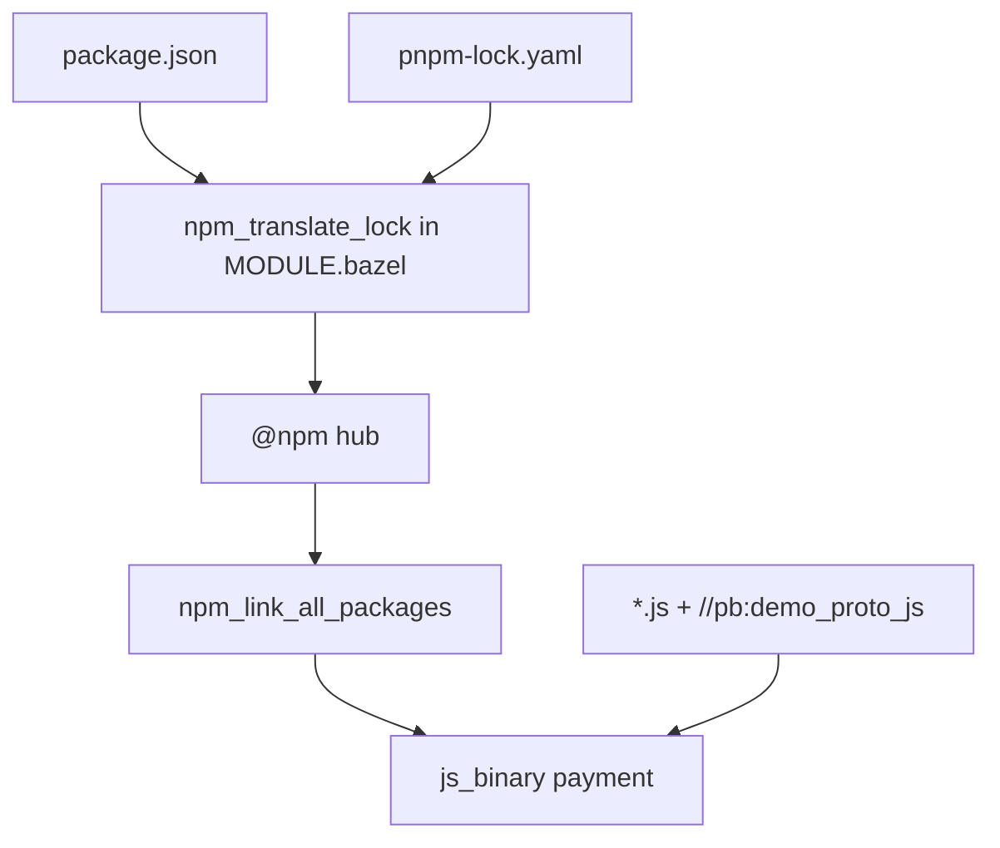
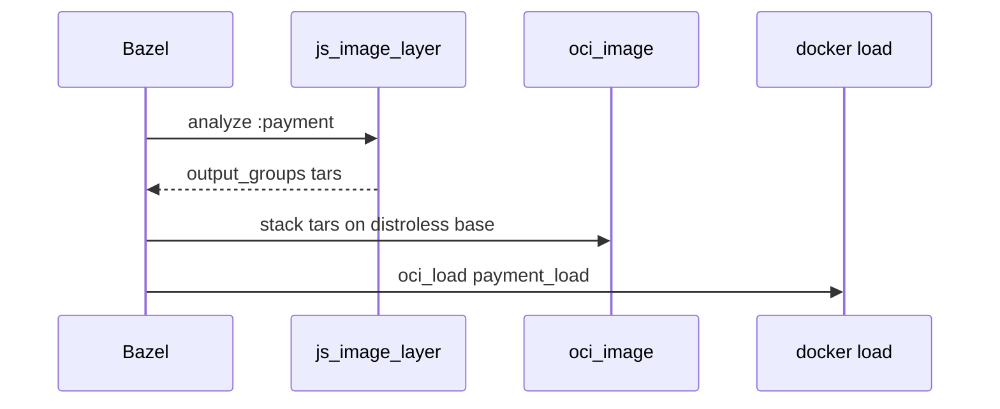

# 14 — Node (`payment`): `aspect_rules_js`, pnpm locks, and “where did my `node_modules` go?”

**Previous:** [`13-language-python-services-and-pip.md`](./13-language-python-services-and-pip.md)

I picked **`payment`** as the **M2** Node pilot (**BZ-050**) because it is small, speaks **gRPC**, and drags in enough real npm dependencies that the graph is honest. It is also where I first felt the shift: **JavaScript stops being “a folder full of files” and becomes “targets + runfiles.”** If that sentence annoys you, good — it means you are paying attention.

---

## What I had before Bazel (the mental model I had to unlearn)

Outside Bazel, my brain said:

1. **`package.json`** lists dependencies.  
2. I run **`npm ci`** or **`pnpm install`**.  
3. **`node_modules/`** appears; **`require('grpc')`** resolves by walking that tree.  
4. **Docker** copies **`package*.json`**, runs install, copies sources — done.

That workflow is **fine** for a single app on one machine. It is **not** a declared **DAG**: two developers can get different trees if locks drift; CI can resolve differently; nothing in the build graph tells Bazel “this binary **depends** on `@grpc/grpc-js` version X.”

**Milestone acceptance I cared about:** **`bazel build //src/payment:payment`** and **`bazel run`** the same binary with a layout stable enough that **gRPC** and **OpenTelemetry** still start in the right order. **M3** later stacked **OCI** on top (**BZ-121**) with the same **argv shape** as the Dockerfile.

---

## The paradigm I landed in (one sentence)

**`aspect_rules_js`** turns a **pnpm lockfile** into an **`@npm`** repository of linked packages; **`npm_link_all_packages`** exposes **`node_modules`** as **targets**; **`js_binary`** wires **entry point + data + that linked tree** so Bazel can **cache** and **rebuild incrementally**.



---

## Bazel basics — pieces I stare at when something breaks

### Node toolchain (pinned, not “whatever `node` is in PATH”)

I register **Node 22.14.0** next to the npm extension so the **same** major line runs locally and in analysis:

```176:177:MODULE.bazel
node = use_extension("@rules_nodejs//nodejs:extensions.bzl", "node")
node.toolchain(node_version = "22.14.0")
```

That lines up with **`src/payment/Dockerfile`**, which builds on **`node:22-slim`** and runs on **distroless Node 22**.

### Why pnpm and a lockfile, when the repo already had `package-lock.json`?

**`aspect_rules_js`** is built around **pnpm’s** dependency graph. The demo already had **`package-lock.json`** for Docker **`npm ci`**. I did **not** throw away npm for humans overnight — I **added** **`pnpm-lock.yaml`** by importing the existing lock (from the payment directory, conceptually: **`pnpm import`**, or **`npx pnpm@8 import`** on older hosts). **Docker** can keep **`npm ci`**; **Bazel** reads **`pnpm-lock.yaml`**.

After I edit **`package.json`** or the lock, I refresh the graph the way Bzlmod expects: **`bazel mod tidy`** so **`use_repo(npm, …)`** stays consistent with what **`npm_translate_lock`** needs.

### `npm_translate_lock` for payment (the contract in `MODULE.bazel`)

```179:188:MODULE.bazel
npm = use_extension("@aspect_rules_js//npm:extensions.bzl", "npm")
npm.npm_translate_lock(
    name = "npm",
    data = [
        "//src/payment:package.json",
        "//src/payment:pnpm-lock.yaml",
    ],
    pnpm_lock = "//src/payment:pnpm-lock.yaml",
    verify_node_modules_ignored = "//:.bazelignore",
)
```

**`verify_node_modules_ignored`** saved me from myself once: if **`src/payment/node_modules`** is **not** in **`.bazelignore`**, Bazel tries to **index** half the internet. I added the ignore entries on purpose; this flag makes the mistake **loud**.

**Separate story:** the **Next.js frontend** uses a **second** **`npm_translate_lock`** block named **`npm_frontend`** with its own **`pnpm-lock.yaml`**. I keep **payment** and **frontend** **unmerged** on purpose — different hoisting rules, different lifecycle exclusions (frontend excludes Cypress postinstall so Bazel does not download the Cypress binary during analysis). **Payment** stays the **small** lesson; **frontend** is chapter **15**.

---

## `BUILD.bazel` — from link to runnable `js_binary`

I **`exports_files`** the manifests so **`MODULE.bazel`** can reference them. Then I link everything:

```22:36:src/payment/BUILD.bazel
exports_files([
    "package.json",
    "pnpm-lock.yaml",
])

npm_link_all_packages(name = "node_modules")

js_binary(
    name = "payment",
    data = glob(["*.js"]) + [
        "//pb:demo_proto_js",
        ":node_modules",
    ],
    entry_point = "index.js",
)
```

**What `npm_link_all_packages` does for me:** it creates the **`node_modules`** target **`payment`’s binary** depends on. Under the hood it is not “one giant `cp -R`” in my source tree — it is **graph edges** that resolve to the right store layout in **runfiles**.

**Why `//pb:demo_proto_js`:** **`@grpc/proto-loader`** wants a **path** to **`demo.proto`**. **`rules_js`** is picky about files **imported across packages**: a bare file label is not enough — I wrap **`demo.proto`** in a **`js_library`** so **copy_to_bin** semantics stay happy.

```19:24:pb/BUILD.bazel
# aspect_rules_js: cross-package data must be a js_library (same-dir copy_to_bin semantics).
js_library(
    name = "demo_proto_js",
    srcs = ["demo.proto"],
    visibility = ["//src/payment:__pkg__"],
)
```

---

## Runtime detail I actually debugged — `demo.proto` path and OpenTelemetry order

**Dockerfile** copies **`demo.proto`** next to **`index.js`**. **Bazel runfiles** put the proto under **`pb/`** relative to the payment package’s runfiles root. I wrote a tiny resolver so **one** codebase serves both worlds:

```12:23:src/payment/index.js
/** Docker: demo.proto next to sources. Bazel runfiles: _main/pb/demo.proto from _main/src/payment. */
function demoProtoPath() {
  const cwd = path.join(__dirname, 'demo.proto')
  if (fs.existsSync(cwd)) {
    return cwd
  }
  const runfilesPb = path.join(__dirname, '..', '..', 'pb', 'demo.proto')
  if (fs.existsSync(runfilesPb)) {
    return runfilesPb
  }
  return 'demo.proto'
}
```

**OpenTelemetry:** Docker starts with **`CMD ["--require=./opentelemetry.js", "index.js"]`**. The **distroless** image’s entrypoint is **`/nodejs/bin/node`**. I mirror that in **`oci_image`** (below). For **`bazel run //src/payment:payment`**, the **`js_binary`** wrapper may not inject **`--require`**, so I **`require('./opentelemetry.js')` at the top of `index.js`** before other requires. Node’s **module cache** means I do not double-initialize when **both** paths apply — I verified that lazily when I was tired and it still behaved.

```3:5:src/payment/index.js
// Load SDK before other deps (Docker uses `node --require ./opentelemetry.js index.js`).
require('./opentelemetry.js')
```

**`package.json`** keeps the human story in **`scripts.start`**: **`node --require ./opentelemetry.js index.js`** — same intent, three surfaces (Docker, Bazel run, npm script).

---

## OCI — `js_image_layer` splits runfiles so `oci_image` can stack them

I wanted **digest-pinned** **distroless Node 22** and **no duplicate Node runtime tarball**: the **base image** already has **`/nodejs/bin/node`**, so I **omit** the **`js_image_layer`** “node” tarball and only layer **pnpm store slices + app + `node_modules`**.

```251:261:MODULE.bazel
# BZ-121 payment: same runtime as src/payment/Dockerfile final stage (gcr.io/distroless/nodejs22-debian12:nonroot).
# Index digest (linux/amd64 + linux/arm64); Bazel fetcher works reliably vs Docker Hub anonymous pulls.
oci.pull(
    name = "distroless_nodejs22_debian12_nonroot",
    digest = "sha256:13593b7570658e8477de39e2f4a1dd25db2f836d68a0ba771251572d23bb4f8e",
    image = "gcr.io/distroless/nodejs22-debian12",
    platforms = [
        "linux/amd64",
        "linux/arm64",
    ],
)
```

**`platform`** on **`js_image_layer`** matches **linux/amd64** for the layer tool; **`oci_image`** uses the **`_linux_amd64`** base repo variant.

```42:90:src/payment/BUILD.bazel
js_image_layer(
    name = "payment_js_layers",
    binary = ":payment",
    platform = ":linux_amd64",
    root = "/usr/src/app",
)

filegroup(
    name = "payment_layer_pkg_3p",
    srcs = [":payment_js_layers"],
    output_group = "package_store_3p",
)
# ... pkg_1p, node_modules, app ...

oci_image(
    name = "payment_image",
    base = "@distroless_nodejs22_debian12_nonroot_linux_amd64//:distroless_nodejs22_debian12_nonroot_linux_amd64",
    cmd = [
        "--require=./opentelemetry.js",
        "index.js",
    ],
    entrypoint = ["/nodejs/bin/node"],
    exposed_ports = ["50051/tcp"],
    tars = [
        ":payment_layer_pkg_3p",
        ":payment_layer_pkg_1p",
        ":payment_layer_node_modules",
        ":payment_layer_app",
    ],
    workdir = "/usr/src/app/src/payment/payment.runfiles/_main/src/payment",
)
```

**`workdir`** looks ugly on purpose: it is the **runfiles-relative** directory where **`index.js`** and friends land inside the image so **relative `require`s** and **`--require=./opentelemetry.js`** match what **`js_image_layer`** produced. I stopped trying to make it “pretty” and started treating it as **mechanical truth**.



---

## Commands I run

```bash
# Binary (what I use in tight loops)
bazelisk build //src/payment:payment --config=ci
PAYMENT_PORT=50051 bazelisk run //src/payment:payment

# Image + load (needs Docker)
bazelisk build //src/payment:payment_image --config=ci
bazelisk run  //src/payment:payment_load
docker images | grep otel/demo-payment

# After touching package.json or pnpm-lock.yaml
bazelisk mod tidy
```

**Regenerating `pnpm-lock.yaml` from `package-lock.json`** (when I intentionally change npm-side locks first): from **`src/payment`**, **`pnpm import`** (or **`npx pnpm@8 import`** if the host Node is old), then **`bazel mod tidy`**.

---

## What still confuses people (including past me)

| “It works in Docker” symptom | What I check |
|------------------------------|--------------|
| **`Cannot find module`** | **`:node_modules`** missing from **`js_binary.data`**; lock not translated; **`mod tidy`** not run. |
| **Proto load fails** | **`//pb:demo_proto_js`** missing; or **`demoProtoPath()`** wrong after a runfiles layout change. |
| **OTel not exporting** | **`opentelemetry.js`** not loaded before other requires; compare **`oci_image.cmd`** to Dockerfile. |
| **Analysis is slow / huge** | **`node_modules`** not **`.bazelignore`’d**; **`verify_node_modules_ignored`** should fail fast if I broke that. |

---

## Interview line I actually use

> “JS in Bazel moves complexity from **shell scripts** into **dependency graph correctness**. Once the lockfile and **`js_binary.data`** are honest, **CI gets reproducible** — and you finally know **which** `node_modules` your action saw.”

---

**Next:** [`15-language-nextjs-frontend-the-beast.md`](./15-language-nextjs-frontend-the-beast.md)
