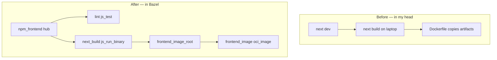
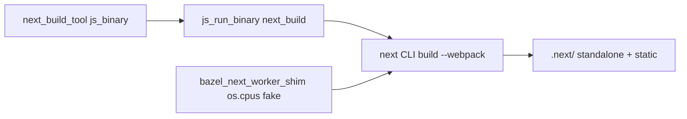
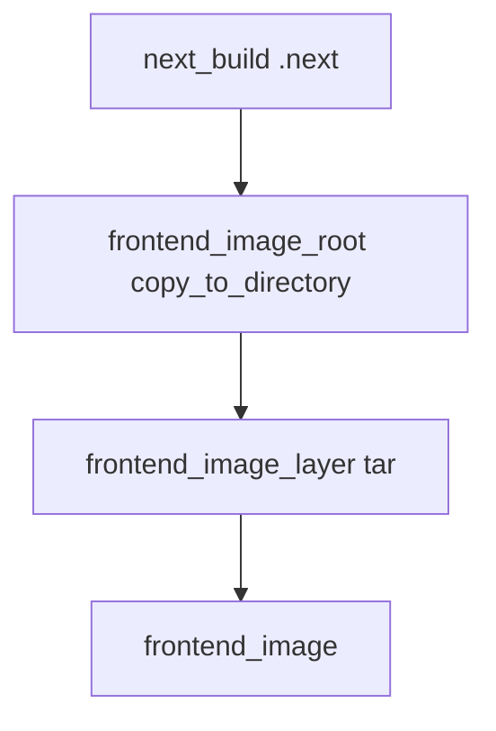

# 15 — Next.js `frontend`: the beast (build, lint, and OCI)

**Previous:** [`14-language-node-payment-and-npm-with-aspect-rules-js.md`](./14-language-node-payment-and-npm-with-aspect-rules-js.md)

If **`payment`** was a lesson, **`frontend`** was a **course**. **`payment`** taught me **`npm_link_all_packages`** and runfiles. **Next.js** taught me that a modern app is not one binary — it is **`next build`** tracing half the disk, **parallel workers** duplicating module graphs, **eslint flat config**, and an **OCI** layout that must look like the Dockerfile’s **`standalone`** story or Compose will lie to you at runtime.

I am writing this chapter so **future me** remembers **why** the scary tags exist, not just **that** they exist.

---

## Before Bazel — how I lived in the repo

**Mentally, I had:**

- **`pnpm install`** / **`npm ci`** at the repo or app root, a fat **`node_modules`**, **`next dev`** for iteration.  
- **`next build`** producing **`.next/`** locally — whatever my laptop felt like that day.  
- **Dockerfile** multi-stage: install deps, **`next build`**, copy **standalone** output into a slim Node runtime.  
- **Cypress** and **e2e** as separate muscle memory (Makefile / CI), not as part of “the build graph.”

**What that optimizes for:** developer ergonomics and familiar tutorials. **What it does not give you:** a single **declared** action whose inputs Bazel can hash, cache, and run **selectively** — and **no accidental “CI pulled a different Next”** without you noticing.

---

## After Bazel — the paradigm I accepted

I split the problem into **four** layers I can name in one breath:

1. **Dependencies** — a **second** pnpm lock hub (**`npm_frontend`**) so the **Next** graph never merges with **`payment`**’s **`@npm`**.  
2. **Lint** — **`js_test`** running **ESLint directly** (not **`next lint`**) so **`rules_js`** argument passing stays deterministic.  
3. **Production compile** — **`js_run_binary`** driving **`next build`**, with tags that admit the truth about **symlinks** and **worker count**.  
4. **Ship** — **`copy_to_directory`** reshapes **`.next`** into the same **shape** the Dockerfile expects, then **`tar` → `oci_image`** on **distroless Node 24**.



---

## Why I refused to merge frontend with `payment`’s npm hub

**`aspect_rules_js`** wants **one lockfile → one translated hub**. The **payment** app and the **Next** app have **different** dependency universes — different versions, different postinstall hooks, different disk size. Merging them into one mega-workspace would have made every **`bazel build //src/payment:...`** pay for **Next**, and vice versa.

So **`MODULE.bazel`** declares **`npm_frontend`** **beside** **`npm`**:

```192:211:MODULE.bazel
npm.npm_translate_lock(
    name = "npm_frontend",
    data = [
        "//src/frontend:package.json",
        "//src/frontend:pnpm-lock.yaml",
    ],
    lifecycle_hooks_exclude = ["cypress"],
    pnpm_lock = "//src/frontend:pnpm-lock.yaml",
    # Hoist runtime frameworks so Next’s parallel page-data workers resolve a single React/Next/styled-components.
    public_hoist_packages = {
        "@openfeature/react-sdk": ["src/frontend"],
        "@openfeature/web-sdk": ["src/frontend"],
        "next": ["src/frontend"],
        "react": ["src/frontend"],
        "react-dom": ["src/frontend"],
        "styled-components": ["src/frontend"],
    },
    verify_node_modules_ignored = "//:.bazelignore",
)
use_repo(npm, "npm", "npm_frontend")
```

**`lifecycle_hooks_exclude = ["cypress"]`:** I do **not** want Bazel analysis to **download the Cypress binary** just because it appears in **`package.json`**. Browser e2e stays **outside** this graph until someone deliberately wires it.

**`public_hoist_packages`:** Next spins up **worker processes** for **“collect page data”**. Under **pnpm + rules_js**, each worker can resolve **its own** symlink forest. I hit **“class extends undefined”**-style failures when **React** / **styled-components** resolved **twice**. Hoisting those packages under **`src/frontend`** nudges everyone toward **one** physical resolution path — boring stability beats purity.

**`BUILD.bazel`** loads the frontend hub explicitly:

```9:9:src/frontend/BUILD.bazel
load("@npm_frontend//:defs.bzl", "npm_link_all_packages")
```

```20:20:src/frontend/BUILD.bazel
npm_link_all_packages(name = "node_modules")
```

---

## Lint — `js_test` + ESLint 9, not `next lint`

**Next 16** changed CLI defaults; under **`rules_js`** I was getting arguments appended in ways that made **`next lint`** look like **`next dev`** with a weird directory. I stopped fighting the CLI and invoked **ESLint** the same way **`next lint`** would under the hood.

**Thin launcher** (ESLint 9 **`exports`** hide **`bin/eslint.js`** from naive **`require.resolve`**):

```5:10:src/frontend/eslint_cli.cjs
// Bazel js_test entry: ESLint 9 package.json "exports" hides ./bin/eslint.js from require.resolve.
const path = require('path')
const eslintRoot = path.dirname(require.resolve('eslint/package.json'))
const eslintBin = path.join(eslintRoot, 'bin', 'eslint.js')
process.argv = [process.argv[0], eslintBin, ...process.argv.slice(2)]
require(eslintBin)
```

**`BUILD.bazel`** wires **`//src/frontend:lint`**: **`chdir`** into the package, **`data`** = sources + **`eslint.config.mjs`** + **`:node_modules`**, **`tags = ["lint", "unit"]`** so it can join **unit sweeps** when I want it to.

```66:83:src/frontend/BUILD.bazel
js_test(
    name = "lint",
    size = "large",
    args = [
        ".",
        "--max-warnings",
        "0",
        "--ignore-pattern",
        "cypress/**",
    ],
    chdir = package_name(),
    data = _FRONTEND_LINT_DATA + [":node_modules"],
    entry_point = "eslint_cli.cjs",
    tags = [
        "lint",
        "unit",
    ],
)
```

---

## Production build — `js_run_binary` and the tags I am not proud of but stand behind

**`next build`** is not a polite **`genrule`**. It wants **RAM**, **time**, and a filesystem view where **standalone** output can **trace `node_modules`**. Under the **default Bazel sandbox**, **`.next/standalone/node_modules`** contained **symlinks** pointing **outside** the action — Bazel correctly said **no**.

So **`next_build`** carries **`tags = ["manual", "no-sandbox"]`**:

```92:108:src/frontend/BUILD.bazel
js_run_binary(
    name = "next_build",
    tool = ":next_build_tool",
    srcs = [":node_modules"] + _FRONTEND_NEXT_SRCS,
    chdir = package_name(),
    out_dirs = [".next"],
    env = {
        "NEXT_TELEMETRY_DISABLED": "1",
        # Do not add another --require via NODE_OPTIONS (rules_js register merge breaks preload).
        "NODE_OPTIONS": "--max-old-space-size=8192",
    },
    mnemonic = "NextBuild",
    progress_message = "Next.js production build //src/frontend",
    resource_set = "mem_8g",
    # Next standalone output copies traced node_modules symlinks; under the sandbox those targets are outside the action and Bazel rejects dangling links.
    tags = ["manual", "no-sandbox"],
)
```

**`manual`:** I do **not** want **`bazel test //...`** to **implicitly** schedule a **multi-gigabyte** Next compile. I call **`//src/frontend:next_build`** or **`//src/frontend:frontend_image`** when I mean it.

**`NODE_OPTIONS`:** I learned the hard way not to stuff **another** **`--require=...`** in here — **`rules_js`** already manages preload; a merged string **broke** Node’s parser on my machine.

**`next_build_cli.cjs`** forces **webpack** when Bazel sets **`BAZEL_COMPILATION_MODE`** — **Turbopack** and **rules_js symlinks** were not a stable combination in the sandbox experiments I ran.

```10:15:src/frontend/next_build_cli.cjs
// Turbopack cannot follow rules_js pnpm symlinks in the sandbox; webpack + next.config aliases is stable.
const extra = process.argv.slice(2)
const bazel = Boolean(process.env.BAZEL_COMPILATION_MODE)
const buildArgs = bazel ? ['build', '--webpack'] : ['build']
process.argv = [process.argv[0], nextBin, ...buildArgs, ...extra]
require(nextBin)
```

**Worker shim** — Next sizes worker pools from **`os.cpus()`**. More workers meant **more** duplicate graphs and **more** **“undefined base class”** pain. I **lie** about CPU count to **serialize** that phase:

```5:13:src/frontend/bazel_next_worker_shim.cjs
// Next’s static worker pool sizes from os.cpus(). Under rules_js, parallel workers each resolve
// their own module graph and hit duplicate React/styled-components → "Class extends undefined".
// Pretend a single CPU so collection runs effectively serial (same as many CI single-core VMs).
const os = require('os')
const realCpus = os.cpus
os.cpus = () => {
  const list = realCpus.call(os)
  return list.length ? [list[0]] : []
}
```

```5:5:src/frontend/next_build_cli.cjs
require('./bazel_next_worker_shim.cjs')
```



---

## From `.next` to `oci_image` — `copy_to_directory` is the Rosetta Stone

Docker expects **`server.js`** at the app root, **`.next/static`**, **`public/`**, and **`Instrumentation.js`** beside **`server.js`** for **`node --require`**. **`next build`** dumps a **nested** **standalone** tree. **`copy_to_directory`** is where I **translate**:

```111:126:src/frontend/BUILD.bazel
copy_to_directory(
    name = "frontend_image_root",
    srcs = [":next_build"] + glob(["public/**"]) + ["utils/telemetry/Instrumentation.js"],
    include_srcs_patterns = [
        "standalone/**",
        "static/**",
        "public/**",
        "**/Instrumentation.js",
    ],
    replace_prefixes = {
        "standalone/": "",
        "static/": ".next/static/",
        "utils/telemetry/Instrumentation.js": "Instrumentation.js",
    },
    tags = ["manual"],
)
```

Then **`mtree_spec` → `tar` → `oci_image`**: **distroless Node 24** (digest-pinned in **`MODULE.bazel`**, same family as **`src/frontend/Dockerfile`**), **`workdir /app`**, **`entrypoint`** **`/nodejs/bin/node`**, **`cmd`** matches Docker’s preload + **`server.js`**:

```148:159:src/frontend/BUILD.bazel
oci_image(
    name = "frontend_image",
    base = "@distroless_nodejs24_debian13_nonroot_linux_amd64//:distroless_nodejs24_debian13_nonroot_linux_amd64",
    cmd = [
        "--require=./Instrumentation.js",
        "server.js",
    ],
    entrypoint = ["/nodejs/bin/node"],
    exposed_ports = ["8080/tcp"],
    tars = [":frontend_image_layer"],
    workdir = "/app",
)
```



---

## Commands I actually type

```bash
# Lint (sandbox-friendly; large but not a full Next production compile)
bazelisk test //src/frontend:lint --config=ci --config=unit

# Production build — explicit because of manual tag
bazelisk build //src/frontend:next_build --config=ci

# Image (depends on next_build via frontend_image_root)
bazelisk build //src/frontend:frontend_image --config=ci
bazelisk run  //src/frontend:frontend_load
docker image ls | grep otel/demo-frontend
```

After editing **`package.json`** or **`pnpm-lock.yaml`**: **`bazelisk mod tidy`** — same muscle memory as **`payment`**.

---

## Footguns I keep on a sticky note

| Symptom | What I check |
|---------|----------------|
| **Duplicate React / styled-components** | **`public_hoist_packages`**; worker shim loaded; **webpack** path under Bazel. |
| **Sandbox / symlink errors on `next_build`** | **`no-sandbox`** still on **`next_build`**? (If you “fix” it, prove **standalone** has no illegal links.) |
| **Broken preload / weird Node startup** | Did I add **`--require`** to **`NODE_OPTIONS`** on **`js_run_binary`**? **Don’t.** |
| **Cypress downloading during analysis** | **`lifecycle_hooks_exclude`** on **`npm_frontend`**. |
| **`.env` surprises** | Next reads **`.env`** via **`next.config.js`** paths — **hermetic CI** may see **empty** values unless I thread **env** into actions on purpose. |

---

## Emotional support (brief, sincere)

If you are stuck on **Next + Bazel**: you are not slow. This stack is where **frontend ergonomics** negotiates with **graph correctness**, usually at **2am**. The **`manual`** and **`no-sandbox`** tags are not **moral failures** — they are **honest labels** for constraints **Next** imposed. My job was to **contain** them, not pretend they vanish.

---

**Next:** [`16-language-jvm-ad-and-kotlin-fraud-detection.md`](./16-language-jvm-ad-and-kotlin-fraud-detection.md)
