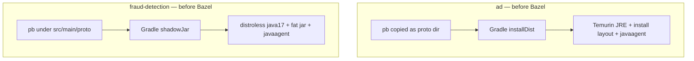
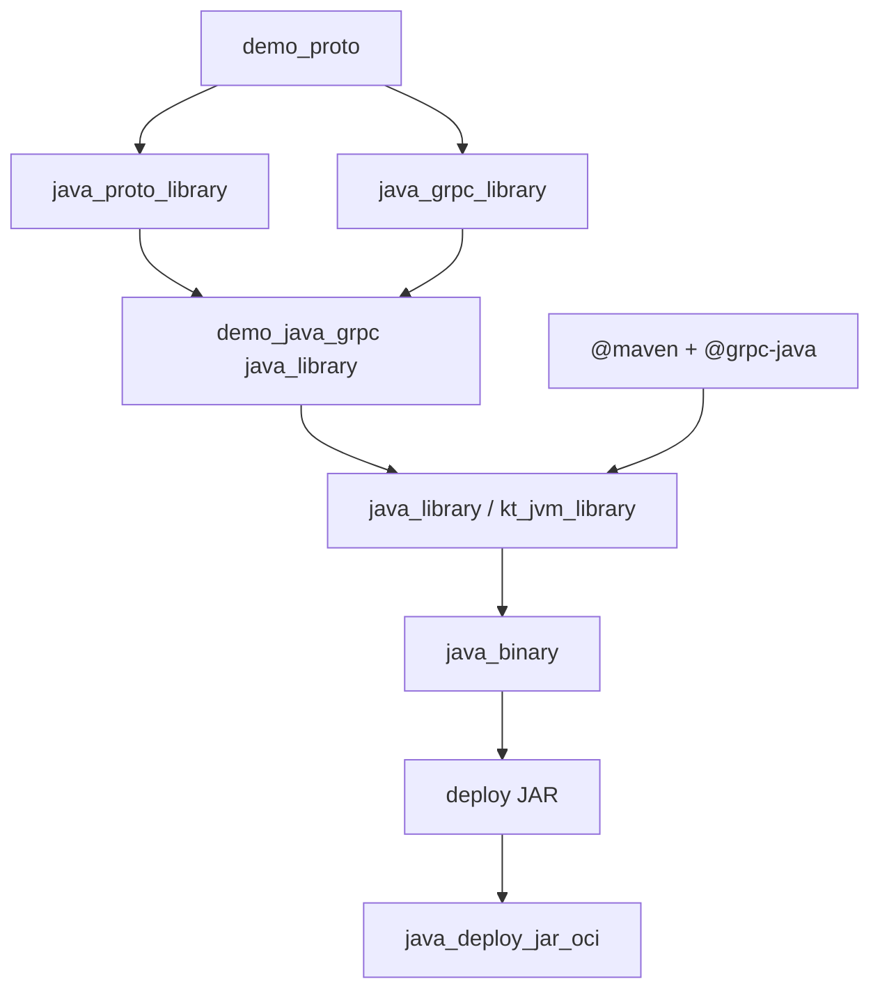

# 16 — JVM: `ad` (Java) and `fraud-detection` (Kotlin), gRPC, and deploy-JAR OCI

**Previous:** [`15-language-nextjs-frontend-the-beast.md`](./15-language-nextjs-frontend-the-beast.md)

The **ad** and **fraud-detection** services are my **JVM** slice of **M3**: same **`pb/demo.proto`** story as Go and Python, but the muscle memory I brought in was **Gradle**, **`installDist`**, **fat JARs**, and Dockerfiles that **`ADD`** the OpenTelemetry Java agent. Bazel forced me to separate **what is true in the graph** (Maven coordinates, **`java_proto_library`**, **`java_grpc_library`**) from **what I still do in Docker for parity** (the agent JAR, **`JAVA_TOOL_OPTIONS`**).

This chapter is the **before / after**, the **MODULE.bazel** shape, the **BUILD** targets, the **OCI macro**, and the **commands** I use when something JVM-shaped breaks.

---

## Before Bazel — how these two services actually built

### `ad` (Java, gRPC)

**Dockerfile story (still valid for Compose and published images):**

- **Builder:** **`eclipse-temurin:21-jdk`**, **`./gradlew installDist`** with protos copied into **`./proto`** from **`pb/`**.  
- **Runtime:** **`eclipse-temurin:21-jre`**, **`ENTRYPOINT`** runs **`./build/install/opentelemetry-demo-ad/bin/Ad`** (Gradle **application** layout).  
- **Observability:** **`opentelemetry-javaagent.jar`** downloaded at image build time, **`JAVA_TOOL_OPTIONS`** sets **`-javaagent:...`**.

So the “source of truth” for many contributors was: **Gradle wrapper + local `build/`**, not a single **`bazel build`** label.

### `fraud-detection` (Kotlin, Kafka client)

**Dockerfile story:**

- **Builder:** **`gradle:8-jdk17`**, **`gradle shadowJar`** — one **all-in-one** JAR.  
- **Runtime:** **`gcr.io/distroless/java17-debian12:nonroot`**, **`java -jar fraud-detection-1.0-all.jar`**.  
- **Same agent pattern:** OTel Java agent + **`JAVA_TOOL_OPTIONS`**.

**Important detail:** **Java 21** for **ad**, **Java 17** for **fraud-detection** — I kept that split in Bazel **OCI bases** on purpose so I am not “upgrading” Kotlin/Kafka behavior by accident.



---

## After Bazel — the paradigm I use

1. **Protos:** **`//pb:demo_proto`** → **`java_proto_library`** + **`java_grpc_library`** wrapped as **`//pb:demo_java_grpc`** — one canonical Java API for **`demo.proto`** (**BZ-034**).  
2. **Third-party:** **`rules_jvm_external`** **`maven.install`** exposes **`@maven//:…`** artifacts; I **merge** app coordinates with what **grpc-java** already contributes and avoid **duplicating** things like Guava (comment in **`MODULE.bazel`**).  
3. **gRPC runtime:** **`@grpc-java//…`** targets (Netty, protobuf, stubs) sit **beside** **`@maven//…`** on **`deps`**.  
4. **Kotlin:** **`rules_kotlin`** **`kt_jvm_library`** compiles Kotlin; **`java_binary`** still provides the runnable with **`main_class`** pointing at the Kotlin entry (**`…MainKt`**).  
5. **Ship:** **`java_binary`** has an implicit **deploy JAR** output (**`:ad_deploy.jar`**, **`:fraud_detection_deploy.jar`**); **`java_deploy_jar_oci`** **`pkg_tar`**’s it under **`/usr/src/app`** and stacks **distroless** **Java 21** or **17** (**BZ-121**).



---

## `pb/` — Java + gRPC codegen (what both services share)

I do not hand-maintain Java stubs next to **`demo.proto`** in **`src/ad`** for the Bazel path. The graph generates/consumes:

```32:51:pb/BUILD.bazel
# BZ-034: Java protobuf + gRPC stubs for demo.proto (consumers: ad, fraud-detection).
java_proto_library(
    name = "demo_java_proto",
    deps = [":demo_proto"],
)

java_grpc_library(
    name = "demo_java_grpc_internal",
    srcs = [":demo_proto"],
    deps = [":demo_java_proto"],
)

java_library(
    name = "demo_java_grpc",
    exports = [
        ":demo_java_proto",
        ":demo_java_grpc_internal",
    ],
    visibility = ["//visibility:public"],
)
```

**`ad`** also depends on **gRPC health** protos from **`@grpc-proto`** because the service registers health/reflection in line with grpc-java expectations:

```13:15:src/ad/BUILD.bazel
    deps = [
        "//pb:demo_java_grpc",
        "@grpc-proto//:health_java_proto",
```

---

## `MODULE.bazel` — Kotlin toolchains + Maven universe

**Kotlin** registers the default JVM toolchain from **rules_kotlin** (Bzlmod extension pulls compiler repos, then **`register_toolchains`**).

**Maven** is the long, honest list. Verbose on purpose: every coordinate is **reviewable** and **lockable** via **`MODULE.bazel.lock`** / resolution, unlike “whatever Gradle resolved last Tuesday.”

```79:113:MODULE.bazel
# Application Maven deps merged into the same `maven` repo as grpc-java/protobuf (rules_jvm_external layering).
# Do not duplicate coordinates already pulled by grpc-java (e.g. guava).
maven = use_extension("@rules_jvm_external//:extensions.bzl", "maven")
maven.install(
    name = "maven",
    artifacts = [
        "com.fasterxml.jackson.core:jackson-core:2.21.1",
        "com.fasterxml.jackson.core:jackson-databind:2.21.1",
        "com.google.protobuf:protobuf-kotlin:4.29.3",
        "dev.openfeature.contrib.providers:flagd:0.11.20",
        "dev.openfeature:sdk:1.20.1",
        "io.opentelemetry.instrumentation:opentelemetry-instrumentation-annotations:2.25.0",
        "io.opentelemetry:opentelemetry-api:1.60.1",
        "io.opentelemetry:opentelemetry-context:1.60.1",
        "io.opentelemetry:opentelemetry-exporter-otlp:1.60.1",
        "io.opentelemetry:opentelemetry-extension-annotations:1.18.0",
        "io.opentelemetry:opentelemetry-sdk:1.60.1",
        "io.opentelemetry:opentelemetry-sdk-common:1.60.1",
        "io.opentelemetry:opentelemetry-sdk-logs:1.60.1",
        "io.opentelemetry:opentelemetry-sdk-metrics:1.60.1",
        "io.opentelemetry:opentelemetry-sdk-trace:1.60.1",
        "javax.annotation:javax.annotation-api:1.3.2",
        "org.apache.kafka:kafka-clients:4.2.0",
        "org.apache.logging.log4j:log4j-api:2.25.3",
        "org.apache.logging.log4j:log4j-core:2.25.3",
        "org.slf4j:slf4j-api:2.0.17",
    ],
    known_contributing_modules = [
        "grpc-java",
        "otel_demo",
        "protobuf",
    ],
    repositories = ["https://repo.maven.apache.org/maven2"],
)
use_repo(maven, "maven")
```

**`known_contributing_modules`** tells the resolver how **grpc-java** / **protobuf** participate so I do not get duplicate-class nightmares from overlapping trees.

---

## `ad` — `java_library` + `java_binary` + OCI (Java 21)

```9:57:src/ad/BUILD.bazel
java_library(
    name = "ad_lib",
    srcs = glob(["src/main/java/**/*.java"]),
    resources = glob(["src/main/resources/**"]),
    deps = [
        "//pb:demo_java_grpc",
        "@grpc-proto//:health_java_proto",
        "@grpc-java//api:api",
        "@grpc-java//core:core_maven",
        "@grpc-java//netty:netty",
        "@grpc-java//protobuf:protobuf",
        "@grpc-java//services:services_maven",
        "@grpc-java//stub:stub",
        "@maven//:com_google_guava_guava",
        "@maven//:dev_openfeature_contrib_providers_flagd",
        "@maven//:dev_openfeature_sdk",
        "@maven//:io_opentelemetry_instrumentation_opentelemetry_instrumentation_annotations",
        "@maven//:io_opentelemetry_opentelemetry_api",
        "@maven//:io_opentelemetry_opentelemetry_context",
        "@maven//:io_opentelemetry_opentelemetry_sdk",
        "@maven//:io_opentelemetry_opentelemetry_sdk_common",
        "@maven//:io_opentelemetry_opentelemetry_sdk_metrics",
        "@maven//:io_opentelemetry_opentelemetry_sdk_trace",
        "@maven//:javax_annotation_javax_annotation_api",
        "@maven//:org_apache_logging_log4j_log4j_api",
        "@maven//:org_apache_logging_log4j_log4j_core",
    ],
)

java_binary(
    name = "ad",
    main_class = "oteldemo.AdService",
    visibility = ["//visibility:public"],
    runtime_deps = [
        ":ad_lib",
        "@maven//:com_fasterxml_jackson_core_jackson_core",
        "@maven//:com_fasterxml_jackson_core_jackson_databind",
    ],
)

# BZ-121: deploy JAR + distroless Java 21 (aligns with src/ad/Dockerfile JRE 21; no OTel agent in image).
java_deploy_jar_oci(
    name = "ad_oci",
    base = "@distroless_java21_debian12_nonroot_linux_amd64//:distroless_java21_debian12_nonroot_linux_amd64",
    deploy_jar = ":ad_deploy.jar",
    exposed_ports = ["9555/tcp"],
    jar_name = "ad_deploy.jar",
    repo_tag = "otel/demo-ad:bazel",
)
```

**Jackson** sits on **`runtime_deps`** of the **`java_binary`** so the **deploy JAR** is self-contained for the classpath the service actually runs.

---

## `fraud-detection` — `kt_jvm_library` + `java_binary` + OCI (Java 17)

```10:44:src/fraud-detection/BUILD.bazel
kt_jvm_library(
    name = "fraud_detection_lib",
    srcs = glob(["src/main/kotlin/**/*.kt"]),
    resources = glob(["src/main/resources/**"]),
    deps = [
        "//pb:demo_java_grpc",
        "@maven//:com_google_protobuf_protobuf_kotlin",
        "@maven//:dev_openfeature_contrib_providers_flagd",
        "@maven//:dev_openfeature_sdk",
        "@maven//:io_opentelemetry_opentelemetry_api",
        "@maven//:io_opentelemetry_opentelemetry_extension_annotations",
        "@maven//:io_opentelemetry_opentelemetry_sdk",
        "@maven//:javax_annotation_javax_annotation_api",
        "@maven//:org_apache_kafka_kafka_clients",
        "@maven//:org_apache_logging_log4j_log4j_api",
        "@maven//:org_apache_logging_log4j_log4j_core",
        "@maven//:org_slf4j_slf4j_api",
    ],
)

java_binary(
    name = "fraud_detection",
    main_class = "frauddetection.MainKt",
    visibility = ["//visibility:public"],
    runtime_deps = [":fraud_detection_lib"],
)

# BZ-121: Kafka worker — no HTTP port; base matches src/fraud-detection/Dockerfile distroless java17.
java_deploy_jar_oci(
    name = "fraud_detection_oci",
    base = "@distroless_java17_debian12_nonroot_linux_amd64//:distroless_java17_debian12_nonroot_linux_amd64",
    deploy_jar = ":fraud_detection_deploy.jar",
    jar_name = "fraud_detection_deploy.jar",
    repo_tag = "otel/demo-fraud-detection:bazel",
)
```

**`protobuf-kotlin`** is explicit for Kotlin-friendly protobuf helpers. **No `exposed_ports`** on the OCI macro — this service is a **Kafka consumer**, not an HTTP server.

---

## OCI macro — `java_deploy_jar_oci`

One pattern for both services: **tar the deploy JAR** into **`/usr/src/app`**, **`java -jar`**, **distroless** base.

```20:34:tools/bazel/java_oci.bzl
    pkg_tar(
        name = "%s_layer" % name,
        srcs = [deploy_jar],
        package_dir = "usr/src/app",
    )

    oci_image(
        name = "%s_image" % name,
        base = base,
        entrypoint = ["/usr/bin/java", "-jar", "/usr/src/app/%s" % jar_name],
        exposed_ports = exposed_ports or [],
        tars = [":%s_layer" % name],
        visibility = visibility or ["//visibility:public"],
        workdir = "/usr/src/app",
    )
```

**Bases** are **digest-pinned** in **`MODULE.bazel`** (multi-arch pull; images use **`_linux_amd64`** today like other services):

```324:341:MODULE.bazel
# JVM services (BZ-121): gcr.io/distroless/java{17,21}-debian12:nonroot — index digests (amd64 + arm64).
oci.pull(
    name = "distroless_java21_debian12_nonroot",
    digest = "sha256:7e37784d94dccbf5ccb195c73b295f5ad00cd266512dfbac12eb9c3c28f8077d",
    image = "gcr.io/distroless/java21-debian12",
    platforms = [
        "linux/amd64",
        "linux/arm64",
    ],
)
oci.pull(
    name = "distroless_java17_debian12_nonroot",
    digest = "sha256:06484c2a9dcc9070aeafbc0fe752cb9f73bc0cea5c311f6a516e9010061998ad",
    image = "gcr.io/distroless/java17-debian12",
    platforms = [
        "linux/amd64",
        "linux/arm64",
    ],
)
```

---

## C++ host toolchain — the “haunted GCC” gotcha (real)

**Java gRPC** codegen can compile **native** bits on the **host** C++ toolchain. On some Linux defaults I saw failures until I forced **C++17** globally:

```8:9:.bazelrc
common --host_cxxopt=-std=c++17
common --cxxopt=-std=c++17
```

Without that, I genuinely thought Bazel was **cursed**. It was just **older default standard** behavior.

---

## Docker vs Bazel image — what I still admit is different

**Dual-build** is intentional: **Compose / matrix builds** still use **Dockerfiles**. Bazel **`oci_image`** proves **reproducible linux/amd64** artifacts and **`docker load`** tags (**`otel/demo-ad:bazel`**, **`otel/demo-fraud-detection:bazel`**).

**OpenTelemetry Java agent:** Dockerfiles **`ADD`** **`opentelemetry-javaagent.jar`** and set **`JAVA_TOOL_OPTIONS`**. The **Bazel OCI targets I wired do not bundle the agent by default** — parity with Compose for auto-instrumentation would mean **another `pkg_tar` layer** or **`env` on `oci_image`**. I note that so I do not claim “byte-identical runtime” when comparing **`docker compose`** to **`bazel run …_load`**.

**Tests:** There are **no** **`java_test`** / **`kt_jvm_test`** targets in-tree yet for these services — the milestone scope was **build + image**, not full JVM test migration.

---

## Commands I use

```bash
# Binaries
bazelisk build //src/ad:ad --config=ci
bazelisk build //src/fraud-detection:fraud_detection --config=ci

# Deploy JAR outputs (implicit outputs of java_binary — useful for inspection)
# bazelisk build //src/ad:ad_deploy.jar --config=ci

# OCI
bazelisk build //src/ad:ad_oci_image --config=ci
bazelisk run  //src/ad:ad_oci_load
bazelisk build //src/fraud-detection:fraud_detection_oci_image --config=ci
bazelisk run  //src/fraud-detection:fraud_detection_oci_load

docker image ls | grep -E 'demo-ad:bazel|demo-fraud-detection:bazel'
```

---

## When things break — my short checklist

| Symptom | What I check |
|---------|----------------|
| **Missing symbol from proto / gRPC** | **`//pb:demo_java_grpc`** on **`deps`**; proto changes need graph rebuild. |
| **Duplicate classes / Maven resolution** | New coordinate **duplicates** grpc-java/protobuf — **`known_contributing_modules`**, avoid re-listing Guava. |
| **Kotlin main not found** | **`main_class`** for **`MainKt`**; **`kt_jvm_library`** linked via **`runtime_deps`**. |
| **Native / codegen errors** | **`.bazelrc`** **`-std=c++17`** for host C++. |
| **“Works in Docker, not in Bazel image”** | Agent / **`JAVA_TOOL_OPTIONS`** differences; not claiming parity until I add that layer. |

---

## Interview line I stand by

> “**JVM in Bazel is mature but verbose.** The win is **one CI graph**, **pinned Maven**, and **shared proto rules** — not shorter **`BUILD` files**. Gradle can stay a **layout reference** until you delete it on purpose.”

---

**Next:** [`17-language-dotnet-accounting-and-cart.md`](./17-language-dotnet-accounting-and-cart.md)
