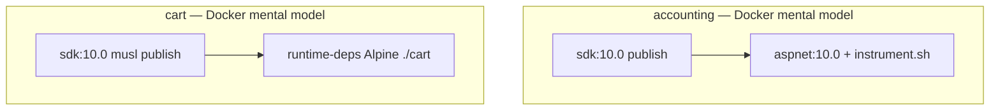
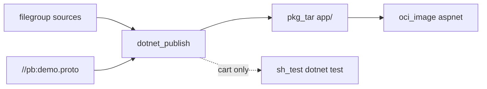

# 17 — .NET: `accounting`, `cart`, host SDK, and an honest `sh_test` for xUnit

**Previous:** [`16-language-jvm-ad-and-kotlin-fraud-detection.md`](./16-language-jvm-ad-and-kotlin-fraud-detection.md)

**.NET on Linux in CI** is usually boring until **Bazel actions** run in an environment that is **not** your login shell: **`dotnet`** is missing, or **`dotnet --version`** is **8** while the project targets **net10.0**, or **`HOME`** is unset and NuGet throws a tantrum.

I did **not** wire **`rules_dotnet`** as the spine for these two services. I used a small custom rule, **`dotnet_publish`**, that runs **host** **`dotnet restore`** and **`dotnet publish`** inside a **declared output directory**, copies **`//pb:demo.proto`** into the **layout each `.csproj` expects**, then packages **`pkg_tar` → `oci_image`** on **digest-pinned `aspnet:10.0`**. For **cart**, I added a **`sh_test`** that runs **`dotnet test`** against a temp tree — **pragmatic**, **networked**, and **tagged** so CI can sweep it deliberately.

---

## Before Bazel — how the two services built

### `accounting`

**Dockerfile (still the Compose / matrix path):**

- **Builder:** **`mcr.microsoft.com/dotnet/sdk:10.0`**, copy **`src/accounting/`** and **`pb/demo.proto` → `Accounting/src/protos/demo.proto`**.  
- **`dotnet restore` / `dotnet build` / `dotnet publish`** into **`/app/publish`**, **`UseAppHost=false`**.  
- **Runtime:** **`mcr.microsoft.com/dotnet/aspnet:10.0`**, user **`app`**, **`WORKDIR /app`**.  
- **OTel .NET auto-instrumentation:** **`./instrument.sh dotnet Accounting.dll`** as **entrypoint**, plus **`OTEL_DOTNET_AUTO_TRACES_ADDITIONAL_SOURCES=Accounting.Consumer`**.  
- **Image extras:** **`/var/log/opentelemetry/dotnet`** created and **chown**’d for **`app`** — Bazel image **does not** recreate that unless I add another layer.

### `cart`

**Dockerfile (nested under `src/cart/src/Dockerfile`):**

- **Builder:** **SDK 10.0**, copy **`src/cart/`** and **`pb/`** under **`/usr/src/app`**, **`dotnet publish`** with **`linux-musl-$TARGETARCH`** into **`/cart`**.  
- **Runtime:** **`mcr.microsoft.com/dotnet/runtime-deps:10.0-alpine3.22`**, **`ENTRYPOINT ./cart`** — **musl**, **single-file / self-contained** style **binary** named **`cart`**.

**Bazel path for cart intentionally differs:** **`extra_publish_args`** forces **`PublishSingleFile=false`** and **`SelfContained=false`** so the **OCI image** runs **`dotnet cart.dll`** on **aspnet** — **framework-dependent**, same **runtime shape** as other demo .NET containers in this fork, not the **Alpine musl** single-file layout.



---

## After Bazel — the paradigm I use

1. **`filegroup`** globs **sources** (`.cs`, `.csproj`, `slnx`, props, `NuGet.config` for cart).  
2. **`dotnet_publish`** — one **Starlark rule** that writes a **manifest**, **`cp`**’s sources + proto into a **temp root**, runs **`dotnet restore`** / **`dotnet publish`**, emits a **directory artifact**. **`tags = ["requires-network"]`** because **NuGet** needs the network unless you vendor everything.  
3. **`pkg_tar`** with **`package_dir = "app"`** — matches **`WORKDIR /app`** on the image.  
4. **`oci_image`** on **`@dotnet_aspnet_10_linux_amd64//:…`**, **entrypoint** aligned with Dockerfile intent (**accounting** uses **`instrument.sh`**; **cart** uses **`dotnet cart.dll`**).  
5. **Cart tests:** **`sh_test`** **`run_cart_dotnet_test.sh`** copies runfiles into a temp tree, drops **`pb/demo.proto`**, runs **`dotnet test`** — **`unit`**, **`requires-network`**, **`no-sandbox`**, **`size = "enormous"`**.



---

## Why `PATH` and `DOTNET_ROOT` in `.bazelrc` (the evening I will not repeat)

Distro packages often put **SDK 8** first under **`/usr/lib/dotnet`**. I install **SDK 10** via **dotnet-install** into **`~/.dotnet`**. **Bazel’s default action environment** does not automatically inherit my **interactive** **`PATH`**.

So I **pass the client environment through**:

```15:18:.bazelrc
# BZ-080 accounting (net10): pass client PATH + DOTNET_ROOT so ~/.dotnet SDK 10 is visible in actions
# (distro packages often install SDK 8 under /usr/lib/dotnet first).
common --action_env=PATH
common --action_env=DOTNET_ROOT
```

The **`dotnet_publish`** implementation **also** tries **`DOTNET_ROOT`**, **`$HOME/.dotnet`**, **passwd home**, and **`/usr/share/dotnet`**, and only prepends to **`PATH`** when **`dotnet --version`** looks like **`10.*`**. Same **SDK10** selection pattern appears in **`run_cart_dotnet_test.sh`**.

---

## Custom rule — `dotnet_publish` (what it actually does)

**Manifest:** every source file is copied to a path **relative to the Bazel package** so **nested** **`src/cart/...`** stays nested. **Proto** is copied to **`proto_dest`** (default **`src/protos/demo.proto`** for **accounting**; **cart** sets **`pb/demo.proto`**).

**Shell action (trimmed to the idea):** temp **`ROOT`**, copy from manifest, **`cd "$ROOT"`**, **`dotnet restore`**, **`dotnet publish`** with **`UseAppHost=false`**, optional **`extra_publish_args`**.

```95:105:tools/bazel/dotnet_publish.bzl
dotnet_publish = rule(
    implementation = _dotnet_publish_impl,
    attrs = {
        "srcs": attr.label_list(allow_files = True, mandatory = True, doc = "All project sources (csproj, cs, props, slnx, …). Paths under the package are preserved."),
        "csproj": attr.label(allow_single_file = [".csproj"], mandatory = True),
        "proto": attr.label(allow_single_file = [".proto"], mandatory = True, doc = "Canonical proto (e.g. //pb:demo.proto); copied to proto_dest."),
        "proto_dest": attr.string(default = "src/protos/demo.proto", doc = "Path relative to package root inside the temp tree (accounting: src/protos/demo.proto; cart: pb/demo.proto)."),
        "extra_publish_args": attr.string(default = "", doc = "Extra MSBuild arguments for dotnet publish (e.g. /p:SelfContained=false)."),
    },
    doc = "Runs host `dotnet publish`. Requires SDK matching TargetFramework (e.g. net10.0). Use tag requires-network for restore.",
)
```

**Hermeticity honesty:** this is **host-tooling** Bazel, not a downloaded **dotnet** toolchain inside the graph. The trade-off I accepted: **ship correctness gates now** (publish + image + test), **tighten hermeticity** later if the org demands it.

---

## `accounting` — `BUILD.bazel`

```10:53:src/accounting/BUILD.bazel
filegroup(
    name = "accounting_sources",
    srcs = glob(
        [
            "*.cs",
            "*.csproj",
            "*.slnx",
            "Directory.Build.props",
        ],
    ),
)

dotnet_publish(
    name = "accounting_publish",
    srcs = [":accounting_sources"],
    csproj = ":Accounting.csproj",
    proto = "//pb:demo.proto",
    tags = ["requires-network"],
    visibility = ["//visibility:public"],
)

pkg_tar(
    name = "accounting_layer",
    srcs = [":accounting_publish"],
    package_dir = "app",
)

oci_image(
    name = "accounting_image",
    base = "@dotnet_aspnet_10_linux_amd64//:dotnet_aspnet_10_linux_amd64",
    entrypoint = ["./instrument.sh", "dotnet", "Accounting.dll"],
    env = {
        "OTEL_DOTNET_AUTO_TRACES_ADDITIONAL_SOURCES": "Accounting.Consumer",
    },
    tars = [":accounting_layer"],
    visibility = ["//visibility:public"],
    workdir = "/app",
)

oci_load(
    name = "accounting_load",
    image = ":accounting_image",
    repo_tags = ["otel/demo-accounting:bazel"],
)
```

**Proto default:** **`proto_dest`** omitted → **`src/protos/demo.proto`** inside the temp tree, matching **`Dockerfile`** **`COPY … Accounting/src/protos/demo.proto`**.

---

## `cart` — nested tree, FDD publish, OCI, and **`cart_dotnet_test`**

```15:95:src/cart/BUILD.bazel
filegroup(
    name = "cart_publish_sources",
    srcs = glob(
        [
            "Directory.Build.props",
            "NuGet.config",
            "cart.slnx",
            "src/**/*.cs",
            "src/**/*.csproj",
            "src/**/*.json",
        ],
        exclude = [
            "src/bin/**",
            "src/obj/**",
        ],
    ),
)

dotnet_publish(
    name = "cart_publish",
    srcs = [":cart_publish_sources"],
    csproj = "src/cart.csproj",
    extra_publish_args = "/p:PublishSingleFile=false /p:SelfContained=false",
    proto = "//pb:demo.proto",
    proto_dest = "pb/demo.proto",
    tags = ["requires-network"],
)
# ... pkg_tar, oci_image entrypoint dotnet cart.dll, oci_load ...

sh_test(
    name = "cart_dotnet_test",
    srcs = ["run_cart_dotnet_test.sh"],
    data = [":cart_dotnet_test_data"],
    tags = [
        "no-sandbox",
        "requires-network",
        "unit",
    ],
    size = "enormous",
)
```

**Why `proto_dest = "pb/demo.proto"`:** **`cart.csproj`** and the **Dockerfile** expect **`pb/demo.proto`** next to the **cart** tree — not **`src/protos/...`**. The custom rule’s **`_dest_relative_to_package`** preserves **`src/**`** paths for nested **`csproj`** files.

**`cart_dotnet_test_data`** includes **`tests/**`** and **`//pb:demo.proto`** so the test script can **`cp -a`** the tree and place the proto before **`dotnet test`**.

**Runner (core idea):** resolve **`TEST_SRCDIR`** runfiles → copy to **`mktemp`** → **`dotnet test tests/cart.tests.csproj -c Release`**.

```72:87:src/cart/run_cart_dotnet_test.sh
WORK="$(mktemp -d)"
trap 'rm -rf "${WORK}"' EXIT
mkdir -p "${WORK}/pb"
cp -a "${CART_SRC}/." "${WORK}/"
cp "${PROTO}" "${WORK}/pb/demo.proto"
# ...
cd "${WORK}"
dotnet test tests/cart.tests.csproj -c Release --verbosity minimal --nologo
```

---

## OCI base — `aspnet:10.0` pinned by digest

```344:354:MODULE.bazel
# BZ-080 / BZ-121 accounting: mcr.microsoft.com/dotnet/aspnet:10.0 (matches src/accounting/Dockerfile runtime).
# Index digest: docker buildx imagetools inspect mcr.microsoft.com/dotnet/aspnet:10.0
oci.pull(
    name = "dotnet_aspnet_10",
    digest = "sha256:a04d1c1d2d26119049494057d80ea6cda25bbd8aef7c444a1fc1ef874fd3955b",
    image = "mcr.microsoft.com/dotnet/aspnet",
    platforms = [
        "linux/amd64",
        "linux/arm64",
    ],
)
```

Both **`accounting_image`** and **`cart_image`** use the **`_linux_amd64`** repo variant today, same pattern as other **OCI** targets in this workspace.

---

## Docker vs Bazel — what I still say out loud

| Topic | Reality |
|-------|---------|
| **Published matrix images** | **Dockerfile** builds remain **authoritative** for multi-arch publishing in CI; Bazel proves **linux/amd64** **`oci_load`** tags (**`otel/demo-accounting:bazel`**, **`otel/demo-cart:bazel`**). |
| **Accounting logging dir** | **Dockerfile** creates **`/var/log/opentelemetry/dotnet`**; **Bazel `oci_image`** **omits** that unless I add a layer. |
| **Cart runtime** | **Docker** = **Alpine musl** **`./cart`**; **Bazel** = **aspnet** **`dotnet cart.dll`** — **documented** as an intentional **FDD** choice for the Bazel path. |
| **SDK** | **Host .NET 10** required for **`dotnet_publish`** and **`cart_dotnet_test`**. |

---

## Commands I use

```bash
# Publish outputs (network)
bazelisk build //src/accounting:accounting_publish --config=ci
bazelisk build //src/cart:cart_publish --config=ci

# Images
bazelisk build //src/accounting:accounting_image --config=ci
bazelisk build //src/cart:cart_image --config=ci
bazelisk run  //src/accounting:accounting_load
bazelisk run  //src/cart:cart_load

# Cart xUnit (host dotnet, network, no-sandbox)
bazelisk test //src/cart:cart_dotnet_test --config=ci --config=unit
```

---

## When things break — my checklist

| Symptom | What I check |
|---------|----------------|
| **`dotnet` not found / wrong version** | **`.bazelrc`** **`PATH` / `DOTNET_ROOT`**; **`dotnet --version`** == **10.x** on the host. |
| **NuGet / restore failures** | **`requires-network`** on **`dotnet_publish`**; CI job allows network for those actions. |
| **Proto not found in MSBuild** | **`proto_dest`** matches **`.csproj`** **Protobuf** includes (**accounting** vs **cart** paths differ). |
| **`cart_dotnet_test` cannot find runfiles** | **`TEST_SRCDIR`** layout; **`cart_dotnet_test_data`** includes **`tests/**`** and **`//pb:demo.proto`**. |

---

## Why I am not ashamed of `sh_test`

**Pure** hermetic **dotnet** in Bazel is a **project**. **`sh_test` + `dotnet test`** is a **stepping stone** that still gives me a **`unit`** gate and catches **regressions** in the **cart** test project **today**. I can defend that in an interview without pretending the graph is **fully hermetic** yet.

---

## Interview line

> “**.NET here is host-`dotnet` wrapped in declared outputs**, not magic. The win is **one place** that copies **`demo.proto`**, **pins** the **aspnet** base by **digest**, and **runs xUnit** when I ask — even if **`rules_dotnet`** purists wince.”

---

**Next:** [`18-language-rust-shipping.md`](./18-language-rust-shipping.md)
