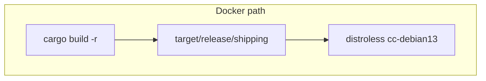
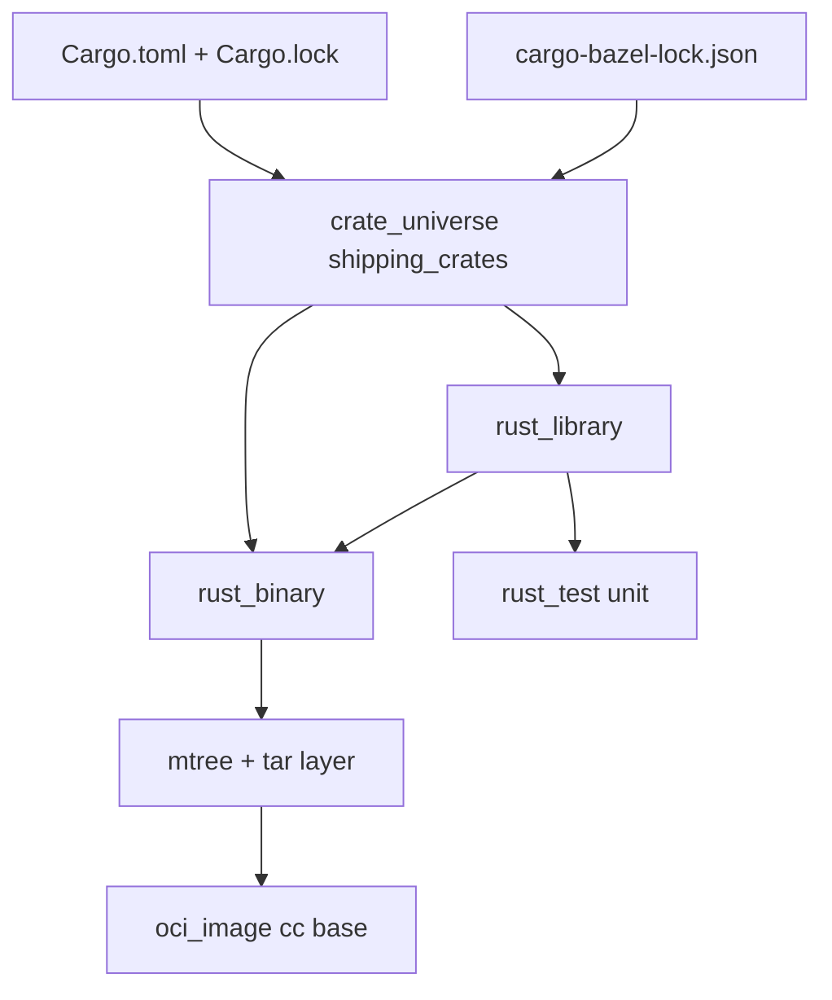

# 18 — Rust `shipping`: `rules_rust`, `crate_universe`, dynamic linking, and distroless **cc**

**Previous:** [`17-language-dotnet-accounting-and-cart.md`](./17-language-dotnet-accounting-and-cart.md)

**Rust** was my **M3** answer for **BZ-090**: prove **`shipping`** builds and tests under Bazel, then (**BZ-121**) package the same **`glibc`-linked** binary the **Dockerfile** already ran on **`distroless/cc`**. This is **not** the “fully static musl” story people tweet about — it is the **default `rules_rust` Linux binary** + **correct base image** story. I picked **distroless cc** on purpose because **static** **distroless** would have been **wrong** for the linker the compiler actually used.

---

## Before Bazel — how `shipping` built

**Dockerfile (still valid for Compose and multi-arch matrix builds):**

- **Builder:** **`rust:1.91`**, **`apt-get`** installs **g++**, **libc**, **protobuf** tooling; optional **cross** toolchain for **aarch64** when **buildx** targets **arm64**.  
- **`cargo build -r`** (native or **`aarch64-unknown-linux-gnu`** with explicit **linker** env vars).  
- **Runtime:** **`gcr.io/distroless/cc-debian13:nonroot`**, **`WORKDIR /app`**, **`COPY …/target/release/shipping`**, **`CMD ["./shipping"]`**, **`EXPOSE`** shipping port.

**What I internalized:** the binary is **dynamically linked against GNU libc** (and friends). **Distroless “static”** images **do not** ship the dynamic loader those binaries expect — **cc** images do.



---

## After Bazel — the paradigm I use

1. **`rules_rust`** registers a **Rust toolchain** (**edition 2021** in **`MODULE.bazel`**).  
2. **`crate_universe`** (**`from_cargo`**) turns **`Cargo.toml` + `Cargo.lock`** into a **`@shipping_crates`** repository with **`aliases()`** and **`all_crate_deps()`** — the Bazel-side mirror of **Cargo’s** dependency graph.  
3. **`rust_library`** + **`rust_binary`** in **`src/shipping/BUILD.bazel`** mirror **`[lib]`** + **`[[bin]]`** in **`Cargo.toml`**.  
4. **`rust_test`** targets the **library crate** with **dev-dependencies** wired through **`normal_dev`** / **`proc_macro_dev`**.  
5. **OCI** uses the **same `mtree_spec` → `mtree_mutate` → `tar`** pattern as **Go checkout**, but **`package_dir = "app"`** and base **`distroless_cc_debian13_nonroot_linux_amd64`** so the **layout** matches **`WORKDIR /app`**, **`./shipping`**.



---

## `MODULE.bazel` — toolchain + `crate_universe`

```136:152:MODULE.bazel
# M3 BZ-090: Rust shipping — rules_rust toolchain + crate_universe from Cargo.lock (repin: CARGO_BAZEL_REPIN=1 bazel sync --only=shipping_crates).
bazel_dep(name = "rules_rust", version = "0.69.0")

rust = use_extension("@rules_rust//rust:extensions.bzl", "rust")
rust.toolchain(edition = "2021")
use_repo(rust, "rust_toolchains")

register_toolchains("@rust_toolchains//:all")

shipping_crate_index = use_extension("@rules_rust//crate_universe:extensions.bzl", "crate")
shipping_crate_index.from_cargo(
    name = "shipping_crates",
    cargo_lockfile = "//src/shipping:Cargo.lock",
    lockfile = "//src/shipping:cargo-bazel-lock.json",
    manifests = ["//src/shipping:Cargo.toml"],
)
use_repo(shipping_crate_index, "shipping_crates")
```

**Two lock artifacts:**

- **`Cargo.lock`** — what **Cargo** owns; truth for **versions**.  
- **`cargo-bazel-lock.json`** — what **crate_universe** generates for **Bazel** labels; checked in so CI does not **non-deterministically** resolve crates.

**When dependencies change** (new crate, version bump): I refresh the Bazel lock the way the comment says:

```bash
CARGO_BAZEL_REPIN=1 bazelisk sync --only=shipping_crates
```

Then I **commit** the updated **`cargo-bazel-lock.json`** (and **`Cargo.lock`** if **`cargo`** changed it).

**`exports_files`** in **`BUILD.bazel`** exposes **`Cargo.toml`**, **`Cargo.lock`**, **`cargo-bazel-lock.json`** so **`MODULE.bazel`** can reference them.

---

## `BUILD.bazel` — library, binary, test, OCI

```20:60:src/shipping/BUILD.bazel
rust_library(
    name = "shipping_lib",
    srcs = glob(
        ["src/**/*.rs"],
        exclude = ["src/main.rs"],
    ),
    aliases = aliases(),
    crate_name = "shipping",
    crate_root = "src/lib.rs",
    edition = "2021",
    proc_macro_deps = all_crate_deps(proc_macro = True),
    deps = all_crate_deps(normal = True),
)

rust_binary(
    name = "shipping",
    srcs = ["src/main.rs"],
    aliases = aliases(),
    edition = "2021",
    proc_macro_deps = all_crate_deps(proc_macro = True),
    deps = [":shipping_lib"] + all_crate_deps(normal = True),
)

rust_test(
    name = "shipping_test",
    aliases = aliases(
        normal_dev = True,
        proc_macro_dev = True,
    ),
    crate = ":shipping_lib",
    edition = "2021",
    proc_macro_deps = all_crate_deps(
        proc_macro = True,
        proc_macro_dev = True,
    ),
    tags = ["unit"],
    deps = all_crate_deps(
        normal = True,
        normal_dev = True,
    ),
)
```

**`aliases()`** and **`all_crate_deps(...)`** come from **`@shipping_crates//:defs.bzl`** — that is how **crate_universe** hides the **long label list** I would otherwise maintain by hand.

**OCI layer** (same mechanical story as **Go checkout**, different **base** and **package_dir**):

```62:96:src/shipping/BUILD.bazel
# --- BZ-121: OCI (rules_oci) — distroless cc for glibc-linked Rust binary (not static like Go checkout). ---
mtree_spec(
    name = "shipping_mtree_raw",
    srcs = [":shipping"],
    out = "shipping_mtree_raw.spec",
)

mtree_mutate(
    name = "shipping_mtree",
    mtree = ":shipping_mtree_raw",
    package_dir = "app",
    srcs = [":shipping"],
)

tar(
    name = "shipping_layer",
    srcs = [":shipping"],
    mtree = ":shipping_mtree",
    out = "shipping_layer.tar",
)

oci_image(
    name = "shipping_image",
    base = "@distroless_cc_debian13_nonroot_linux_amd64//:distroless_cc_debian13_nonroot_linux_amd64",
    entrypoint = ["./shipping"],
    exposed_ports = ["50050/tcp"],
    tars = [":shipping_layer"],
    workdir = "/app",
)

oci_load(
    name = "shipping_load",
    image = ":shipping_image",
    repo_tags = ["otel/demo-shipping:bazel"],
)
```

**Base digest** in **`MODULE.bazel`** (multi-arch **pull**; image pins **`linux/amd64`** today like several other services):

```239:249:MODULE.bazel
# BZ-090 / BZ-121 shipping (Rust): dynamically linked GNU target — matches src/shipping/Dockerfile (gcr.io/distroless/cc-debian13:nonroot).
# Index digest: docker buildx imagetools inspect gcr.io/distroless/cc-debian13:nonroot
oci.pull(
    name = "distroless_cc_debian13_nonroot",
    digest = "sha256:9c4fe2381c2e6d53c4cfdefeff6edbd2a67ec7713e2c3ca6653806cbdbf27a1e",
    image = "gcr.io/distroless/cc-debian13",
    platforms = [
        "linux/amd64",
        "linux/arm64",
    ],
)
```

---

## Static vs dynamic — why I did not pretend `shipping` is Go

**`checkout`** (Go) can sit on **`distroless/static`** because the **Go** toolchain produced a **statically linked** binary for that target. **Default `rules_rust`** output on **Linux** is typically **dynamic** against **glibc**. If I dropped that binary onto **`distroless/static`**, I would get a **runtime** that cannot **resolve the loader** — a failure mode that looks like “Bazel is broken” when the image policy was wrong.

**Future option:** a **musl** / **fully static** Rust build could move to **`static`** — that is a **deliberate** compile-flag and platform choice, not a free lunch.

---

## Protobufs and `//pb` (honest scope)

**`shipping`** uses **tonic** / **gRPC** in **`Cargo.toml`**, but **this workspace** does **not** yet wire **`rust_proto_library`** / **prost** from **`//pb:demo_proto`** into **`shipping_lib`**. The **`pb/BUILD.bazel`** comment in-tree states the intent: when **`demo.proto`** becomes a **Rust** dependency, generate from **`:demo_proto`** and add **`deps`** from **`//src/shipping:shipping_lib`**. Until then, **Bazel** owns **build + test + image** for **shipping** without **`pb`** codegen in the graph.

---

## Developer hygiene — ignore **`target/`**

Rust’s **`target/`** directory is huge and irrelevant to Bazel’s graph. **`.bazelignore`** includes **`src/shipping/target`** so **`query`** and analysis do not wander into **Cargo**’s scratch forest.

---

## Commands I use

```bash
# Binary + unit tests
bazelisk build //src/shipping:shipping --config=ci
bazelisk test  //src/shipping:shipping_test --config=ci --config=unit

# OCI
bazelisk build //src/shipping:shipping_image --config=ci
bazelisk run  //src/shipping:shipping_load
docker image ls | grep demo-shipping

# After changing Cargo dependencies
CARGO_BAZEL_REPIN=1 bazelisk sync --only=shipping_crates
```

---

## When things break — my checklist

| Symptom | What I check |
|---------|----------------|
| **Unknown crate / label after edit** | **`CARGO_BAZEL_REPIN`** + **`sync --only=shipping_crates`**; commit **`cargo-bazel-lock.json`**. |
| **Binary runs locally, dies in container** | **Wrong OCI base** — **cc** vs **static**; **`ldd`**-style thinking. |
| **Tests fail only in CI** | **Rust toolchain** version on runner vs laptop; **`rust_test`** **`deps`** include **`normal_dev`**. |
| **Slow / huge analysis** | **`src/shipping/target`** still ignored? |

---

## Interview line

> “**Rust in Bazel here is `crate_universe` + honest linking discipline.** I match **distroless cc** to a **glibc** binary — **static** images are for **static** binaries, not wishful thinking.”

---

**Next:** [`19-language-cpp-currency-and-proto-smoke.md`](./19-language-cpp-currency-and-proto-smoke.md)
