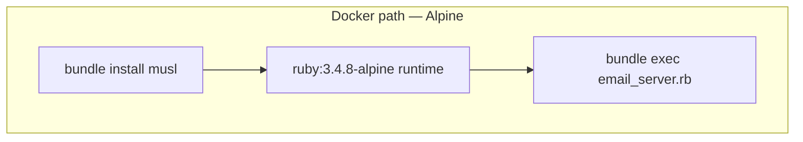
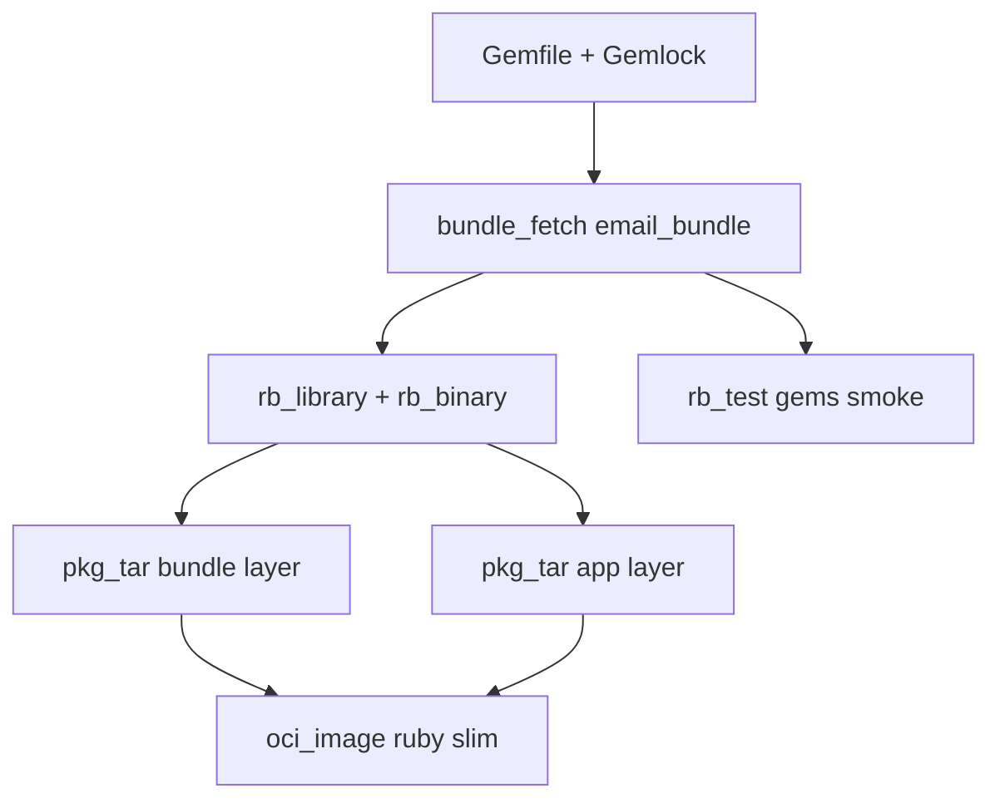

# 20 — Ruby `email`: `rules_ruby`, `bundle_fetch`, glibc vs Alpine, and a gems smoke test

**Previous:** [`19-language-cpp-currency-and-proto-smoke.md`](./19-language-cpp-currency-and-proto-smoke.md)

**Ruby** in a polyglot repo is **ecosystem-picky**: **native extensions**, **OpenSSL**, **libc** (**glibc** vs **musl**), and **Bundler** platforms in **`Gemfile.lock`**. **BZ-093** was my milestone to get **`email`** **building**, **testing**, and **packaged for OCI** under Bazel without lying that **Alpine** and **portable MRI + `bundle_fetch`** are the same world.

I **document the tension** between **Compose’s Alpine Dockerfile** and **Bazel’s Debian-slim image** — both are **valid**; they **optimize for different linkers**.

---

## Before Bazel — how `email` built

**Dockerfile (Alpine, still the matrix / Compose path):**

- **Builder:** **`ruby:3.4.8-alpine3.22`**, **`bundle install`** after **`apk`** adds **gcc**, **musl-dev**, **make**, **gcompat**.  
- **Runtime:** same **Alpine** Ruby image, **`COPY`** **`/usr/local/bundle`** from builder.  
- **`WORKDIR /email_server`**, copy **`views/`**, **`Gemfile`**, **`Gemfile.lock`**, **`.ruby-version`**, **`email_server.rb`**.  
- **`ENTRYPOINT ["bundle", "exec", "ruby", "email_server.rb"]`**, **`EXPOSE`** email port.

**What that assumes:** **musl**, **Alpine**-built **native gems** where needed, and a **global** bundle path under **`/usr/local/bundle`**.



---

## After Bazel — the paradigm I use

1. **`rules_ruby`** with **`portable_ruby = True`** and **`version_file = //src/email:.ruby-version`** (**`3.4.8`**) — a **consistent** interpreter for **actions**, not “whatever `ruby` is on PATH today.”  
2. **`ruby.bundle_fetch`** creates **`@email_bundle`** from **`Gemfile` + `Gemfile.lock`** — **vendored** layout Bazel can depend on (**`deps = ["@email_bundle"]`**).  
3. **`rb_library`** wraps **`email_server.rb`** + **`views/**`**; **`rb_binary`** sets **`main`**.  
4. **`rb_test`** runs **`test/gems_load_test.rb`** — **requires** key gems **without** starting **Sinatra** in **classic** mode (that would **block** until timeout).  
5. **OCI:** two **`pkg_tar`** layers — **`@email_bundle//:email_bundle`** (vendor tree + binstubs) and **app files** — on **`ruby:3.4.8-slim-bookworm`** (**glibc**), digest-pinned, **`WORKDIR /email_server`**, same **`bundle exec`** entrypoint shape as Docker.



---

## `MODULE.bazel` — toolchain + `bundle_fetch` + OCI base

```154:170:MODULE.bazel
# M3 BZ-093: Ruby email — rules_ruby portable MRI + bundle_fetch (Gemfile.lock → vendor/bundle in @email_bundle).
bazel_dep(name = "rules_ruby", version = "0.24.0")

ruby = use_extension("@rules_ruby//ruby:extensions.bzl", "ruby")
ruby.toolchain(
    name = "ruby",
    portable_ruby = True,
    version_file = "//src/email:.ruby-version",
)
ruby.bundle_fetch(
    name = "email_bundle",
    gemfile = "//src/email:Gemfile",
    gemfile_lock = "//src/email:Gemfile.lock",
)
use_repo(ruby, "email_bundle", "ruby", "ruby_toolchains")

register_toolchains("@ruby_toolchains//:all")
```

**Base image pull** (Debian **bookworm** **slim**, **glibc** — matches **native** gem expectations for **`rules_ruby`** **bundle** resolution on **Linux**):

```287:298:MODULE.bazel
# BZ-093 email (Ruby): docker.io/library/ruby:3.4.8-slim-bookworm — glibc; matches rules_ruby portable MRI
# native extensions in @email_bundle (Alpine/musl in src/email/Dockerfile is the Compose path; Bazel image is Debian-slim).
# Index digest: docker buildx imagetools inspect ruby:3.4.8-slim-bookworm
oci.pull(
    name = "ruby_348_slim_bookworm",
    digest = "sha256:1af92319c7301866eddd99a7d43750d64afa1f2b96d9a4cb45167d759e865a85",
    image = "docker.io/library/ruby",
    platforms = [
        "linux/amd64",
        "linux/arm64",
    ],
)
```

---

## `Gemfile` — **`force_ruby_platform`** on **`google-protobuf`**

**grpc** and **protobuf** gems ship **platform-specific** builds. **`rules_ruby`** **`bundle_fetch`** runs **`bundle install`** in a **glibc** **portable MRI** context. **Alpine** and **glibc** **native** variants are **not** simultaneously satisfiable in one lockfile the way I wanted for **CI + Bazel**.

So I **force** **protobuf** to the **pure-Ruby** platform where needed:

```14:17:src/email/Gemfile
# force_ruby_platform: single "ruby" platform in the lockfile so Bundler can resolve the same
# graph for rules_ruby bundle_install (glibc portable MRI) and multi-OS CI; native musl/glibc
# protobuf gems are not all simultaneously satisfiable across PLATFORMS.
gem "google-protobuf", "~> 4.34.0", force_ruby_platform: true
```

**`Gemfile.lock`** **PLATFORMS** are limited to **Linux glibc** ABIs so **`bundle install`** under Bazel resolves **grpc** for **x86_64** / **aarch64** **linux**:

```272:274:src/email/Gemfile.lock
PLATFORMS
  aarch64-linux
  x86_64-linux
```

**Compose** can still **`docker build -f src/email/Dockerfile .`** — **Alpine** path unchanged; **Bazel** path is **explicitly** **Debian-slim + glibc** bundle resolution.

---

## `BUILD.bazel` — library, binary, test, OCI

```12:38:src/email/BUILD.bazel
exports_files([
    ".ruby-version",
    "Gemfile",
    "Gemfile.lock",
])

rb_library(
    name = "email_lib",
    srcs = ["email_server.rb"],
    data = glob(["views/**"]),
    deps = ["@email_bundle"],
)

rb_binary(
    name = "email",
    main = "email_server.rb",
    deps = [":email_lib"],
)

# Hermetic: exercises Bundler + key gems (no HTTP server started).
rb_test(
    name = "email_gems_smoke_test",
    srcs = ["test/gems_load_test.rb"],
    main = "test/gems_load_test.rb",
    deps = ["@email_bundle"],
    tags = ["unit"],
)
```

**Smoke test source** — **`bundler/setup`**, **`sinatra/base`** (not **`sinatra`** classic), **stdout** marker:

```4:8:src/email/test/gems_load_test.rb
# Smoke test for Bazel: Bundler + Sinatra API (do not `require "sinatra"` here — classic mode
# would start a web server and block until timeout).
require "bundler/setup"
require "sinatra/base"
puts "email_gems_smoke_ok"
```

**OCI layers** — **vendor** tree first, then **app** sources (same **`/email_server`** layout as **`WORKDIR`** in Dockerfile):

```40:74:src/email/BUILD.bazel
pkg_tar(
    name = "email_bundle_layer",
    srcs = ["@email_bundle//:email_bundle"],
    package_dir = "email_server",
)

pkg_tar(
    name = "email_app_layer",
    srcs = [
        "email_server.rb",
        "Gemfile",
        "Gemfile.lock",
        ".ruby-version",
    ] + glob(["views/**"]),
    package_dir = "email_server",
)

oci_image(
    name = "email_image",
    base = "@ruby_348_slim_bookworm_linux_amd64//:ruby_348_slim_bookworm_linux_amd64",
    cmd = [],
    entrypoint = [
        "bundle",
        "exec",
        "ruby",
        "email_server.rb",
    ],
    exposed_ports = ["6060/tcp"],
    tars = [
        ":email_bundle_layer",
        ":email_app_layer",
    ],
    workdir = "/email_server",
)
```

---

## Alpine vs Debian-slim — the honest comparison

| Aspect | **Dockerfile (Alpine)** | **Bazel `email_image`** |
|--------|-------------------------|-------------------------|
| **libc** | **musl** | **glibc** (**bookworm** slim) |
| **Native gems** | Built against **musl** toolchain in image | **`bundle_fetch`** under **portable MRI** / **glibc** |
| **When I use it** | **Published** multi-arch matrix, **Compose** | **`bazel build`**, **`docker load`**, **`otel/demo-email:bazel`** |

I **do not** claim byte-identical **`bundle`** trees between the two — I claim **same entrypoint shape** and **same app source** layout under **`/email_server`**.

---

## Commands I use

```bash
bazelisk build //src/email:email --config=ci
bazelisk test  //src/email:email_gems_smoke_test --config=ci --config=unit
bazelisk build //src/email:email_image --config=ci
bazelisk run  //src/email:email_load
docker image ls | grep demo-email
```

**After changing `Gemfile` or `Gemfile.lock`:** **`bazelisk mod tidy`** may be needed if the **Ruby** extension’s **`use_repo`** surface changes; then **rebuild** **`@email_bundle`**-backed targets.

---

## When things break — my checklist

| Symptom | What I check |
|---------|----------------|
| **Bundle / gem resolution errors** | **`Gemfile.lock`** **PLATFORMS**; **`force_ruby_platform`** on **protobuf**; **Ruby 3.4.8** matches **`.ruby-version`**. |
| **`rb_test` hangs** | Accidental **`require "sinatra"`** **classic** — use **`sinatra/base`** only in smoke. |
| **Native extension mismatch** | **Alpine** vs **slim** — am I mixing **musl** binaries into **glibc** image? |
| **Missing `views/`** | **`rb_library` `data = glob(["views/**"])`**; **`email_app_layer`** includes **views**. |

---

## Interview line

> “**Ruby in Bazel is Bundler graph + libc policy.** I **`bundle_fetch`** into **`@email_bundle`**, run a **small `rb_test`** that **does not** start Sinatra, and I **pick Debian-slim** for the **Bazel** image because **glibc** matches **portable MRI** native gems — **Alpine** stays the **Dockerfile** path.”

---

**Next:** [`21-language-elixir-flagd-ui-and-custom-mix-release.md`](./21-language-elixir-flagd-ui-and-custom-mix-release.md)
