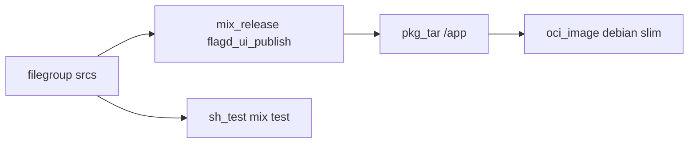

# 21 — Elixir `flagd-ui`: custom `mix_release`, Phoenix, and a Debian-slim runtime

**Previous:** [`20-language-ruby-email-and-bundle-vendoring.md`](./20-language-ruby-email-and-bundle-vendoring.md)

**Phoenix** releases are not a **single fat JAR**. They are a **directory orchestra**: **`mix deps`**, **`assets.deploy`**, **`mix compile`**, **`mix release`**, **`rel/`** overlays, and a runtime that still needs **OpenSSL**, **ERTS**, and the right **locale** env. **BZ-094** was my milestone to make **`flagd-ui`** **build**, **test**, and **OCI** under Bazel without pretending **BCR `rules_elixir`** replaces **Mix** for that whole pipeline.

I chose the same **pragmatic pattern** I used for **.NET `dotnet_publish`**: a **Starlark rule** copies a **declared file manifest** into a **temp tree**, runs **host tools** (**`mix`**) with **`MIX_ENV=prod`**, and emits a **`declare_directory`** artifact — then **`pkg_tar` → `oci_image`** on **digest-pinned `debian:bullseye-20251117-slim`**, matching the **Dockerfile** runner tag.

---

## Before Bazel — how `flagd-ui` built

**Dockerfile (multi-stage, Debian-based):**

- **Builder:** **`hexpm/elixir`** image pinned to **Elixir 1.19.3**, **Erlang/OTP 28.0.2**, **Debian bullseye** slim variant (same **DEBIAN_VERSION** token as the runner tag). **`apt-get`** installs **`build-essential`** and **`git`**.  
- **Mix:** **`mix local.hex`**, **`mix local.rebar`**, **`MIX_ENV=prod`**, **`mix deps.get`**, **`deps.compile`**, **`assets.setup`**, copy **`priv` / `lib` / `assets`**, **`assets.deploy`**, **`compile`**, copy **`rel`**, **`mix release`**.  
- **Final:** plain **`debian:${DEBIAN_VERSION}`** runner, **`apt-get`** installs **`libstdc++6`**, **`openssl`**, **`libncurses5`**, **`locales`**, **`ca-certificates`**, **`locale-gen`** for **`en_US.UTF-8`**.  
- **`WORKDIR /app`**, copy **`_build/prod/rel/flagd_ui`** tree, **`CMD`** runs **`ulimit`** then **`exec /app/bin/server`**.

**What that optimizes for:** a **known-good** Phoenix release inside **Docker**. **What it does not give** by itself: a **Bazel target graph** that knows **which** `.ex` files invalidated **`mix release`**.

```mermaid
flowchart TB
  subgraph docker_path [Docker path]
    HB[hexpm/elixir builder]
    MIX[mix deps + assets + release]
    DEB[debian slim + apt runtime libs]
    HB --> MIX --> DEB
    DEB --> SRV[/app/bin/server]
  end
```

---

## Why I did not lean on BCR `rules_elixir` for this app

**`rules_elixir`** (Rabbitmq / BCR) is aimed at **Erlang/Elixir sources** with **`rules_erlang`-style** graphs. It does **not** replace **Mix** for a full **Phoenix** pipeline: **Hex** resolution, **git** dependencies (e.g. **heroicons**-style paths), **`assets.setup` / `assets.deploy`**, and **`mix release`** output layout.

So this fork follows the **same trade** as **`dotnet_publish`**: **declared inputs**, **host `mix`**, **network** for **Hex**, **honest tags** on the rule.

---

## After Bazel — the paradigm I use

1. **`filegroup`** globs **`mix.exs`**, **`mix.lock`**, **`config/**`**, **`lib/**`**, **`assets/**`**, **`priv/**`**, **`rel/**`**, formatters — everything **`mix release`** needs.  
2. **`mix_release`** (**`tools/bazel/mix_release.bzl`**) → **`//src/flagd-ui:flagd_ui_publish`**, **`tags = ["requires-network"]`**.  
3. **`sh_test` `flagd_ui_mix_test`** runs **`run_mix_test.sh`**: finds **`src/flagd-ui`** under **`TEST_SRCDIR`**, **`MIX_ENV=test`**, **`mix deps.get`**, **`mix test`**, **`tags = ["unit", "requires-network"]`**, **`size = "enormous"`** — **separate** Mix fetch from **`flagd_ui_publish`** (no shared **`_build`**).  
4. **`pkg_tar`** **`flagd_ui_release_layer`** packs **`flagd_ui_publish`** under **`/app`**.  
5. **`oci_image`** **`flagd_ui_image`**: base **`debian_bullseye_20251117_slim_linux_amd64`**, **`entrypoint`** mirrors **Dockerfile `CMD`** (**`ulimit`**, **`exec /app/bin/server`**), **`MIX_ENV=prod`**, **`LANG` / `LC_ALL` C.UTF-8**, **`4000/tcp`**.



---

## `mix_release.bzl` — what the action does

**Manifest:** same **relative-path** trick as **.NET**: copy each **`src`** into a **temp `ROOT`** preserving paths under **`src/flagd-ui`**.

**Shell (condensed):** **`MIX_ENV=prod`**, **`LANG` / `LC_ALL`**, writable **`HOME`** for **Hex/Rebar**, **`git config safe.directory *`** for **git** deps, **`mix local.hex`**, **`mix local.rebar`**, **`mix deps.get --only prod`**, **`deps.compile`**, **`assets.setup`**, **`assets.deploy`**, **`compile`**, **`mix release <app>`**, then **`cp -a`** **`_build/prod/rel/<app>/`** into the **declared output directory**.

```36:73:tools/bazel/mix_release.bzl
        command = """
set -euo pipefail
export MIX_ENV=prod
export LANG=C.UTF-8
export LC_ALL=C.UTF-8
# Writable HOME for Hex/Rebar and mix archives (sandbox often has no real HOME).
MIXHOME="$(mktemp -d)"
export HOME="$MIXHOME"
trap 'rm -rf "$MIXHOME" "$ROOT"' EXIT
ROOT="$(mktemp -d)"
mkdir -p "$ROOT"
while IFS=$(printf '\\t') read -r src dst || [ -n "$src" ]; do
  [ -z "$src" ] && continue
  d="$ROOT/$(dirname "$dst")"
  mkdir -p "$d"
  cp "$src" "$ROOT/$dst"
done < {manifest}
cd "$ROOT"
git config --global --add safe.directory '*' 2>/dev/null || true
if ! command -v mix >/dev/null 2>&1; then
  echo "mix not found on PATH; install Elixir/OTP (see src/flagd-ui/README.md Bazel section)." >&2
  exit 1
fi
mix local.hex --force
mix local.rebar --force
mix deps.get --only prod
mix deps.compile
mix assets.setup
mix assets.deploy
mix compile
mix release {release_app}
REL="$ROOT/_build/prod/rel/{release_app}"
if [ ! -d "$REL" ]; then
  echo "mix release did not produce $REL" >&2
  exit 1
fi
mkdir -p "{outdir}"
cp -a "$REL/." "{outdir}/"
```

**Rule surface:**

```85:92:tools/bazel/mix_release.bzl
mix_release = rule(
    implementation = _mix_release_impl,
    attrs = {
        "srcs": attr.label_list(allow_files = True, mandatory = True, doc = "Mix project tree (mix.exs, config, lib, assets, priv, rel, …)."),
        "release_app": attr.string(default = "flagd_ui", doc = "Release name from mix.exs :releases."),
    },
    doc = "Runs host `mix release`. Requires Elixir/OTP compatible with mix.exs (e.g. ~> 1.19) and network for Hex/git (tag `requires-network`).",
)
```

**Hermeticity honesty:** **host `mix`** + **network** — first builds can take **several minutes**. The win is **declared inputs** and **reproducible commands**, not pretending **Hex** is frozen without the **lockfile** you already committed.

---

## `BUILD.bazel` — publish, test, OCI

```12:77:src/flagd-ui/BUILD.bazel
_FLAGD_UI_SRC_GLOBS = [
    "mix.exs",
    "mix.lock",
    ".formatter.exs",
    "config/**",
    "lib/**",
    "assets/**",
    "priv/**",
    "rel/**",
]

filegroup(
    name = "flagd_ui_release_srcs",
    srcs = glob(_FLAGD_UI_SRC_GLOBS),
)

filegroup(
    name = "flagd_ui_test_data",
    srcs = glob(_FLAGD_UI_SRC_GLOBS + ["test/**"]),
)

mix_release(
    name = "flagd_ui_publish",
    srcs = [":flagd_ui_release_srcs"],
    release_app = "flagd_ui",
    tags = ["requires-network"],
)

sh_test(
    name = "flagd_ui_mix_test",
    srcs = ["run_mix_test.sh"],
    data = [":flagd_ui_test_data"],
    size = "enormous",
    tags = [
        "requires-network",
        "unit",
    ],
)
```

**OCI** — **entrypoint** matches **Dockerfile** **`CMD`** shape (**`ulimit`**, **`exec /app/bin/server`**); **`PHX_SERVER`** is set by **release overlays** as in the stock image story.

```57:71:src/flagd-ui/BUILD.bazel
oci_image(
    name = "flagd_ui_image",
    base = "@debian_bullseye_20251117_slim_linux_amd64//:debian_bullseye_20251117_slim_linux_amd64",
    cmd = [],
    # Mirrors src/flagd-ui/Dockerfile CMD (server sets PHX_SERVER=true).
    entrypoint = ["/bin/sh", "-c", "ulimit -n 65536 2>/dev/null || true; exec /app/bin/server"],
    env = {
        "LANG": "C.UTF-8",
        "LC_ALL": "C.UTF-8",
        "MIX_ENV": "prod",
    },
    exposed_ports = ["4000/tcp"],
    tars = [":flagd_ui_release_layer"],
    workdir = "/app",
)
```

**`MODULE.bazel`** pins the **runner** image by **digest** (same tag family as **`Dockerfile`** **`RUNNER_IMAGE`**):

```300:307:MODULE.bazel
oci.pull(
    name = "debian_bullseye_20251117_slim",
    digest = "sha256:530a3348fc4b5734ffe1a137ddbcee6850154285251b53c3425c386ea8fac77b",
    image = "docker.io/library/debian",
    platforms = [
        "linux/amd64",
        "linux/arm64",
    ],
)
```

---

## `run_mix_test.sh` — runfiles + **`mix test`**

```6:39:src/flagd-ui/run_mix_test.sh
# Bazel sh_test: locate src/flagd-ui under runfiles (Bzlmod workspace name varies).
_MIX_ROOT=""
if [[ -n "${TEST_SRCDIR:-}" ]]; then
  for _base in "${TEST_SRCDIR}"/*; do
    [[ -d "${_base}/src/flagd-ui" ]] || continue
    if [[ -f "${_base}/src/flagd-ui/mix.exs" ]]; then
      _MIX_ROOT="${_base}/src/flagd-ui"
      break
    fi
  done
fi
# ...
cd "${_MIX_ROOT}"
export MIX_ENV=test
# ...
mix local.hex --force
mix local.rebar --force
mix deps.get
mix test --color=false
```

---

## CI host setup I rely on (inlined from the workflow)

The **Bazel** job installs **Elixir/OTP** and **build deps** so **`mix release`** and **`mix test`** see the same major versions as the **Dockerfile** builder:

- **`erlef/setup-beam@v1`** with **`elixir-version: '1.19.3'`**, **`otp-version: '28.0.2'`**.  
- **`sudo apt-get install -y build-essential git gettext-base`** — **gcc** for **native** deps, **git** for **git**-based Mix deps, **`gettext-base`** for **`envsubst`** used elsewhere in the same job (**baked Envoy/nginx** patterns).

---

## `gettext` / CI — why it shows up in the same job

**`gettext-base`** is installed on that runner not only for **flagd-ui** — **other Bazel targets** in the repo **bake** templates with **`envsubst`** (**genrule**-style infra). I treat **one** apt line as **shared** CI hygiene so I do not chase **“works on my laptop”** **`envsubst`** failures later.

---

## Docker vs Bazel image — caveats I do not hide

| Topic | **Dockerfile final stage** | **Bazel `flagd_ui_image`** |
|-------|----------------------------|----------------------------|
| **Base** | **`debian:bullseye-20251117-slim`** after **`apt`** adds **libs + `ca-certificates` + `locales`** | **Same digest-pinned slim** — **no** extra **`apt`** layer in the Bazel graph **today** |
| **HTTPS / OTLP** | **`ca-certificates`** installed | **OTLP over HTTPS** from the container may need an **extra layer** or **use the Dockerfile** for full parity |
| **Runtime secrets** | **`SECRET_KEY_BASE`**, **`OTEL_EXPORTER_OTLP_ENDPOINT`**, etc. (**`config/runtime.exs`**) | **Same** — **Bazel** does not inject secrets; **`docker run -e …`** still required |

**Example local run** (generate a secret, wire OTLP, map port):

```bash
bazelisk run //src/flagd-ui:flagd_ui_load
docker run --rm \
  -e SECRET_KEY_BASE="$(mix phx.gen.secret)" \
  -e OTEL_EXPORTER_OTLP_ENDPOINT=http://host.docker.internal:4317 \
  -e FLAGD_UI_PORT=4000 \
  -p 4000:4000 \
  otel/demo-flagd-ui:bazel
```

---

## Commands I use

```bash
bazelisk build //src/flagd-ui:flagd_ui_publish --config=ci
bazelisk test  //src/flagd-ui:flagd_ui_mix_test --config=ci --config=unit
bazelisk build //src/flagd-ui:flagd_ui_image --config=ci
bazelisk run  //src/flagd-ui:flagd_ui_load
```

---

## When things break — my checklist

| Symptom | What I check |
|---------|----------------|
| **`mix not found`** | **Elixir 1.19.x** + **OTP 28.x** on **PATH**; CI **`setup-beam`** versions. |
| **Hex / git failures** | **`requires-network`** on **`flagd_ui_publish`**; **`git`** installed on runner. |
| **Native compile errors** | **`build-essential`** (**gcc**) on host. |
| **Runfiles / test root wrong** | **`run_mix_test.sh`** loop over **`TEST_SRCDIR`**; **`mix.exs`** present. |
| **Release dir missing** | **`release_app`** string matches **`mix.exs` `:releases`** name (**`flagd_ui`**). |

---

## Learner note (still true)

If **`mix`** is missing locally, Bazel errors look **scary** — they are usually **“install Elixir/OTP aligned with `mix.exs`”** wearing a trench coat.

---

## Interview line

> “**Phoenix in Bazel without replacing Mix** means a **custom `mix_release` rule**: manifest in, **`mix release` out**, **Debian slim** OCI on a **digest-pinned** base. **`rules_elixir` isn’t wrong — it’s the wrong hammer for this Phoenix-shaped nail.**”

---

**Next:** [`22-language-php-quote-and-composer.md`](./22-language-php-quote-and-composer.md)
