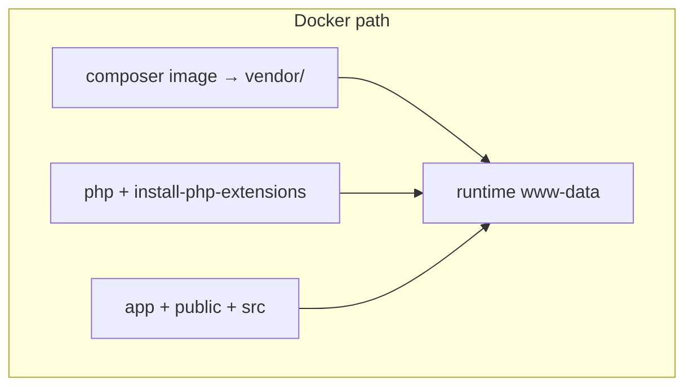
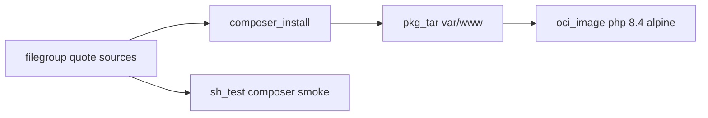

# 22 — PHP `quote`: Composer, `composer_install`, and Alpine **without** the PECL orchestra

**Previous:** [`21-language-elixir-flagd-ui-and-custom-mix-release.md`](./21-language-elixir-flagd-ui-and-custom-mix-release.md)

**PHP** in this repo is **BZ-095**: **`quote`** is a **Slim** app with **OpenTelemetry** Composer packages, but **no `composer.lock`** in-tree — **Packagist** resolution happens on every **`composer install`**. I wired Bazel the same way I wired **.NET** and **Elixir**: a **custom rule** (**`composer_install`**) copies a **declared tree** into a **temp directory**, runs **host** **`composer install`** with **flags aligned to the Dockerfile vendor stage**, emits a **directory artifact**, then **`pkg_tar` → `oci_image`** on **digest-pinned `php:8.4-cli-alpine3.22`**.

I **do not** claim **byte-identical** parity with the **Dockerfile**: the **Dockerfile** runs **`install-php-extensions`** (**opcache**, **pcntl**, **protobuf**, **opentelemetry**). The **Bazel OCI** base is **stock CLI Alpine PHP** — **pure-PHP** auto-instrumentation may work; **full PECL parity** means **building from the Dockerfile** or **adding a custom base**.

---

## Before Bazel — how `quote` built

**Dockerfile (multi-stage):**

1. **`mlocati/php-extension-installer`** stage — supplies **`install-php-extensions`** helper.  
2. **`composer:2.8.12` vendor stage** — **`COPY composer.json` only**, then:

   **`composer install --ignore-platform-reqs --no-interaction --no-plugins --no-scripts --no-dev --prefer-dist`**

3. **Runtime:** **`php:8.4-cli-alpine3.22`**, copy **`install-php-extensions`**, **`RUN install-php-extensions opcache pcntl protobuf opentelemetry`**.  
4. **`WORKDIR /var/www`**, **`USER www-data`**, copy **`vendor/`** from vendor stage, copy **`app/`**, **`public/`**, **`src/`**.  
5. **`CMD ["php", "public/index.php"]`**, **`EXPOSE`** quote port.

**What that optimizes for:** **extensions** + **Composer** in **controlled** stages. **What Bazel copies first:** the **same `composer install` argument shape** for **`vendor/`**, not the **PECL** layer.



---

## After Bazel — the paradigm I use

1. **`filegroup`** globs **`composer.json`**, **`app/**`**, **`public/**`**, **`src/**`** — **no `composer.lock`** to glob (resolution is **live** against **`composer.json`**).  
2. **`composer_install`** → **`quote_publish`**, **`tags = ["requires-network"]`**.  
3. **`sh_test` `quote_composer_smoke_test`** runs **`run_composer_smoke_test.sh`**: find **`src/quote`** in runfiles, **`composer install`** with the **same flags**, **`php -r 'require "vendor/autoload.php"'`**.  
4. **`pkg_tar`** **`package_dir = "var/www"`** — matches **`WORKDIR /var/www`**.  
5. **`oci_image`**: base **`php_84_cli_alpine322_linux_amd64`**, **`entrypoint ["php", "public/index.php"]`**, **`workdir /var/www`**, **`8090/tcp`**.



---

## `composer_install.bzl` — manifest + **`composer install`**

Same **temp tree** pattern as **`dotnet_publish`** / **`mix_release`**: write **manifest**, **`cp`** into **`ROOT`**, run tool, **`cp -a`** into **declared output**.

```36:57:tools/bazel/composer_install.bzl
        command = """
set -euo pipefail
export COMPOSER_NO_INTERACTION=1 COMPOSER_ALLOW_SUPERUSER=1
COMPOSER_HOME="$(mktemp -d)"
export COMPOSER_HOME
trap 'rm -rf "$COMPOSER_HOME" "$ROOT"' EXIT
ROOT="$(mktemp -d)"
mkdir -p "$ROOT"
while IFS=$(printf '\\t') read -r src dst || [ -n "$src" ]; do
  [ -z "$src" ] && continue
  d="$ROOT/$(dirname "$dst")"
  mkdir -p "$d"
  cp "$src" "$ROOT/$dst"
done < {manifest}
cd "$ROOT"
if ! command -v composer >/dev/null 2>&1; then
  echo "composer not found on PATH; install Composer (see src/quote/README.md Bazel section)." >&2
  exit 1
fi
composer install {extra_args}
mkdir -p "{outdir}"
cp -a "$ROOT"/. "{outdir}/"
```

**Default **`composer_install_args`**** — **matches** the **Dockerfile** vendor **`RUN`** unless I override:

```69:78:tools/bazel/composer_install.bzl
composer_install = rule(
    implementation = _composer_install_impl,
    attrs = {
        "srcs": attr.label_list(allow_files = True, mandatory = True, doc = "PHP app tree (composer.json, app/, public/, src/, …)."),
        "composer_install_args": attr.string(
            default = "--ignore-platform-reqs --no-interaction --no-plugins --no-scripts --no-dev --prefer-dist",
            doc = "Arguments after `composer install` (match Dockerfile vendor stage unless you need dev deps).",
        ),
    },
    doc = "Runs host `composer install`. Requires PHP + Composer on PATH and network for Packagist. Use tag requires-network.",
)
```

**`--no-plugins` / `--no-scripts`:** reduces **surprise code execution** during install; **Dockerfile** uses the same **defensive** flags.

---

## `BUILD.bazel` — publish, smoke, OCI

```12:62:src/quote/BUILD.bazel
_QUOTE_SRC_GLOBS = [
    "composer.json",
    "app/**",
    "public/**",
    "src/**",
]

filegroup(
    name = "quote_release_srcs",
    srcs = glob(_QUOTE_SRC_GLOBS),
)

composer_install(
    name = "quote_publish",
    srcs = [":quote_release_srcs"],
    tags = ["requires-network"],
)

sh_test(
    name = "quote_composer_smoke_test",
    srcs = ["run_composer_smoke_test.sh"],
    data = [":quote_release_srcs"],
    size = "enormous",
    tags = [
        "requires-network",
        "unit",
    ],
)

pkg_tar(
    name = "quote_app_layer",
    srcs = [":quote_publish"],
    package_dir = "var/www",
)

oci_image(
    name = "quote_image",
    base = "@php_84_cli_alpine322_linux_amd64//:php_84_cli_alpine322_linux_amd64",
    cmd = [],
    entrypoint = ["php", "public/index.php"],
    env = {},
    exposed_ports = ["8090/tcp"],
    tars = [":quote_app_layer"],
    workdir = "/var/www",
)
```

**`MODULE.bazel`** **OCI pull** — **same tag line** as **Dockerfile** **`FROM php:8.4-cli-alpine3.22`**:

```312:322:MODULE.bazel
# BZ-095 quote (PHP): matches src/quote/Dockerfile runtime image tag (php:8.4-cli-alpine3.22).
# Index digest: docker buildx imagetools inspect php:8.4-cli-alpine3.22
oci.pull(
    name = "php_84_cli_alpine322",
    digest = "sha256:1029d5513f254a17f41f8384855cb475a39f786e280cf261b99d2edef711f32d",
    image = "docker.io/library/php",
    platforms = [
        "linux/amd64",
        "linux/arm64",
    ],
)
```

---

## `run_composer_smoke_test.sh` — runfiles + **`vendor/autoload.php`**

```6:45:src/quote/run_composer_smoke_test.sh
# Bazel sh_test: locate src/quote under runfiles (Bzlmod workspace name varies).
_QUOTE_ROOT=""
if [[ -n "${TEST_SRCDIR:-}" ]]; then
  for _base in "${TEST_SRCDIR}"/*; do
    [[ -d "${_base}/src/quote" ]] || continue
    if [[ -f "${_base}/src/quote/composer.json" ]]; then
      _QUOTE_ROOT="${_base}/src/quote"
      break
    fi
  done
fi
# ...
composer install \
  --ignore-platform-reqs \
  --no-interaction \
  --no-plugins \
  --no-scripts \
  --no-dev \
  --prefer-dist

php -r 'require "vendor/autoload.php"; echo "autoload_ok\n";'
```

**What the smoke proves:** **Composer** can **resolve** and **materialize** **`vendor/`**, and **autoload** loads — **not** full **HTTP** integration.

---

## `composer.json` — what gets pulled

**Runtime deps** (excerpt) include **Slim**, **Monolog**, **OpenTelemetry** API/SDK/exporters, **Slim** auto-instrumentation, **Guzzle**, **PHP-DI** — all **declared** in **`require`**; **no lockfile** means **CI** and **local** **`composer install`** may see **compatible** newer **patch** releases within **constraints** until someone commits a **lock**.

```5:22:src/quote/composer.json
    "require": {
        "php": ">= 8.3",
        "ext-json": "*",
        "ext-pcntl": "*",
        "monolog/monolog": "3.10.0",
        "open-telemetry/api": "1.8.0",
        "open-telemetry/sdk": "1.13.0",
        "open-telemetry/exporter-otlp": "1.4.0",
        "open-telemetry/opentelemetry-auto-slim": "1.3.0",
        "open-telemetry/detector-container": "1.1.0",
        "open-telemetry/opentelemetry-logger-monolog": "1.1.0",
        "guzzlehttp/guzzle": "7.10.0",
        "php-di/php-di": "7.1.1",
        "php-di/slim-bridge": "3.4.1",
        "php-http/guzzle7-adapter": "1.1.0",
        "react/http": "v1.11.0",
        "slim/psr7": "1.8.0",
        "slim/slim": "4.15.1"
    },
```

---

## CI — PHP + Composer on the runner

The **Bazel** workflow installs **PHP 8.4** and **Composer** so **`composer_install`** and **`quote_composer_smoke_test`** match the **Dockerfile** major line:

- **`shivammathur/setup-php@v2`** with **`php-version: '8.4'`**, **`tools: composer`**.

Locally I need the **same** or I get **`composer not found`** / **`php not found`** from the **rule** and the **smoke script**.

---

## Docker vs Bazel — differences I state clearly

| Topic | **Dockerfile** | **Bazel `quote_image`** |
|-------|----------------|-------------------------|
| **PECL extensions** | **`install-php-extensions`** (**opentelemetry**, **protobuf**, …) | **Not run** — **stock** **`php:8.4-cli-alpine`** |
| **User** | **`www-data`** for **COPY** / runtime | **Image default** (**root** on this base) unless **`user`** is set on **`oci_image`** |
| **`composer.lock`** | **Not copied** in **vendor** stage — only **`composer.json`** | **Same** — **no lock** in **filegroup** |
| **OTel behavior** | **Extension**-backed where installed | May rely on **pure PHP** paths where supported |

**`QUOTE_PORT`:** the app reads **`getenv('QUOTE_PORT')`** — pass **`-e`** at **`docker run`** like other services.

---

## Commands I use

```bash
bazelisk build //src/quote:quote_publish --config=ci
bazelisk test  //src/quote:quote_composer_smoke_test --config=ci --config=unit
bazelisk build //src/quote:quote_image --config=ci
bazelisk run  //src/quote:quote_load
docker image ls | grep demo-quote
```

---

## When things break — my checklist

| Symptom | What I check |
|---------|----------------|
| **Packagist / network** | **`requires-network`** on **`quote_publish`** and **`quote_composer_smoke_test`**; CI allows network. |
| **`composer` / `php` missing** | **PATH** on host; **`setup-php`** in CI. |
| **Platform ext errors** | **`--ignore-platform-reqs`** matches **Dockerfile**; host **exts** may differ. |
| **Extensions missing at runtime in Bazel image** | Expected vs **Dockerfile** — **use Dockerfile** or **extend base**. |

---

## Interview line

> “**PHP here is Composer-as-a-declared-directory**, same family as **`dotnet publish`** and **`mix release`**. I **pin the runtime image by digest**, **match `composer install` flags** to **Docker**, and I’m **honest** that **PECL** parity is **Dockerfile territory** until I add a **custom base**.”

---

**Next:** [`23-envoy-nginx-baked-config-and-oci.md`](./23-envoy-nginx-baked-config-and-oci.md)
