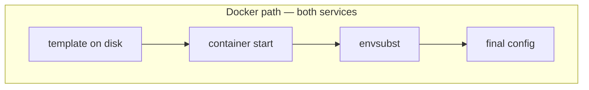
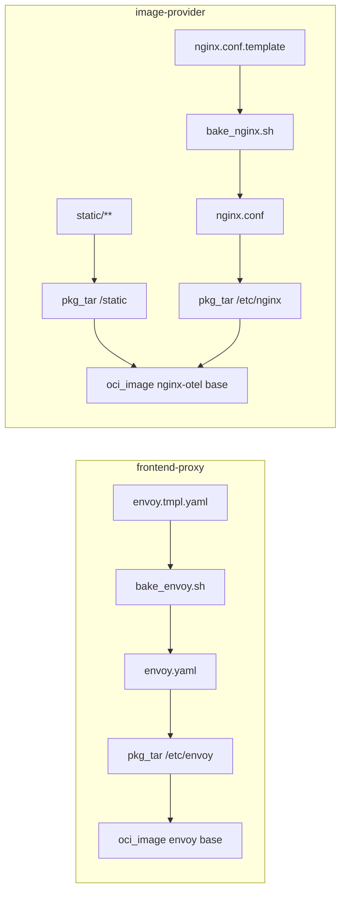

# 23 — Envoy + nginx: baked config, `envsubst`, and “config images” in Bazel

**Previous:** [`22-language-php-quote-and-composer.md`](./22-language-php-quote-and-composer.md)

**`frontend-proxy`** and **`image-provider`** are not **Spring Boot** or **Express** — they are **edge proxies** whose **real artifact** is **configuration**: **Envoy YAML** and **nginx.conf**, plus **static files** for **image-provider**. **BZ-097** was my milestone to treat them like **first-class Bazel targets**: **`genrule`** + **`bake_*.sh`** + **`pkg_tar` + `oci_image`**, with **`sh_test`** guards so **templating** does not rot silently.

The **philosophical split** I own: **Dockerfile** paths run **`envsubst` at container start** — any env can override upstreams at **runtime**. **Bazel** paths **bake** config at **build time** using **defaults** aligned with **Compose** service DNS names and **`.env`** port conventions. To **change** upstreams in the Bazel image, I **rebuild** with different env passed into the **bake** step — or I use the **Dockerfile** for **runtime** substitution.

---

## Before Bazel — how the two edges ran

### `frontend-proxy` (Envoy)

**Dockerfile:** **`FROM envoyproxy/envoy:v1.34-latest`**, **`apt-get gettext-base`**, **`USER envoy`**, **`WORKDIR /home/envoy`**, copy **`envoy.tmpl.yaml`**, **`ENTRYPOINT`** runs **`envsubst < envoy.tmpl.yaml > envoy.yaml && envoy -c envoy.yaml`**.

**Implication:** **Every container start** re-renders YAML from **whatever** environment the orchestrator injected.

### `image-provider` (nginx + OTel build)

**Dockerfile:** **`FROM nginxinc/nginx-unprivileged:1.29.0-alpine3.22-otel`**, **`USER 101`**, copy **`static/`** and **`nginx.conf.template`**, **`CMD`** runs **`envsubst` with an explicit variable list**, writes **`/etc/nginx/nginx.conf`**, **`cat`** for debug, **`exec nginx`**.

**Implication:** same **runtime** **`envsubst`** story with a **fixed** allowlist of **`$VARS`**.



---

## After Bazel — the paradigm I use

1. **`bake_envoy.sh` / `bake_nginx.sh`** export **defaults** (same **Compose**-shaped hostnames and ports when vars are unset).  
2. **`genrule`** invokes the script, writes **`envoy.yaml`** / **`nginx.conf`** as **declared outputs**. **`tags = ["no-sandbox"]`** — these actions shell out to **`envsubst`** on the **host**; I am not pretending they are fully hermetic sandboxes.  
3. **`pkg_tar`** places artifacts under **`/etc/envoy`** or **`/etc/nginx`**, and for **nginx** a second tar layers **`static/**` → **`/static`**.  
4. **`oci_image`** uses **digest-pinned** **`envoyproxy/envoy:v1.34-latest`** and **`nginxinc/nginx-unprivileged:…-otel`** (**`linux/amd64`** repo variants today).  
5. **`sh_test`** re-runs the bake script from **runfiles**, **`grep`**-asserts **shape** (clusters, **otel** stanzas, **listen** line).



---

## `frontend-proxy` — `BUILD.bazel`

```16:47:src/frontend-proxy/BUILD.bazel
genrule(
    name = "envoy_compose_defaults_yaml",
    srcs = ["envoy.tmpl.yaml"],
    outs = ["envoy.yaml"],
    cmd = "$(location bake_envoy.sh) $@ $(location envoy.tmpl.yaml)",
    tags = ["no-sandbox"],
    tools = ["bake_envoy.sh"],
)

pkg_tar(
    name = "frontend_proxy_envoy_layer",
    srcs = [":envoy_compose_defaults_yaml"],
    package_dir = "etc/envoy",
)

oci_image(
    name = "frontend_proxy_image",
    base = "@envoy_v134_latest_linux_amd64//:envoy_v134_latest_linux_amd64",
    cmd = ["-c", "/etc/envoy/envoy.yaml"],
    entrypoint = ["/usr/local/bin/envoy"],
    exposed_ports = [
        "8080/tcp",
        "10000/tcp",
    ],
    tars = [":frontend_proxy_envoy_layer"],
)

oci_load(
    name = "frontend_proxy_load",
    image = ":frontend_proxy_image",
    repo_tags = ["otel/demo-frontend-proxy:bazel"],
)
```

**`bake_envoy.sh`** — **defaults** mirror **demo network** names (**`frontend`**, **`image-provider`**, **`otel-collector`**, **`flagd`**, **`grafana`**, **`jaeger`**, …):

```8:33:src/frontend-proxy/bake_envoy.sh
export ENVOY_ADDR="${ENVOY_ADDR:-0.0.0.0}"
export ENVOY_PORT="${ENVOY_PORT:-8080}"
export ENVOY_ADMIN_PORT="${ENVOY_ADMIN_PORT:-10000}"
export OTEL_SERVICE_NAME="${OTEL_SERVICE_NAME:-frontend-proxy}"
export OTEL_COLLECTOR_HOST="${OTEL_COLLECTOR_HOST:-otel-collector}"
export OTEL_COLLECTOR_PORT_GRPC="${OTEL_COLLECTOR_PORT_GRPC:-4317}"
export OTEL_COLLECTOR_PORT_HTTP="${OTEL_COLLECTOR_PORT_HTTP:-4318}"
export FRONTEND_HOST="${FRONTEND_HOST:-frontend}"
export FRONTEND_PORT="${FRONTEND_PORT:-8080}"
export IMAGE_PROVIDER_HOST="${IMAGE_PROVIDER_HOST:-image-provider}"
export IMAGE_PROVIDER_PORT="${IMAGE_PROVIDER_PORT:-8081}"
export FLAGD_HOST="${FLAGD_HOST:-flagd}"
export FLAGD_PORT="${FLAGD_PORT:-8013}"
export FLAGD_UI_HOST="${FLAGD_UI_HOST:-flagd-ui}"
export FLAGD_UI_PORT="${FLAGD_UI_PORT:-4000}"
export LOCUST_WEB_HOST="${LOCUST_WEB_HOST:-load-generator}"
export LOCUST_WEB_PORT="${LOCUST_WEB_PORT:-8089}"
export GRAFANA_HOST="${GRAFANA_HOST:-grafana}"
export GRAFANA_PORT="${GRAFANA_PORT:-3000}"
export JAEGER_HOST="${JAEGER_HOST:-jaeger}"
export JAEGER_UI_PORT="${JAEGER_UI_PORT:-16686}"
if ! command -v envsubst >/dev/null 2>&1; then
  echo "bake_envoy.sh: envsubst not found; install gettext-base (e.g. apt-get install gettext-base)." >&2
  exit 1
fi
envsubst < "$tpl" > "$out"
```

**Config smoke test:**

```21:26:src/frontend-proxy/run_frontend_proxy_config_test.sh
bash "${_ROOT}/bake_envoy.sh" "${_TMP}" "${_ROOT}/envoy.tmpl.yaml"
grep -q 'static_resources:' "${_TMP}"
grep -q 'cluster: frontend' "${_TMP}"
grep -q 'opentelemetry_collector_grpc' "${_TMP}"
```

```49:61:src/frontend-proxy/BUILD.bazel
sh_test(
    name = "frontend_proxy_config_test",
    srcs = ["run_frontend_proxy_config_test.sh"],
    data = [
        "bake_envoy.sh",
        "envoy.tmpl.yaml",
    ],
    size = "small",
    tags = [
        "no-sandbox",
        "unit",
    ],
)
```

---

## `image-provider` — `BUILD.bazel`

```15:67:src/image-provider/BUILD.bazel
_STATIC = glob(["static/**"])

genrule(
    name = "nginx_compose_defaults_conf",
    srcs = ["nginx.conf.template"],
    outs = ["nginx.conf"],
    cmd = "$(location bake_nginx.sh) $@ $(location nginx.conf.template)",
    tags = ["no-sandbox"],
    tools = ["bake_nginx.sh"],
)

pkg_tar(
    name = "image_provider_static_layer",
    srcs = _STATIC,
    package_dir = "static",
)

pkg_tar(
    name = "image_provider_nginx_layer",
    srcs = [":nginx_compose_defaults_conf"],
    package_dir = "etc/nginx",
)

oci_image(
    name = "image_provider_image",
    base = "@nginx_unprivileged_1290_alpine322_otel_linux_amd64//:nginx_unprivileged_1290_alpine322_otel_linux_amd64",
    cmd = ["-g", "daemon off;"],
    entrypoint = ["/usr/sbin/nginx"],
    exposed_ports = ["8081/tcp"],
    tars = [
        ":image_provider_static_layer",
        ":image_provider_nginx_layer",
    ],
    user = "101",
)
```

**`bake_nginx.sh`** — **restricted `envsubst`** list matches **Dockerfile `CMD`**:

```8:17:src/image-provider/bake_nginx.sh
export OTEL_COLLECTOR_HOST="${OTEL_COLLECTOR_HOST:-otel-collector}"
export IMAGE_PROVIDER_PORT="${IMAGE_PROVIDER_PORT:-8081}"
export OTEL_COLLECTOR_PORT_GRPC="${OTEL_COLLECTOR_PORT_GRPC:-4317}"
export OTEL_SERVICE_NAME="${OTEL_SERVICE_NAME:-image-provider}"
# ...
# Dockerfile: envsubst '$OTEL_COLLECTOR_HOST $IMAGE_PROVIDER_PORT $OTEL_COLLECTOR_PORT_GRPC $OTEL_SERVICE_NAME'
envsubst '$OTEL_COLLECTOR_HOST $IMAGE_PROVIDER_PORT $OTEL_COLLECTOR_PORT_GRPC $OTEL_SERVICE_NAME' < "$tpl" > "$out"
```

**Smoke test assertions:**

```23:26:src/image-provider/run_image_provider_config_test.sh
bash "${_ROOT}/bake_nginx.sh" "${_TMP}" "${_ROOT}/nginx.conf.template"
grep -q 'otel_exporter' "${_TMP}"
grep -q 'listen 8081' "${_TMP}"
grep -q 'root /static' "${_TMP}"
```

---

## `MODULE.bazel` — digest-pinned bases

```356:378:MODULE.bazel
# BZ-097 frontend-proxy: docker.io/envoyproxy/envoy:v1.34-latest (matches src/frontend-proxy/Dockerfile FROM).
# Index digest: docker buildx imagetools inspect envoyproxy/envoy:v1.34-latest
oci.pull(
    name = "envoy_v134_latest",
    digest = "sha256:a27ac382cb5f4d3bebb665a4f557a8e96266a724813e1b89a6fb0b31d4f63a39",
    image = "docker.io/envoyproxy/envoy",
    platforms = [
        "linux/amd64",
        "linux/arm64",
    ],
)

# BZ-097 image-provider: nginxinc/nginx-unprivileged:1.29.0-alpine3.22-otel (matches Dockerfile FROM).
oci.pull(
    name = "nginx_unprivileged_1290_alpine322_otel",
    digest = "sha256:5a41b6424e817a6c97c057e4be7fb8fdc19ec95845c784487dee1fa795ef4d03",
    image = "docker.io/nginxinc/nginx-unprivileged",
    platforms = [
        "linux/amd64",
        "linux/arm64",
    ],
)
```

---

## Host dependency — **`gettext-base` / `envsubst`**

**`genrule`** and **`sh_test`** assume **`envsubst`** exists on the **machine running Bazel** (developer laptop or CI). The **Bazel CI** job installs **`gettext-base`** alongside **`build-essential`** and **`git`** so **Envoy/nginx** bakes and **Elixir**-adjacent **`envsubst`** patterns do not fail mysteriously.

If **`envsubst` is missing**, **`bake_envoy.sh`** and **`bake_nginx.sh`** exit **1** with an **install gettext-base** message.

---

## Bazel vs Dockerfile — trade-off I repeat in reviews

| Topic | **Dockerfile** | **Bazel `oci_image`** |
|-------|----------------|------------------------|
| **When config is rendered** | **Container start** | **`bazel build`** (unless you wrap bake in a **custom** env) |
| **Overriding upstreams** | Change **env** at **`docker run`** | **Rebuild** with env for **`genrule`**, or use **Docker** path |
| **Debug** | **nginx** **`cat`**’s config at start | **Baked** file is in **layer** — inspect tar or **run** container |

**Stub `/status`** and similar **template** behaviors stay in the **template** sources; the **smoke tests** only check **key** substrings, not full **golden** files.

---

## Commands I use

```bash
# Config smoke (unit sweep)
bazelisk test //src/frontend-proxy:frontend_proxy_config_test --config=ci --config=unit
bazelisk test //src/image-provider:image_provider_config_test --config=ci --config=unit

# Images (CI smoke often builds these without oci_load)
bazelisk build //src/frontend-proxy:frontend_proxy_image --config=ci
bazelisk build //src/image-provider:image_provider_image --config=ci

# Optional: load locally
bazelisk run  //src/frontend-proxy:frontend_proxy_load
bazelisk run  //src/image-provider:image_provider_load
```

---

## When things break — my checklist

| Symptom | What I check |
|---------|----------------|
| **`envsubst: command not found`** | **`gettext-base`** installed; **PATH** in CI. |
| **`genrule` fails in sandbox** | **`no-sandbox`** still on **`genrule`**; host tool access. |
| **Wrong upstream in image** | **Defaults** in **`bake_*.sh`** vs **Compose**; **rebuild** after template edits. |
| **nginx user / permission** | **`user = "101"`** on **`image_provider_image`** matches **unprivileged** image. |

---

## Interview line

> “**Edge proxies in Bazel are config-as-artifacts:** **`envsubst` at build time**, **digest-pinned upstream images**, and **`sh_test` grep-smoke** so **YAML/nginx** doesn’t rot. **Runtime** **`envsubst`** stays the **Dockerfile** story when I need **last-mile** overrides.”

---

**Next:** [`24-react-native-android-and-the-expo-edges.md`](./24-react-native-android-and-the-expo-edges.md)
