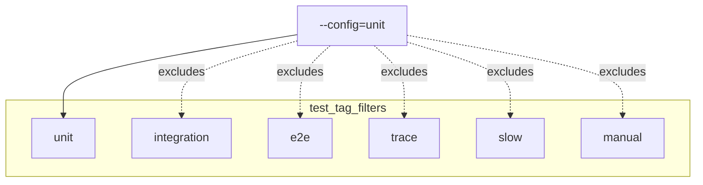
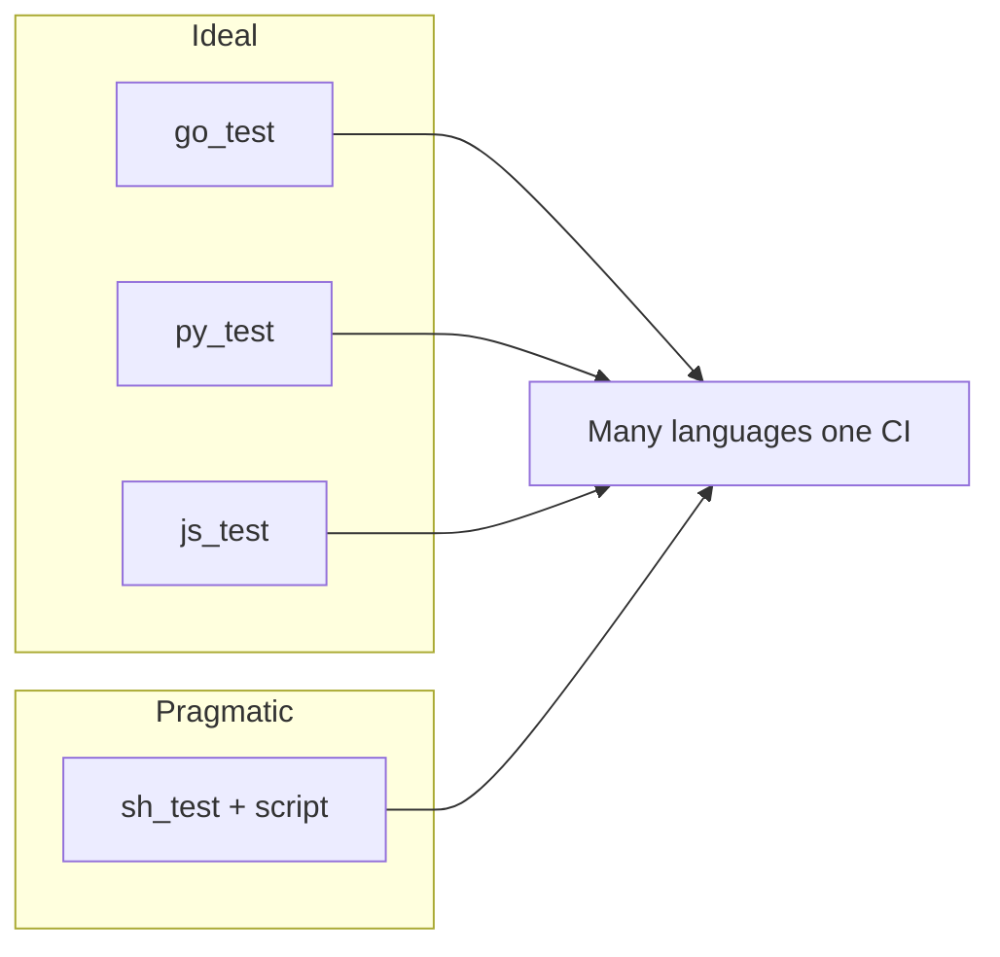

# 25 — Test tags, flakes, `requires-network`, and why `sh_test` is a power tool

**Previous:** [`24-react-native-android-and-the-expo-edges.md`](./24-react-native-android-and-the-expo-edges.md)

---

## Tags are routing, not decoration

I treat **tags** as **selectors** that CI and humans use to decide **what runs when**. The workspace wires that through **`.bazelrc`** so the same graph can answer different questions: fast PR gate, integration, browser work, trace-heavy suites.

**Test configs** (excerpt — the important part is the **filter expression**):

```text
test:ci --test_output=errors

test:unit --test_tag_filters=unit,-integration,-e2e,-trace,-slow,-manual
test:integration --test_tag_filters=integration,-e2e,-trace,-slow,-manual
test:e2e --test_tag_filters=e2e
test:trace --test_tag_filters=trace
```

**The subtlety that burned me once:** with **`--config=unit`**, Bazel runs **only** tests that carry the **`unit`** tag. **Untagged tests do not run.** So when I wanted something in the default PR sweep, I had to **add** `tags = ["unit"]` explicitly — including after wiring **frontend ESLint** into the same graph as a **`js_test`**.



---

## What each tag means (how I use it)

| Tag | When I use it |
|-----|----------------|
| **`unit`** | Fast checks: small package tests, smoke **`sh_test`s**, config bakers, **`js_test`** lint. This is what **`ci_full.sh`** runs via **`bazel test //... --config=unit`**. |
| **`integration`** | Needs local services, databases, or Compose; often paired with **`manual`** until infra is trustworthy. |
| **`e2e`** | Browser / full stack (Cypress-class work — intentionally deferred; see the **Cypress / Tracetest** article later in this series). |
| **`trace`** | Tracetest or trace-validation style suites (same deferral story). |
| **`slow`** | Large timeouts; easy to exclude from PRs even if the test is otherwise **`unit`**. |
| **`manual`** | Never runs in a blind **`//...`** sweep unless you opt in; **`--config=unit`** explicitly excludes it. |
| **`requires-network`** | Convention: the test may hit npm, NuGet, Packagist, Hex, etc. I pair it with **`unit`** when the check is still “CI-sized” but not hermetic. |
| **`no-sandbox`** | Gradle, .NET host SDK, or tools that need paths Bazel cannot enumerate — **only** when justified and documented next to the target. |
| **`lint`** | I use this on **`//src/frontend:lint`** alongside **`unit`** so ESLint stays visible in the tag set without pretending it is a classical unit test. |

---

## `unit` targets that sit in my graph today

These are the **`unit`**-tagged tests I rely on for **`bazel test //... --config=ci --config=unit --build_tests_only`** (same shape as the **`bazel_ci`** job’s script):

| Target | Tags (high level) |
|--------|-------------------|
| `//src/checkout/money:money_test` | `unit` |
| `//src/shipping:shipping_test` | `unit` |
| `//src/currency:currency_proto_smoke_test` | `unit` |
| `//src/email:email_gems_smoke_test` | `unit` |
| `//src/flagd-ui:flagd_ui_mix_test` | `unit`, `requires-network` |
| `//src/quote:quote_composer_smoke_test` | `unit`, `requires-network` |
| `//src/react-native-app:rn_js_checks` | `unit`, `requires-network` |
| `//src/frontend-proxy:frontend_proxy_config_test` | `unit` |
| `//src/image-provider:image_provider_config_test` | `unit` |
| `//src/cart:cart_dotnet_test` | `unit`, `requires-network`, `no-sandbox` |
| `//src/frontend:lint` | `unit`, `lint` (ESLint via **`js_test`**) |
| `//tools/bazel/policy:oci_allowlist_test` | `unit` |

**Rule for contributors (and for future me):** **Gazelle does not add tags.** Every new **`go_test`**, **`sh_test`**, **`js_test`**, or other runner needs an explicit tag choice after generation.

---

## Network, flakes, and honesty

**`requires-network`** does not mean “flaky is OK”. It means “this action reaches registries”. I still keep scripts **idempotent** and fail **loudly** on missing tools.

When something flakes:

1. **Re-run once** to see if it is infra (registry blip) or logic.  
2. If it is registry noise, consider **caching** (disk cache in CI, vendor dirs where language rules allow).  
3. If it is timeout, bump **`size`** or mark **`slow`** and **exclude** from **`unit`** — do not let a long tail wag the PR graph.

---

## Why I love `sh_test` for polyglot migrations

Native test rules are ideal when they exist. **`sh_test`** is the **honest bridge**: I can invoke **`dotnet test`**, **`mix test`**, **`composer install` + PHP smoke**, **`npm ci` + `tsc` + `jest`**, **`envsubst`** bakers — **without** blocking the migration on a perfect Starlark rule for every ecosystem.

Trade-offs I accept:

- **Host tools** must exist (CI installs them to match the script).  
- **`no-sandbox`** sometimes appears — I document **why** next to the target.  
- **Runfiles** layout surprises newcomers — a later article in this series goes deep on **`TEST_SRCDIR`** and **`$(location …)`**.



---

## Commands I use every week

```bash
# Whole repo unit sweep (matches CI’s test phase)
bazelisk test //... --config=ci --config=unit --build_tests_only

# Targets explicitly tagged unit (useful when debugging filters)
bazelisk query 'attr("tags", "unit", tests(//...))'

# One noisy test with full output
bazelisk test //src/cart:cart_dotnet_test --config=ci --config=unit --test_output=all
```

---

## Interview line

> “I routed tests with **`.bazelrc` tag filters** so PRs run **`unit`** only. **`requires-network`** and **`no-sandbox`** are **documented exceptions** for ecosystem reality — not an excuse to skip hermeticity where Go and protos already give it for free.”

---

**Next:** [`26-milestone-m3-when-the-wave-crashed-in-a-good-way.md`](./26-milestone-m3-when-the-wave-crashed-in-a-good-way.md)
