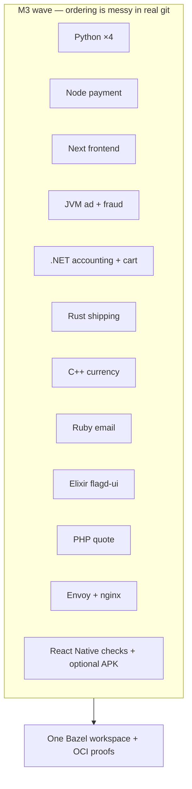

# 26 — Milestone M3: when the wave crashed (in a good way)

**Previous:** [`25-test-tags-flakes-network-and-sh-test-strategy.md`](./25-test-tags-flakes-network-and-sh-test-strategy.md)

**M3**, in my story, is the milestone where the OpenTelemetry Astronomy Shop stopped being “a few Go packages in Bazel” and became **a portfolio**: **many languages**, **`BUILD.bazel` everywhere it mattered**, **`oci_image` proofs** for the services I chose to containerize, and **tagged tests** that could survive a real CI conversation.

It is **not** a single commit. In git history it reads as a **long wave** — Python services, Node payment, Next frontend, JVM, .NET, Rust, C++, Ruby, Elixir, PHP, edge proxies (Envoy + nginx), React Native Android edges — each landing with **build files**, **smoke or unit tests**, and often **digest-pinned OCI bases**.

---

## What M3 proved (the claims I can make out loud)

1. **One build tool can stay coherent** across stacks that usually scatter into Make, Gradle, Docker, and “run this script”.  
2. **OCI from Bazel** can be **deterministic enough** for CI: **`rules_oci`**, **`oci.pull`** with **pinned digests**, **`pkg_tar`** / **`js_image_layer`** patterns per ecosystem.  
3. **The hard part is never Starlark syntax** — it is **ecosystem quirks**: Next standalone output, .NET publish vs Alpine musl, Ruby native gems, Elixir releases, PHP extensions, Envoy **`envsubst`** vs baked YAML at build time.

---

## The service surface I brought under Bazel (high level)

Think of M3 as “**application services + edges** in the graph”, each with a **`BUILD.bazel`** story:

| Area | Examples of what landed |
|------|-------------------------|
| **Go** | Checkout, product-catalog — binaries, tests, **`oci_image`** for checkout. |
| **Node / TS** | Payment (**Aspect rules_js** + pnpm lock), frontend (**Next** + heavy **`next_build`** rules). |
| **Python** | recommendation, product-reviews, llm, load-generator — **`py_binary`** + **`oci_image`** macros. |
| **JVM** | ad, fraud-detection — deploy JAR layers on distroless Java bases. |
| **.NET** | accounting, cart — publish trees on **aspnet** base (different from some Dockerfiles’ musl single-file choices). |
| **Rust / C++** | shipping (**cc** + distroless static), currency — static/dynamic linking lessons. |
| **Ruby / Elixir / PHP** | email (**Bundler vendor**), flagd-ui (**mix release**), quote (**Composer** + extensions). |
| **Edges** | frontend-proxy (**baked Envoy YAML**), image-provider (**baked nginx.conf**). |
| **Mobile** | react-native-app — **JS `sh_test`** (`tsc` + `jest`) plus **optional** **Android debug APK** with a **hermetic SDK bundle** (`@rn_android_sdk`) and **Gradle** `assembleDebug` (Linux amd64 only; iOS not in Bazel). |

Not every row has a **published** Bazel image in production — M3’s point is **graph + proof**, not “delete Docker forever”.



---

## What changed vs earlier milestones

| Before M3 | After M3 |
|-----------|----------|
| Mostly **Go** + protos + a thin slice of other languages | **Polyglot application layer** represented in Starlark |
| OCI experiments on **one** service | **Many** `oci_image` targets with **digest-pinned** bases |
| Ad-hoc “run this locally” | **`sh_test`** and native tests **tagged** for **`--config=unit`** |

---

## The command habit (even before CI was “the boss”)

Later, **`bash ./tools/bazel/ci/ci_full.sh`** became the **full** orchestration (see the **M4** article). During M3 I lived in **targeted** builds:

```bash
bazelisk build //src/checkout/... //src/payment/... --config=ci
bazelisk test //src/checkout/money:money_test --config=ci
```

As the graph grew, I **collapsed** that habit into scripts so I would not forget a leaf target. **The discipline starts in M3**; **the automation hardens in M4**.

---

## Emotional note (earned)

M3 is where **impostor syndrome peaks** — then breaks. You will see a failure and think “Bazel cannot do mobile” or “Next is impossible” — and often the fix is **one env var**, **one tag**, **one `data = []` entry**, or **`bazel mod tidy`**.

The milestone is **done** when you can **walk the repo** and explain **each oddity** without hand-waving.

---

## Interview line

> “M3 was my **breadth milestone**: I proved **`rules_oci` + language-specific packaging** across **Go, Node, Python, JVM, .NET, Rust, C++, Ruby, Elixir, PHP**, plus **edge config images** and **bounded mobile**. Depth — CI blocking, allowlists, release SBOM — came **next**.”

---

**Next:** [`27-oci-policy-dual-build-dockerfile-vs-bazel.md`](./27-oci-policy-dual-build-dockerfile-vs-bazel.md)
