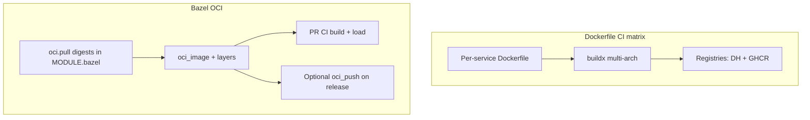

# 27 — OCI policy: living with two builders (Dockerfile matrix + Bazel `oci_image`)

**Previous:** [`26-milestone-m3-when-the-wave-crashed-in-a-good-way.md`](./26-milestone-m3-when-the-wave-crashed-in-a-good-way.md)

I did **not** delete the Dockerfile-driven CI matrix. That is a **deliberate** product decision, not a failure to finish.

---

## Why two build tracks exist

| Track | Role |
|-------|------|
| **Dockerfile matrix** (reusable workflow + per-service Dockerfiles) | **Published** multi-arch images (**`linux/amd64`**, **`linux/arm64`**) to **Docker Hub** and **GHCR** — the path the wider demo ecosystem expects. |
| **Bazel `oci_image` + `oci_load` (+ optional `oci_push`)** | **PR-time proof** on **linux/amd64**: reproducible layering, digest-pinned bases declared in **`MODULE.bazel`**, tests that catch “graph broke” before anyone tags a release. |

**Interview framing:**

> “I separated **registry truth** (multi-arch, release mechanics) from **build-graph truth** (hermetic-ish Bazel proofs). Shrinking the matrix in favor of **`oci_push`** everywhere is a **phase-two** cost trade — I did not pretend it was free.”



---

## Technical choices I standardized on (Bazel side)

| Topic | Choice | Why |
|-------|--------|-----|
| **Rule set** | **`rules_oci`** from BCR | Bzlmod-native, modern layering model. |
| **Base images** | **`oci.pull` + digest** | Reviewable pins; supply-chain clarity in module files. |
| **Local tags** | **`:bazel` suffix** on **`oci_load`** repo tags | Avoids colliding with Compose **`latest-*`** pulls on a developer laptop. |

**Caveats I keep visible** (so nobody confuses “green in Bazel” with “pixel-identical to Dockerfile”):

- **load-generator**: Bazel image has **Python** Playwright deps — **not** **`playwright install`** browsers; full browser parity stays on the Dockerfile path.  
- **JVM services**: some Dockerfiles inject the **OTel Java agent** via **`JAVA_TOOL_OPTIONS`**; Bazel images may **omit** that unless you add a layer.  
- **accounting / cart / email / quote**: base distro or extension sets may **differ** from Alpine/musl Dockerfiles — on purpose where **glibc** or **rules_ruby** compatibility wins.  
- **Edge proxies**: Dockerfile path runs **`envsubst` at container start** so any env can rewrite upstreams; the Bazel path typically **bakes** Envoy YAML / nginx config at **build** time using defaults aligned with Compose DNS — to change upstreams in the Bazel image you **rebuild** with different bake inputs, or you use the Dockerfile for runtime substitution.

---

## Dockerfile vs Bazel — the matrix I actually maintain

This table is the **closure** of “what exists in both worlds” versus “Dockerfile only” in this fork:

| `tag_suffix` / service | Dockerfile (matrix) | Bazel targets (summary) | Notes |
|------------------------|--------------------|-------------------------|-------|
| accounting | `./src/accounting/Dockerfile` | `//src/accounting:accounting_image`, `accounting_load` | Dual; publish = Dockerfile today. |
| ad | `./src/ad/Dockerfile` | `//src/ad:ad_oci_image`, `ad_oci_load` | Dual; JVM agent parity differs. |
| cart | `./src/cart/src/Dockerfile` | `//src/cart:cart_image`, `cart_load` | Dual; Bazel = FDD **aspnet** vs musl single-file Docker. |
| checkout | `./src/checkout/Dockerfile` | `checkout_image`, `checkout_load`, **`checkout_push`** | Dual; Bazel push pattern in the next article. |
| currency | `./src/currency/Dockerfile` | `currency_image`, `currency_load` | Dual. |
| email | `./src/email/Dockerfile` | `email_image`, `email_load` | Dual; Bazel base = Debian slim vs Alpine Docker. |
| flagd-ui | `./src/flagd-ui/Dockerfile` | `flagd_ui_image`, `flagd_ui_load` | Dual. |
| fraud-detection | `./src/fraud-detection/Dockerfile` | `fraud_detection_oci_image`, `fraud_detection_oci_load` | Dual. |
| frontend | `./src/frontend/Dockerfile` | `frontend_image`, `frontend_load` | Dual; **`next_build`** is **`manual`**. |
| frontend-proxy | `./src/frontend-proxy/Dockerfile` | `frontend_proxy_image`, `frontend_proxy_load` | Dual; Bazel bakes Envoy YAML. |
| frontend-tests | `./src/frontend/Dockerfile.cypress` | — | **Dockerfile only** (Cypress). |
| image-provider | `./src/image-provider/Dockerfile` | `image_provider_image`, `image_provider_load` | Dual; Bazel bakes nginx.conf. |
| kafka | `./src/kafka/Dockerfile` | — | **Dockerfile only**. |
| llm | `./src/llm/Dockerfile` | `llm_image`, `llm_load` | Dual. |
| load-generator | `./src/load-generator/Dockerfile` | `load_generator_image`, `load_generator_load` | Dual; Playwright caveat above. |
| opensearch | `./src/opensearch/Dockerfile` | — | **Dockerfile only**. |
| payment | `./src/payment/Dockerfile` | `payment_image`, `payment_load` | Dual. |
| product-catalog | `./src/product-catalog/Dockerfile` | Go **binary** in Bazel; **no** `oci_image` yet | Dockerfile for publish. |
| product-reviews | `./src/product-reviews/Dockerfile` | `product_reviews_image`, `product_reviews_load` | Dual. |
| quote | `./src/quote/Dockerfile` | `quote_image`, `quote_load` | Dual; PECL extensions differ. |
| recommendation | `./src/recommendation/Dockerfile` | `recommendation_image`, `recommendation_load` | Dual. |
| shipping | `./src/shipping/Dockerfile` | `shipping_image`, `shipping_load` | Dual. |
| traceBasedTests | `./test/tracetesting/Dockerfile` | — | **Dockerfile only** (Tracetest driver). |

---

## Commands — proving the Bazel side locally

```bash
# Representative OCI proof (Go + distroless — friendly first target)
bazelisk build //src/checkout:checkout_image --config=ci
bazelisk run //src/checkout:checkout_load --config=ci
docker images | grep demo-checkout

# Heavy graph (same shape as the main CI Bazel script)
bash ./tools/bazel/ci/ci_full.sh
```

---

## Interview line

> “Dual-build is **intentional**: **multi-arch release** stays on **Dockerfiles**, while **Bazel** gives me **digest-pinned bases** and **CI-visible OCI builds**. I document **parity gaps** (agents, Playwright, musl vs glibc) instead of hiding them.”

---

**Next:** [`28-oci-push-checkout-and-registry-auth.md`](./28-oci-push-checkout-and-registry-auth.md)
