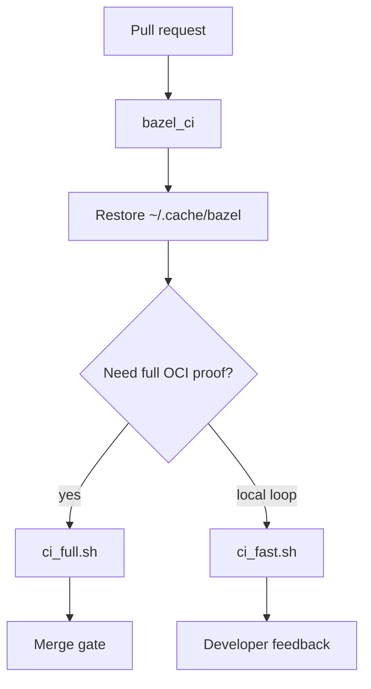

# 29 — Milestone M4: when CI became the boss (`bazel_ci` + `ci_full.sh`)

**Previous:** [`28-oci-push-checkout-and-registry-auth.md`](./28-oci-push-checkout-and-registry-auth.md)

Early Bazel in this fork **whispered** — jobs could be **non-blocking** while the graph matured. **M4** is the emotional pivot: **if Bazel is red, the PR is red.**

---

## What changed in GitHub Actions

The **`Checks`** workflow includes a job named **`bazel_ci`** (Ubuntu). It installs the **full toolchain orchestra** the polyglot graph needs, warms a **disk cache**, then runs **one script**.

```87:145:.github/workflows/checks.yml
  # M4 (BZ-611 / BZ-613): Bazel is the primary build+test gate for the migrated graph.
  bazel_ci:
    runs-on: ubuntu-latest
    steps:
      - name: check out code
        uses: actions/checkout@v6.0.2
        with:
          fetch-depth: 0
      - name: Set up Go
        uses: actions/setup-go@v6
        with:
          go-version: '1.25.x'
      - name: Set up Node
        uses: actions/setup-node@v6
        with:
          node-version: '22'
      - name: Set up Python
        uses: actions/setup-python@v6
        with:
          python-version: '3.x'
      - name: Set up .NET
        uses: actions/setup-dotnet@v4
        with:
          dotnet-version: '10.0.x'
      - name: Set up Elixir / OTP (flagd-ui Bazel — matches src/flagd-ui/Dockerfile)
        uses: erlef/setup-beam@v1
        with:
          elixir-version: '1.19.3'
          otp-version: '28.0.2'
      - name: Install build deps for flagd-ui mix release + gettext (BZ-097 baked Envoy/nginx)
        run: |
          sudo apt-get update
          sudo apt-get install -y build-essential git gettext-base
      - name: Set up PHP (quote Bazel — matches src/quote/Dockerfile PHP 8.4)
        uses: shivammathur/setup-php@v2
        with:
          php-version: '8.4'
          tools: composer
      - name: npm install (root dev tools)
        run: npm install
      - name: Install yamllint
        run: make install-yamllint
      - name: Set up Bazelisk
        uses: bazel-contrib/setup-bazelisk@v3
      - name: Bazel disk cache (BZ-613)
        uses: actions/cache@v4
        with:
          path: ~/.cache/bazel
          key: bazel-${{ runner.os }}-${{ hashFiles('.bazelversion', 'MODULE.bazel.lock') }}
          restore-keys: |
            bazel-${{ runner.os }}-
      - name: Bazel version
        run: bazelisk version
      - name: Affected targets hint (BZ-612)
        if: github.event_name == 'pull_request'
        continue-on-error: true
        run: bash ./tools/bazel/ci/affected_targets.sh "${{ github.event.pull_request.base.sha }}" "${{ github.sha }}"
      - name: Bazel CI full script (BZ-611 / M4)
        run: bash ./tools/bazel/ci/ci_full.sh
```

**Disk cache:** **`~/.cache/bazel`** keyed by **`.bazelversion`** + **`MODULE.bazel.lock`** — not a remote cache (that comes in the **remote cache** article), but it cuts repeat PR time dramatically.

**Affected targets:** **`affected_targets.sh`** prints a **hint** on pull requests with **`continue-on-error: true`**. I **do not** use it as the only gate — **correctness first**, cleverness second.

---

## What `ci_full.sh` does (the actual script)

```24:73:tools/bazel/ci/ci_full.sh
# BZ-720: MODULE.bazel oci.pull names must match tools/bazel/policy/oci_base_allowlist.txt.
run python3 "${ROOT}/tools/bazel/policy/check_oci_allowlist.py"

# Single invocation keeps startup cost lower than dozens of separate bazel calls.
run "${BAZEL}" build \
  //:smoke \
  //pb:demo_proto \
  //pb:go_grpc_protos \
  //pb:demo_py_grpc \
  //pb:demo_java_grpc \
  //src/ad:ad \
  //src/ad:ad_oci_image \
  //src/fraud-detection:fraud_detection \
  //src/fraud-detection:fraud_detection_oci_image \
  //src/accounting:accounting_publish \
  //src/accounting:accounting_image \
  //src/cart:cart_publish \
  //src/cart:cart_image \
  //src/checkout/... \
  //src/product-catalog/... \
  //src/payment/... \
  //src/frontend:frontend_image \
  //src/recommendation:recommendation \
  //src/product-reviews:product_reviews \
  //src/llm:llm \
  //src/load-generator:load_generator \
  //src/recommendation:recommendation_image \
  //src/product-reviews:product_reviews_image \
  //src/llm:llm_image \
  //src/load-generator:load_generator_image \
  //src/shipping:shipping \
  //src/shipping:shipping_image \
  //src/currency:currency \
  //src/currency:currency_image \
  //src/email:email \
  //src/email:email_image \
  //src/flagd-ui:flagd_ui_publish \
  //src/flagd-ui:flagd_ui_image \
  //src/quote:quote_publish \
  //src/quote:quote_image \
  //src/frontend-proxy:frontend_proxy_image \
  //src/image-provider:image_provider_image \
  --config=ci

# BZ-133: single unit-tagged test graph (.bazelrc test:unit).
run "${BAZEL}" test //... --config=ci --config=unit --build_tests_only

run "${BAZEL}" run //:lint --config=ci

echo "ci_full.sh: OK"
```

1. **Allowlist** — every **`oci.pull` name** in **`MODULE.bazel`** must match a checked-in allowlist file; CI fails if someone adds a new base without updating policy.  
2. **Curated `bazel build`** — protos, migrated binaries, and **all** the **`oci_image`** targets CI is expected to prove — **one** invocation to amortize analysis.  
3. **`bazel test //... --config=unit`** — the **tagged** unit suite (see the **test tags** article). **`--build_tests_only`** avoids surprise builds of non-test targets during the test phase.  
4. **`//:lint`** — Make-backed hygiene still valued.

---

## `ci_fast.sh` — when I need speed, not every OCI layer

```23:53:tools/bazel/ci/ci_fast.sh
run python3 "${ROOT}/tools/bazel/policy/check_oci_allowlist.py"

run "${BAZEL}" build \
  //:smoke \
  //pb:demo_proto \
  //pb:go_grpc_protos \
  //pb:demo_py_grpc \
  //pb:demo_java_grpc \
  //src/ad:ad \
  //src/fraud-detection:fraud_detection \
  //src/accounting:accounting_publish \
  //src/cart:cart_publish \
  //src/checkout/... \
  //src/product-catalog/... \
  //src/payment/... \
  //src/recommendation:recommendation \
  //src/product-reviews:product_reviews \
  //src/llm:llm \
  //src/load-generator:load_generator \
  //src/shipping:shipping \
  //src/currency:currency \
  //src/email:email \
  //src/flagd-ui:flagd_ui_publish \
  //src/quote:quote_publish \
  //src/frontend-proxy:envoy_compose_defaults_yaml \
  //src/image-provider:nginx_compose_defaults_conf \
  --config=ci

run "${BAZEL}" test //... --config=ci --config=unit --build_tests_only

echo "ci_fast.sh: OK"
```

**Difference:** **`ci_fast`** builds **libraries / publish trees / genrule outputs** but **skips most heavy `oci_image`** targets (minutes saved). It still runs **allowlist + unit tests**. Use it for tight loops; use **`ci_full`** before you merge something that touches images.



---

## What changed vs M3

| M3 | M4 |
|----|-----|
| Bazel proved **breadth** | Bazel is the **blocking** gate on **`main`** PRs |
| Toolchains “best effort” locally | **`checks.yml`** installs **Go, Node 22, Python, .NET 10, Elixir/OTP, PHP+Composer**, plus **gettext** for baked edge configs |
| Developers ran ad-hoc targets | **`ci_full.sh`** is the **single** scripted entrypoint |

---

## Commands

```bash
# Parity with GitHub’s bazel_ci job
bash ./tools/bazel/ci/ci_full.sh

# Faster loop
bash ./tools/bazel/ci/ci_fast.sh

# PR hint only (non-blocking in CI)
bash ./tools/bazel/ci/affected_targets.sh "${BASE_SHA}" "${HEAD_SHA}"
```

---

## Interview line

> “M4 was when I stopped treating Bazel as a **side demo**: **`bazel_ci`** installs **the same toolchains the BUILD files assume**, warms a **disk cache**, runs **`ci_full.sh`** — **allowlist**, **curated OCI build**, **`unit` tests**, **`//:lint`**. **Affected queries** are **hints**, not the law.”

---

**Next:** [`30-milestone-m5-allowlist-sbom-release-workflow.md`](./30-milestone-m5-allowlist-sbom-release-workflow.md)
