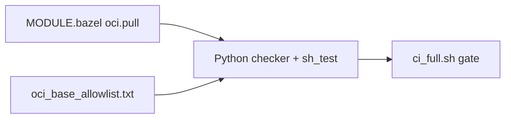

# 30 — Milestone M5: allowlist, SBOM, scan, optional push (supply chain without theater)

**Previous:** [`29-milestone-m4-when-ci-became-the-boss.md`](./29-milestone-m4-when-ci-became-the-boss.md)

**M5** in a backlog often sounds enterprise-y. In my fork it became a **credible story** you can **run** and **show**:

1. **OCI base allowlist** — every **`oci.pull` `name`** in **`MODULE.bazel`** must match a checked-in text file. A **Python checker** runs at the start of **`ci_full.sh`** / **`ci_fast.sh`** and in **`sh_test`**.  
2. **Release workflow** — on **GitHub release** (and **manual dispatch**), build **checkout** with Bazel, **load** into Docker, run **Anchore SBOM** + **Anchore scan** (informational by default), and **optionally push** if a repository secret is set.

---

## The allowlist — policy as a diffable text file

**File:** `tools/bazel/policy/oci_base_allowlist.txt` — one **`oci.pull` name** per line (comments allowed with `#`).

**Rules:**

- Every **`oci.pull( name = "…" )`** in **`MODULE.bazel`** must appear in the allowlist.  
- Every allowlist entry must have a matching **`oci.pull`** — no stale lines.  

That **symmetry** stops two failure modes: someone adds a new base image without review, or someone deletes a pull but leaves the policy file lying.

**Example head of the allowlist** (illustrative — the real file may grow):

```text
# Allowed oci.pull repository names in MODULE.bazel (one per line).
distroless_static_debian12_nonroot
dotnet_aspnet_10
envoy_v134_latest
nginx_unprivileged_1290_alpine322_otel
python_312_slim_bookworm
# …
```

**Checker implementation** (behavior in prose): **`check_oci_allowlist.py`** walks up from its path to find **`MODULE.bazel`**, regex-extracts **`oci.pull` names** in file order, loads the allowlist, then errors if **set difference** is non-empty either way.

```22:59:tools/bazel/policy/check_oci_allowlist.py
def extract_oci_pull_names(module_text: str) -> list[str]:
    """Return oci.pull `name =` values in file order."""
    return re.findall(
        r'oci\.pull\(\s*\n\s*name\s*=\s*"([^"]+)"',
        module_text,
        flags=re.MULTILINE,
    )
# ...
    for name in pulled:
        if name not in allow_set:
            errors.append(f"oci.pull name {name!r} is not in {allow_path}")
    for name in allowed:
        if name not in pull_set:
            errors.append(f"Allowlist entry {name!r} has no matching oci.pull in MODULE.bazel")
```

---

## Run the allowlist locally

```bash
python3 tools/bazel/policy/check_oci_allowlist.py
```

Or via Bazel:

```bash
bazelisk test //tools/bazel/policy:oci_allowlist_test --config=ci
```

---

## Why I like the allowlist trick

Reviewers can **see** policy in a **small text file**. CI fails if someone sneaks a new base without updating that file. It is simpler than OPA for a learning repo — and **simple counts**.



---

## Release workflow (what the YAML actually does)

Workflow name on the fork: **“Bazel checkout OCI (release)”**. Triggers: **`release: published`**, **`workflow_dispatch`**. Sketch of steps:

| Step | Purpose |
|------|---------|
| Checkout + Go + Bazelisk | Minimal toolchain for **checkout** image |
| Disk cache on `~/.cache/bazel` | Warm repeated release builds |
| Resolve tag | Release tag or manual input |
| **`check_oci_allowlist.py`** | Same policy as PR CI |
| **`bazelisk build //src/checkout:checkout_image`** | Build image |
| **`bazelisk run //src/checkout:checkout_load`** | Load **`otel/demo-checkout:bazel`** into Docker |
| **Anchore `sbom-action`** | SPDX-style SBOM artifact |
| **Anchore `scan-action`** | Vuln scan; **`fail-build: false`**, **`severity-cutoff: high`** |
| **`docker/login-action`** to GHCR | On **`release`** events |
| **Optional `oci_push`** | If **`BAZEL_CHECKOUT_PUSH_REPOSITORY`** secret is set |

**Optional push command shape** (when secret present):

```bash
bazelisk run --config=ci //src/checkout:checkout_push -- --repository "${REPO}" --tag "${TAG}"
```

**Why `fail-build: false` on scan:** distroless and base-image **CVE noise** can swamp a demo repo until you tune **waivers** — but the **instrumentation** exists and the logs are real.

---

## What changed vs M4

| M4 | M5 |
|----|-----|
| CI blocks on **build + unit + lint** | Same, plus **explicit supply-chain hooks** on **release** |
| OCI bases pinned in **`MODULE.bazel`** only | Pins + **allowlist enforcement** in CI |
| Push story **documented** for developers | **Automated** SBOM/scan path; push **opt-in** via secret |

---

## Commands cheat card

```bash
# Same check PRs run first
python3 tools/bazel/policy/check_oci_allowlist.py

# Bazel-wrapped test
bazelisk test //tools/bazel/policy:oci_allowlist_test --config=ci
```

---

## Interview line

> “I didn’t just **pin digests** — I **enforce** that every **`oci.pull` name** appears in a **reviewable allowlist**, and on **release** I **SBOM + scan** the Bazel-built checkout image. **Gating** on CVEs is **tunable** so the pipeline stays honest without becoming theater.”

---

**Next:** [`31-remote-cache-bazelrc-user-and-ci-secrets.md`](./31-remote-cache-bazelrc-user-and-ci-secrets.md)
