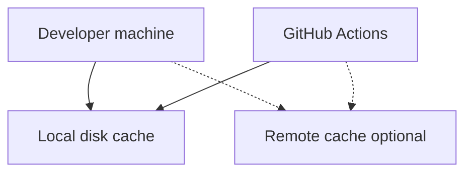

# 31 — Remote cache: `.bazelrc.user`, forking ethics, and speed that matters

**Previous:** [`30-milestone-m5-allowlist-sbom-release-workflow.md`](./30-milestone-m5-allowlist-sbom-release-workflow.md)

PR CI already uses a **disk** cache on **`~/.cache/bazel`** (Actions **`cache`** step on **`~/.cache/bazel`**). A **remote** cache speeds **clean** runners and **large teams** by sharing action outputs across machines.

---

## How remote caching fits Bazel

Bazel can read and write build outputs through a **remote cache** endpoint (gRPC or HTTP). Common providers include **Google Remote Build Execution–compatible** caches, **BuildBuddy**, **EngFlow**, or self-hosted **bazel-remote**. Official overview: [Bazel remote caching](https://bazel.build/remote/caching).

**This fork does not require a remote cache** — local disk cache + lockfile discipline already cut most PR pain.

---

## Recommended setup (local)

1. Provision a cache endpoint your org trusts.  
2. **Do not commit** credentials. Use a **user-local** rc file ignored by git.

**Workspace hook** (already in **`.bazelrc`**):

```text
try-import %workspace%/.bazelrc.user
```

**`.gitignore`** should list **`.bazelrc.user`** (or use a **global** gitignore) so keys never land in history.

**Example** `.bazelrc.user` (replace with your org’s endpoint and headers):

```text
# Example only — replace with your org’s endpoint and flags.
build --remote_cache=grpcs://remote.buildbuddy.io
build --remote_header=x-buildbuddy-api-key=YOUR_KEY
```

**One-shot override** (no file):

```bash
bazelisk build //src/checkout:checkout_image --config=ci \
  --remote_cache=https://cache.example.com \
  --remote_cache_header="Authorization=Bearer $TOKEN"
```



---

## CI secrets (maintainers only)

To enable remote cache in **GitHub Actions**, inject the same flags via a repository **secret** (for example **`BAZEL_REMOTE_CACHE_URL`**) and either:

- append to **`BAZEL_EXTRA_OPTS`** in a workflow step, or  
- emit a small **`.bazelrc.ci`** from secrets in a **maintainer-only** job.

**Fork ethics:** I am allergic to workflows that **require** secrets on **every contributor’s fork**. **Forks** should leave remote-cache secrets **unset** so CI stays **green** without org credentials. Only **upstream** or **maintainer** repositories need the extra wiring.

---

## Disk vs remote — mental model

| Mechanism | What it solves |
|-----------|----------------|
| **`~/.cache/bazel` on Actions** | **Same** runner or repeated runs see warm **local** blobs |
| **Remote cache** | **Different** runners (or teammates) share **action outputs** |
| **`MODULE.bazel.lock`** | **Dependency graph** is reproducible — cache is an optimization, not the contract |

---

## Commands

```bash
# Any target — add remote flags as needed
bazelisk build //src/checkout:checkout_image --config=ci \
  --remote_cache=https://cache.example.com \
  --remote_cache_header="Authorization=Bearer $TOKEN"
```

---

## Interview line

> “I split **disk cache** (cheap, on Actions) from **optional remote cache** (org secret, never required for forks). **Lockfiles** define correctness; **caches** are **performance**.”

---

**Next:** [`32-make-wrappers-quickstart-and-contributing-notes.md`](./32-make-wrappers-quickstart-and-contributing-notes.md)
