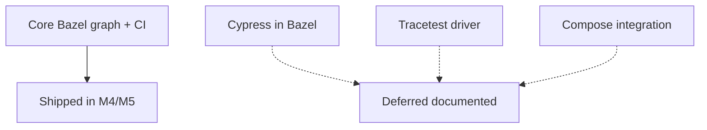

# 33 — Cypress, Tracetest, integration prelude: what I deferred on purpose

**Previous:** [`32-make-wrappers-quickstart-and-contributing-notes.md`](./32-make-wrappers-quickstart-and-contributing-notes.md)

Not finishing everything is **a decision** if you document it.

---

## Cypress and Bazel

**Current state:**

- **`src/frontend`** uses **Aspect `rules_js`** with **`npm_translate_lock`** (pnpm lock → **`npm_frontend`** repo).  
- **`lifecycle_hooks_exclude = ["cypress"]`** avoids running Cypress’s postinstall during **`npm`** fetch under Bazel (large binary download; unstable in hermetic sandboxes).  
- **E2E** today runs via **Makefile** / npm scripts **outside** Bazel, and **`frontend-tests`** is built from **`Dockerfile.cypress`** in the component image workflow — not from a **`bazel test`** target.

**Why I did not wrap Cypress in the blocking PR graph:**

- Cypress needs a **browser** or **official Cypress image**; plain **`ubuntu-latest`** runners need extra setup.  
- **`bazel test`** sandboxing fights Cypress defaults unless you commit to **`tags = ["no-sandbox", "manual"]`** and a **dedicated** job.

**Planned shape (backlog, not a promise in CI):**

1. Add **`js_test`** or **`sh_test`** that runs **`npx cypress run`** (or **`cypress run --headless`**) with **`tags = ["e2e", "manual"]`** initially.  
2. Wire a **separate** GitHub Actions job (nightly or **`workflow_dispatch`**) with browser deps or **`cypress-io/github-action`**.  
3. Optionally reuse **`Dockerfile.cypress`** as the execution environment instead of raw Bazel.

**Future command I am **not** claiming works today:**

```bash
# Not implemented in the blocking migration slice:
# bazel test //src/frontend:cypress_e2e --config=e2e
```

**Interview translation:**

> “I separated **build graph correctness** from **E2E ergonomics**; Cypress remains a tracked follow-up with a written plan.”

---

## Tracetest

The integration workflow today is still essentially **Compose-first**:

```bash
make build && docker system prune -f && make run-tracetesting
```

A **placeholder comment** in the integration workflow describes how a future “Bazel images first” path could hook in **once** image strategy stabilizes — I did not block **M4** on rewriting that graph.

---

## Why deferral is not shame

A migration sells better when you can show:

- **blocking** CI graph  
- **multi-language** builds  
- **OCI** proofs  
- **policy** hooks (allowlist, SBOM on release)

…than when you show a **flaky browser suite** that hides real regressions.



---

## Interview line

> “I shipped **deterministic build gates** first. **Cypress** and **Tracetest** stay on **Docker/Compose** paths with an explicit **Bazel follow-up** — so I never pretended E2E was ‘done’ because Bazel was green.”

---

**Next:** [`34-debugging-playbook-what-usually-broke.md`](./34-debugging-playbook-what-usually-broke.md)
