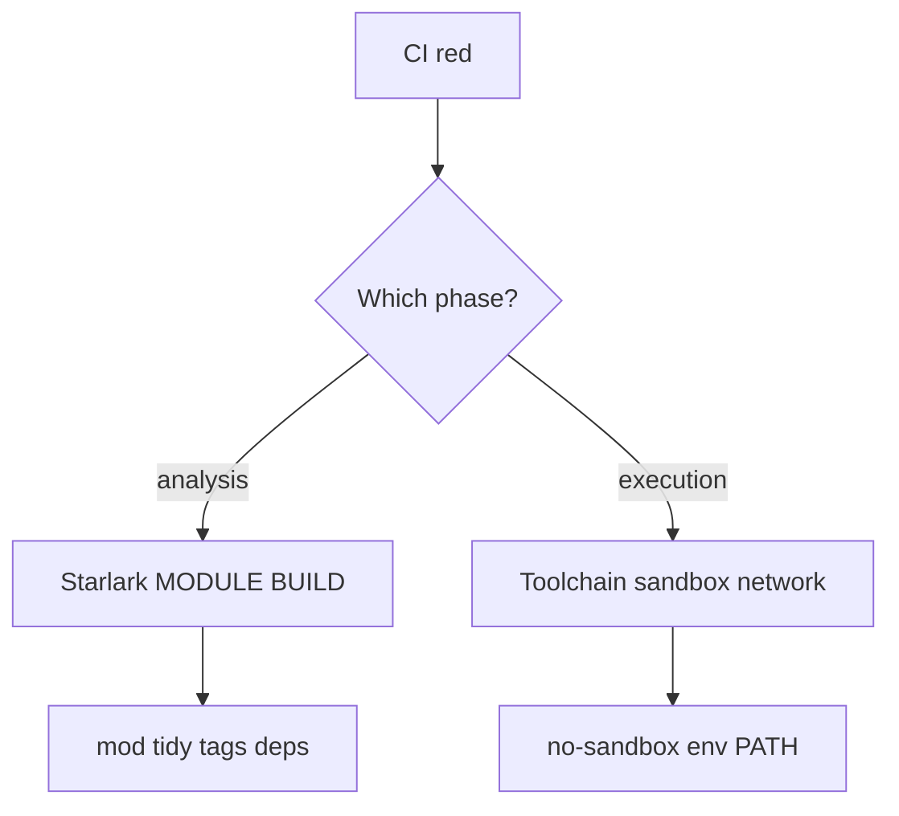

# 34 — Debugging playbook: the failures that ate my evenings (and the fixes)

**Previous:** [`33-cypress-tracetest-and-what-i-deferred-on-purpose.md`](./33-cypress-tracetest-and-what-i-deferred-on-purpose.md)

This chapter is **practical therapy** — the failures I saw repeatedly while wiring a polyglot **`bazel_ci`** job.

---

## 1) “It works on my laptop” in CI

**Symptom:** green locally, red in Actions.  
**Usual cause:** missing toolchain or wrong version (**`mix`**, **`composer`**, **Node**, **.NET SDK**).  
**Fix:** make local installs match the **`bazel_ci`** job literally — same **Go**, **Node 22**, **Python**, **.NET 10**, **Elixir/OTP**, **PHP 8.4 + Composer**, plus **gettext** for baked Envoy/nginx configs.

---

## 2) Sandbox vs host tools

**Symptom:** **`dotnet`**, **`docker`**, or **`git`** not found inside an action.  
**Fix:** **`tags = ["no-sandbox"]`** *only when justified*, or pass **`--action_env=PATH`** / **`DOTNET_ROOT`** in **`.bazelrc`** so the action sees the same env CI sets up on the runner.

---

## 3) Wrong arguments after `--`

**Symptom:** `bazel run //src/checkout:checkout_push -- --repository …` works until you “helpfully” move flags.  
**Rule:** **`bazel` flags before `--`, tool flags after `--`**.

---

## 4) Tag filters hiding tests

**Symptom:** “CI says no tests ran” / you expected a check but it never fired.  
**Fix:** **`--config=unit`** **requires** the **`unit`** tag. Add **`tags = ["unit"]`** to new tests.

---

## 5) `MODULE.bazel` / extension errors

**Symptom:** “run **`bazel mod tidy`**” or opaque Bzlmod resolution errors.  
**Fix:** run **`bazel mod tidy`**. Commit the **`MODULE.bazel.lock`** diff with intent.

---

## 6) OCI allowlist failures

**Symptom:** **`ci_full.sh`** dies immediately on Python checker.  
**Fix:** every new **`oci.pull( name = "foo" )`** needs **`foo`** in **`tools/bazel/policy/oci_base_allowlist.txt`** (and remove stale allowlist lines if you delete a pull).

---

## Commands I reach for

```bash
bazelisk build //path:target -s        # see subcommands
bazelisk test //path:test --test_output=all
bazelisk query --output=build //path:target
bazelisk query 'deps(//path:target)' --output=graph > /tmp/graph.dot
```



---

## Interview line

> “When Bazel fails in CI, I **diff toolchains against Actions** first, then **tags**, then **`--`**, then **lockfiles**. That order saves hours.”

---

**Next:** [`35-interview-mode-patterns-i-can-defend.md`](./35-interview-mode-patterns-i-can-defend.md)
