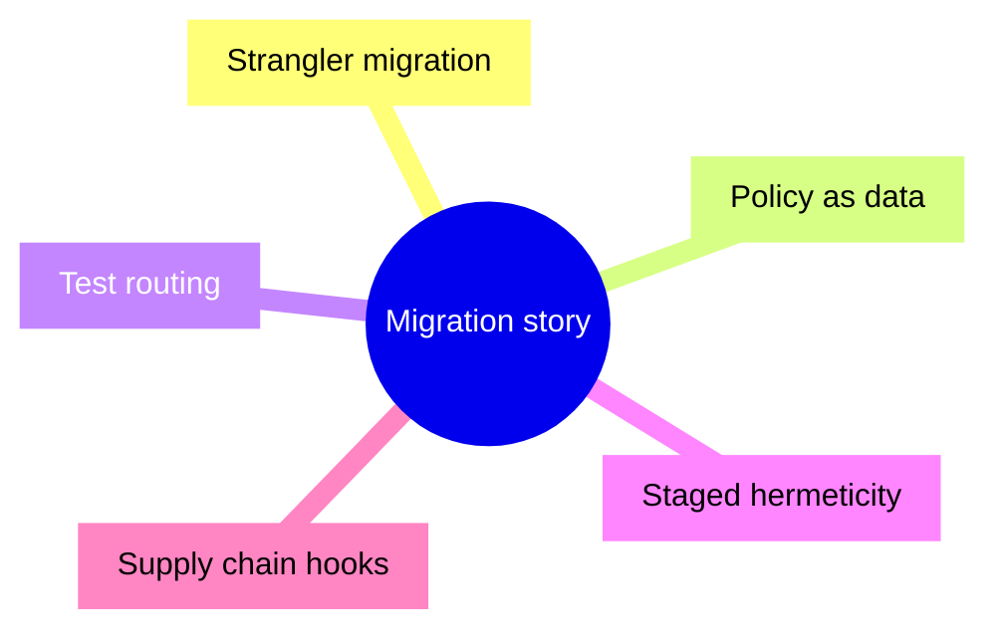

# 35 — Interview mode: patterns I can defend calmly

**Previous:** [`34-debugging-playbook-what-usually-broke.md`](./34-debugging-playbook-what-usually-broke.md)

If you are using this series to prep for a **Bazel-heavy role**, here is how **I** explain what I did — without sounding like I memorized a blog post.

---

## Pattern A — “Strangler fig” migration

> “I kept Docker Compose runtime and Dockerfile registry builds while growing a Bazel graph until CI could block on it.”

**Evidence:** dual Dockerfile + Bazel OCI matrix; **M4** switched **`bazel_ci`** to **`ci_full.sh`**.

---

## Pattern B — “Policy as data”

> “OCI bases are digest-pinned in the module; an **allowlist** enforces that every **`oci.pull` name** was reviewed.”

**Evidence:** `tools/bazel/policy/oci_base_allowlist.txt` + Python checker + **`sh_test`**; first step of **`ci_full.sh`**.

---

## Pattern C — “Tests routed by tags”

> “Fast PR gates run **`unit`**; integration / e2e / trace are explicit configs.”

**Evidence:** **`.bazelrc`** **`test:unit`** filters; **`rn_js_checks`**, **`oci_allowlist_test`**, **`frontend:lint`**, etc.

---

## Pattern D — “Hermeticity is staged”

> “I used **`sh_test`**, host toolchains, and **`no-sandbox`** where the ROI of perfect hermeticity was low — and I kept **Go/proto** paths strict where they shine.”

**Evidence:** polyglot **`sh_test`** bridges (Elixir, PHP, .NET, RN) vs **`go_binary`** / **`oci_image`** on checkout.

---

## Pattern E — “Supply chain instrumentation exists”

> “Release workflow emits **SBOM** and runs a **scanner**; failing the build on every CVE is **tunable**.”

**Evidence:** **`Bazel checkout OCI (release)`** workflow — Anchore actions, optional **`oci_push`**.

---

## A question I want interviewers to ask

> “Where would you spend the next month?”

**My answer:** **reduce dual-build cost** by expanding **`oci_push`** for more services **or** investing in **RBE** — but only after **scan policy** and **CVE waivers** are aligned with security stakeholders. Parallel track: **Cypress** in a **non-blocking** job once browser infra is stable.

---

## Interview line

> “I can point to **five patterns** — strangler dual-build, **allowlist** policy, **tag routing**, **pragmatic sh_test**, and **release SBOM** — each backed by **a file** or **workflow**, not vibes.”

---

**Next:** [`36-appendix-cheat-sheet-and-reading-order.md`](./36-appendix-cheat-sheet-and-reading-order.md)
