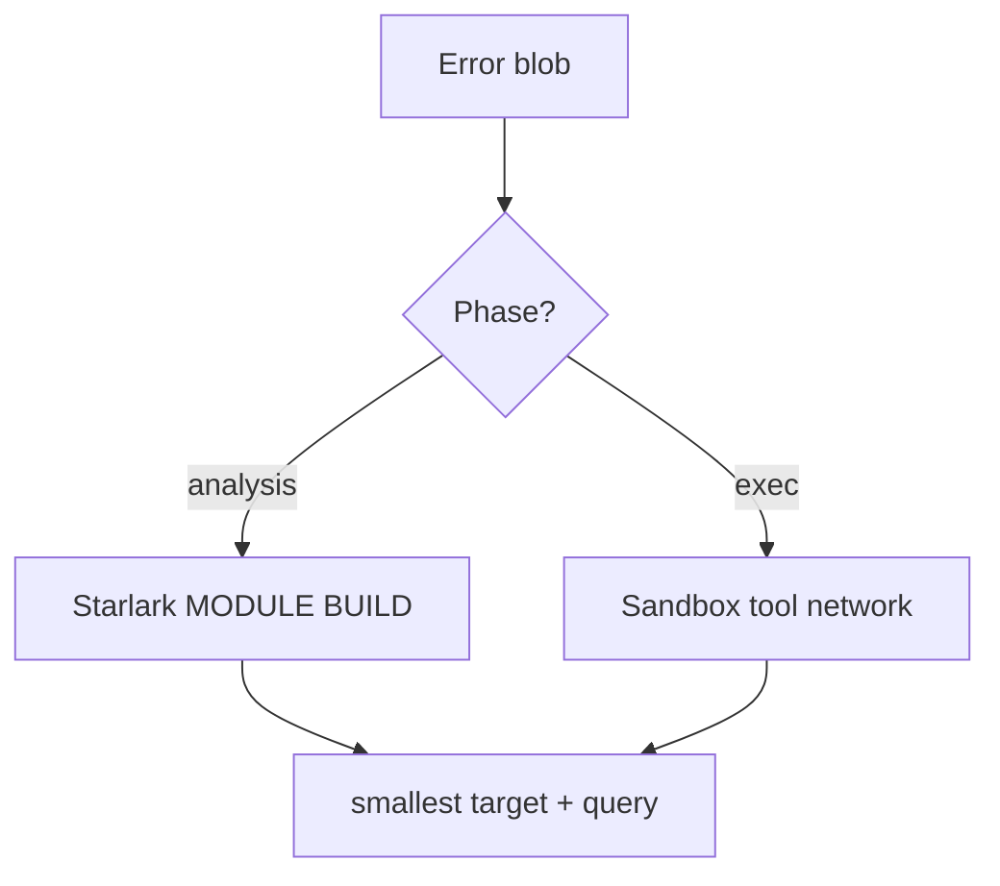

# 39 — How I read a Bazel error without rage-quitting (a literal algorithm)

**Previous:** [`38-module-bazel-lock-and-reproducible-fetches.md`](./38-module-bazel-lock-and-reproducible-fetches.md)

Bazel errors are verbose on purpose. I use a **checklist** so I do not scroll emotionally.

---

## Step 1 — Identify the phase

Does it say **analysis**, **configuration**, or **execution**?

- **Analysis / configuration** → usually Starlark, missing deps, bad attributes, wrong **`select()`**, Bzlmod **`use_repo`** gaps.  
- **Execution** → compiler output, sandbox denials, missing tools, network in a test that did not declare **`requires-network`**.

---

## Step 2 — Find the *first* actionable `file:line`

Scroll until you see **`BUILD.bazel:NN`** or **`MODULE.bazel:NN`** or a **`.bzl`** path. That is usually the **defendant** — not the first wall of Java stack trace.

---

## Step 3 — Distinguish “my code” vs “third-party”

If the stack is deep under **`external/`**, the fix might be:

- a **module version** bump in **`MODULE.bazel`**  
- a **toolchain** or **`--action_env`** flag  
- a missing **`use_repo`** after an extension

---

## Step 4 — Reproduce smaller

Replace **`//...`** with the **smallest** target:

```bash
bazelisk build //src/checkout:checkout --config=ci
```

---

## Step 5 — Ask “what changed?”

**Git diff.** Half of migrations are “I edited **`MODULE.bazel`** while tired” or “I renamed a target but not a **`data`** dep”.

---

## Step 6 — Use query as an X-ray

```bash
bazelisk query 'deps(//src/checkout:checkout)' --output=graph > /tmp/graph.dot
```

I do not always render the graph, but **thinking** in **deps** fixes a lot of “why is this rebuilding?” confusion.

---

## Step 7 — When the error is a test, add verbosity

```bash
bazelisk test //pkg:test --test_output=all --test_arg=…
```

For **`sh_test`**, **`--verbose_failures`** on the **build** side sometimes helps; for **logic**, **`--test_output=streamed`** is loud but honest.



---

## Interview line

> “I read Bazel errors **bottom-up** for **file:line**, classify **phase**, then **shrink** the target. Everything else is noise until those three are done.”

---

**Next:** [`40-git-history-as-my-lab-notebook.md`](./40-git-history-as-my-lab-notebook.md)
