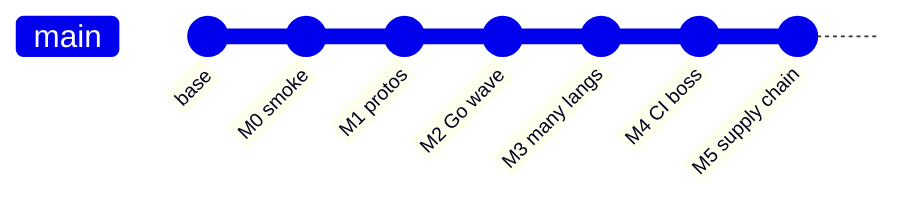

# 40 — Git history as my lab notebook (annotated commit arc)

**Previous:** [`39-how-i-read-a-bazel-error-without-rage-quitting.md`](./39-how-i-read-a-bazel-error-without-rage-quitting.md)

I committed in **milestone-shaped chunks**. If you are replaying the migration, **`git log --oneline`** is a syllabus — not because git is fancy, but because **ordered narrative** beats a single “big bang” squash for learning.

---

## The arc I actually see

| Milestone | What moved in the graph |
|-----------|-------------------------|
| **M0** | Bazel **smoke** in CI (early days could be non-blocking while wiring Bzlmod). |
| **M1** | **Proto** graph + CI gate evolution — **`pb`** targets as the spine. |
| **M2** | First **language wave** solid (Go services deeply integrated). |
| **M3** | Long series: payment, frontend, Python fleet, JVM, .NET, Rust, C++, Ruby, Elixir, PHP, React Native Android edges, Envoy/nginx — **BUILD files**, **tests**, **oci_image** proofs. |
| **M4** | CI switches to **blocking** **`bazel_ci`** + **`ci_full.sh`** (full toolchain on Ubuntu, disk cache, curated **`bazel build`** list, **`unit`** tests, **`//:lint`**). |
| **M5** | **Closure**: OCI **allowlist** enforcement, **release** workflow with **SBOM** + **scan**, optional **`oci_push`**, **Make** wrappers, **remote cache** story. |

Names (**M0**–**M5**) are **my** chapter headings — upstream may use different ticket IDs. The **shape** is what matters: **spine → breadth → CI boss → supply chain**.

---

## How to use this as a learner

Pick a commit, check it out in a **worktree**, and diff against its parent — but **filter** to the files that tell the build story:

```bash
git show --stat <commit>
git diff <commit>^..<commit> -- '*.bazel' 'MODULE.bazel' 'MODULE.bazel.lock' '.github/workflows/*.yml' '.bazelrc'
```

You will see **only build / CI motion**, which is the point.

---

## Why ordered commits matter for portfolios

Interviewers sometimes ask: *“Show me how you broke down a large change.”*  
A clean commit series is evidence you can **ship incrementally** — the same skill enterprises need for monorepo migrations.

**Anti-pattern:** one giant squash titled “bazel” with 400 files — it **hides** judgment.



---

## Interview line

> “I treat **git history** as **documentation**: each milestone is a **slice** you can **check out** and **diff**. That is how I prove I did not ‘mysteriously’ end up with Bazel — I **landed** it in **stages**.”

---

**Series:** start at [`01-the-opentelemetry-astronomy-shop-demo.md`](./01-the-opentelemetry-astronomy-shop-demo.md) · [`README.md`](./README.md) for the full index.
